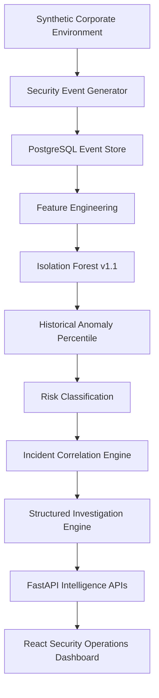
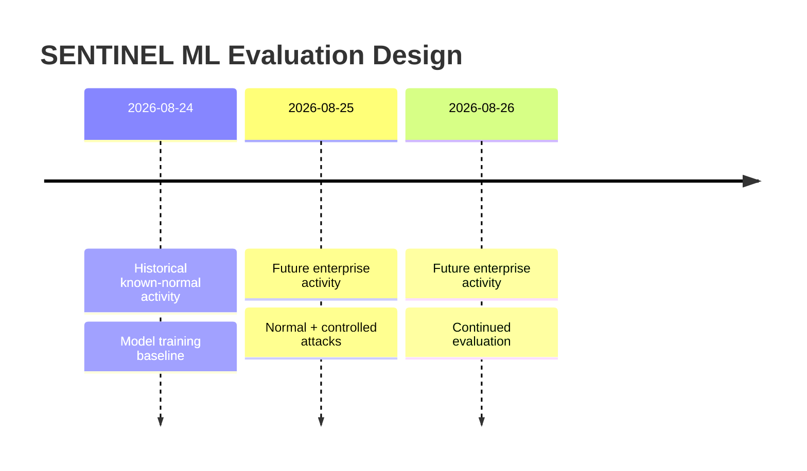
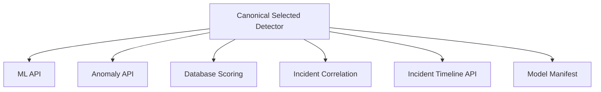
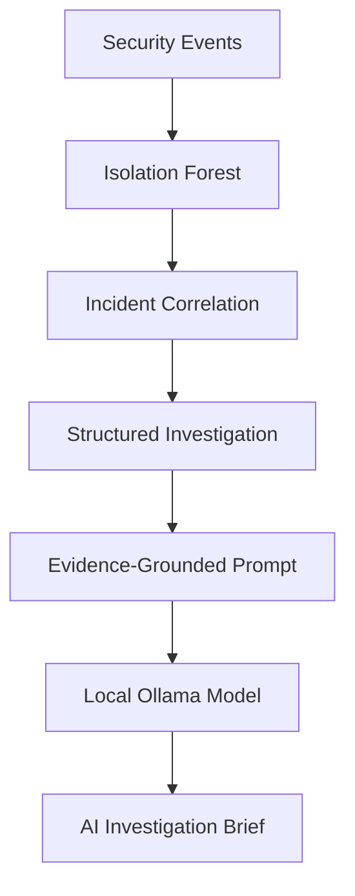
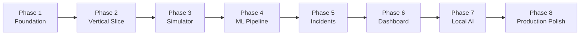

# SENTINEL

### AI-Powered Anomaly Detection & Incident Intelligence Platform

> **Project Status: Ongoing Development**
>
> SENTINEL is an actively developed educational portfolio project focused on behavioral security analytics, anomaly detection, incident correlation, investigation intelligence, and local AI-assisted security analysis.
>
> **Phases 1–6 are complete. Phases 7–8 are currently planned and under development.**

---
## Table of Contents

- [Overview](#overview)
- [Current Project Status](#current-project-status)
- [What SENTINEL Does](#what-sentinel-does)
- [Synthetic Enterprise Environment](#synthetic-enterprise-environment)
- [Controlled Security Scenarios](#controlled-security-scenarios)
- [Machine Learning Pipeline](#machine-learning-pipeline)
- [Chronological Training Strategy](#chronological-training-strategy)
- [Production Feature Set](#production-feature-set)
- [Model Experimentation](#model-experimentation)
- [Current ML Evaluation](#current-ml-evaluation)
- [Risk Classification](#risk-classification)
- [Incident Correlation Engine](#incident-correlation-engine)
- [Current Incident Types](#current-incident-types)
- [Incident-Level Evaluation](#incident-level-evaluation)
- [Investigation Intelligence](#investigation-intelligence)
- [Evaluation Registry](#evaluation-registry)
- [Canonical Selected Detector](#canonical-selected-detector)
- [Security Operations Dashboard](#security-operations-dashboard)
- [Security Operations Overview](#security-operations-overview)
- [Incident Investigation Workspace](#incident-investigation-workspace)
- [Anomaly Intelligence](#anomaly-intelligence)
- [Model Intelligence](#model-intelligence)
- [Current Technology Stack](#current-technology-stack)
- [Repository Architecture](#repository-architecture)
- [Current Backend Pipeline](#current-backend-pipeline)
- [API Architecture](#api-architecture)
- [PostgreSQL Persistence](#postgresql-persistence)
- [Phase 7 — Local AI Investigation](#phase-7--local-ai-investigation)
- [Planned Phase 7 Work](#planned-phase-7-work)
- [Phase 8 — Production & Portfolio Polish](#phase-8--production--portfolio-polish)
- [Why This Project Exists](#why-this-project-exists)
- [Design Principles](#design-principles)
- [Current Development Environment](#current-development-environment)
- [Running the Project](#running-the-project)
- [Useful Development Commands](#useful-development-commands)
- [Development Roadmap](#development-roadmap)
- [Project Status Disclaimer](#project-status-disclaimer)
- [Author](#author)
---

## Overview

SENTINEL is a full-stack security intelligence platform that simulates the activity of a fictional enterprise, analyzes employee behavior using machine learning, detects anomalous activity, correlates suspicious events into security incidents, and presents them through a modern Security Operations Center-style dashboard.

The project is designed to demonstrate the complete lifecycle of a security analytics system rather than only training an isolated machine-learning model.

SENTINEL currently includes:

- synthetic enterprise generation
- realistic employee behavioral profiles
- synthetic security telemetry
- controlled attack scenario injection
- feature engineering
- Isolation Forest anomaly detection
- historical percentile-based anomaly scoring
- incident correlation
- deterministic investigation intelligence
- evaluation against hidden simulator ground truth
- PostgreSQL persistence
- FastAPI APIs
- a responsive React intelligence dashboard
- model experiment tracking
- generated evaluation metadata
- explainable anomaly and incident views

Future phases will add local LLM-assisted investigation, live event simulation, employee administration, runtime orchestration, deployment polish, automated testing, and full portfolio packaging.

---

# Current Project Status

| Phase | Description | Status |
|---|---|---|
| Phase 1 | Foundation & Environment | ✅ Complete |
| Phase 2 | End-to-End Vertical Slice | ✅ Complete |
| Phase 3 | Synthetic Corporate Environment | ✅ Complete |
| Phase 4 | Real ML Pipeline | ✅ Complete |
| Phase 5 | Incident Correlation & Investigation | ✅ Complete |
| Phase 6 | Full Intelligence Dashboard | ✅ Complete |
| Phase 7 | Local AI Investigation | 🚧 Planned / Next |
| Phase 8 | Production & Portfolio Polish | 🚧 Planned |

---

# What SENTINEL Does

SENTINEL currently follows this pipeline:



The final system is being designed to extend this pipeline with:


---

# Synthetic Enterprise Environment

SENTINEL currently models a fictional organization with:

- **100 employees**
- multiple departments
- job-specific behavioral profiles
- expected working hours
- typical source IPs
- location behavior
- file activity baselines
- expected network activity
- expected transfer volume
- remote-work probability

Current department distribution:

| Department | Employees |
|---|---:|
| Engineering | 32 |
| Finance | 21 |
| Sales | 17 |
| IT Operations | 16 |
| Human Resources | 14 |

The simulation currently contains **5,970 security events**.

These events include:

- login successes
- login failures
- logouts
- file access
- file downloads
- file uploads
- database access
- network connections

The current dataset acts as a **reproducible benchmark dataset** for model and incident evaluation.

A continuous live-simulation mode is planned for Phase 8.

---

# Controlled Security Scenarios

The simulator currently supports controlled attack scenarios including:

### Brute Force

Repeated authentication failures designed to reproduce an authentication attack pattern.

### Account Takeover

Authentication failures followed by successful access from suspicious or non-baseline context.

### Data Exfiltration

Abnormal file and data-transfer behavior involving unusually large outbound transfers.

### Insider Threat

Suspicious file or sensitive-resource interaction occurring outside an employee's normal behavioral profile.

### Network Scanning

Rapid connections to multiple destination systems representing reconnaissance behavior.

These simulator labels are treated as **hidden ground truth**.

They are never supplied to the operational machine-learning model or incident-correlation engine.

They are only used during offline evaluation.

---

# Machine Learning Pipeline

SENTINEL currently uses:

## Isolation Forest v1.1

The selected production candidate is an unsupervised Isolation Forest model.

The model learns historical normal behavior and assigns future activity a behavioral anomaly score.

Instead of presenting the score as a probability of malicious activity, SENTINEL converts raw model output into a:

> **Historical anomaly percentile relative to the learned normal baseline**

This distinction is important:

```text
99.8% anomaly percentile
≠
99.8% probability of attack
```

---

# Chronological Training Strategy

SENTINEL intentionally avoids a random train/test split.

Security telemetry is temporal, so the model is trained on historical activity and evaluated on future events.



Current dataset split:

| Dataset | Rows |
|---|---:|
| Training | 1,938 |
| Evaluation | 4,030 |

---

# Production Feature Set

The selected V1.1 model uses **17 behavioral features**.

### Temporal Behavior

- `hour_sin`
- `hour_cos`
- `outside_work_hours`

### Identity Context

- `source_ip_is_baseline`
- `remote_work_probability`
- `success`

### Data Volume

- `bytes_sent`
- `bytes_received`
- `total_bytes`
- `data_volume_ratio`

### Rolling Activity

- `failed_logins_10m`
- `events_5m`
- `file_events_30m`
- `bytes_sent_30m`
- `bytes_received_30m`

### Network Behavior

- `network_events_5m`
- `unique_destinations_5m`

The production preprocessing schema is frozen alongside the selected model to preserve reproducibility.

---

# Model Experimentation

SENTINEL does not assume that adding more features automatically improves detection.

Two Isolation Forest feature architectures were evaluated against the same chronological evaluation dataset.

| Model | Features | Precision | Recall | F1 | False Positive Rate |
|---|---:|---:|---:|---:|---:|
| **V1 / V1.1** | **17** | **68.5%** | **95.5%** | **79.8%** | **0.99%** |
| V2 | 27 | 66.9% | 95.5% | 78.7% | 1.07% |

### Selected: V1 / V1.1

V1 was retained because it achieved:

- the same recall as V2
- better precision
- better F1
- fewer false positives
- fewer features

This keeps the production detector simpler while preserving stronger measured performance.

---

# Current ML Evaluation

The selected model currently produces:

| Metric | Result |
|---|---:|
| True Positives | 85 |
| False Positives | 39 |
| True Negatives | 3,902 |
| False Negatives | 4 |
| Precision | 68.5% |
| Recall | 95.5% |
| F1 Score | 79.8% |
| False Positive Rate | 0.99% |

The production alert threshold is based on the **99th historical anomaly percentile**.

---

# Risk Classification

SENTINEL converts anomaly percentiles into operational risk levels.

Current stored score distribution:

| Risk Level | Events |
|---|---:|
| Critical | 145 |
| High | 46 |
| Medium | 169 |
| Low | 305 |
| Normal | 5,305 |
| **Total** | **5,970** |

These risk labels help prioritize investigation but remain behavioral anomaly classifications rather than attack probabilities.

---

# Incident Correlation Engine

Individual anomalous events are often insufficient to understand a security incident.

SENTINEL therefore applies a separate multi-signal incident-correlation layer.

Correlation considers observable information such as:

- affected employee
- temporal proximity
- session relationships
- authentication behavior
- source-IP deviation
- file activity
- outbound data volume
- destination fan-out
- sensitive-resource access
- anomaly severity

The engine groups related signals into investigation-level incidents.

---

# Current Incident Types

The correlation engine currently identifies:

- `AUTHENTICATION_ATTACK`
- `POTENTIAL_ACCOUNT_COMPROMISE`
- `SUSPICIOUS_DATA_TRANSFER`
- `NETWORK_RECONNAISSANCE`
- `PRIVILEGED_ACCESS_ANOMALY`
- `GENERAL_BEHAVIORAL_ANOMALY`

Current database state:

- **11 correlated incidents**
- **3 Critical**
- **3 High**
- **5 Medium**
- **101 correlated event links**

---

# Incident-Level Evaluation

SENTINEL evaluates correlation separately from raw ML detection.

Current controlled evaluation contains:

- **5 attack instances**
- **89 controlled attack events**
- **7 incidents evaluated**

Results:

| Metric | Result |
|---|---:|
| True-Positive Incidents | 5 |
| False-Positive Incidents | 2 |
| Incident Precision | 71.4% |
| Incident Recall | 100% |
| Incident F1 | 83.3% |
| Attack Instances Detected | 5 / 5 |
| Attack Events Recovered | 89 / 89 |
| Timeline Recovery | 100% |

All five controlled scenarios were recovered:

| Ground Truth Scenario | Correlated Incident |
|---|---|
| Account Takeover | Potential Account Compromise |
| Brute Force | Authentication Attack |
| Data Exfiltration | Suspicious Data Transfer |
| Insider Threat | Privileged Access Anomaly |
| Network Scan | Network Reconnaissance |

This demonstrates an important part of the SENTINEL architecture:

```text
Event-level ML Recall: 95.5%

               ↓ correlation

Attack-instance Recall: 100%

               ↓ evidence expansion

Attack Timeline Recovery: 100%
```

The correlation layer can therefore reconstruct broader incident context even when individual early events are not themselves critical ML detections.

---

# Investigation Intelligence

Every correlated incident can be enriched by SENTINEL's deterministic investigation engine.

The engine produces:

- executive incident summary
- severity rationale
- key behavioral findings
- observable indicators
- prioritized investigation steps
- analyst questions
- conditional containment guidance

Example workflow:


This investigation layer works **without an LLM**.

That is intentional.

SENTINEL's core security reasoning remains deterministic and inspectable.

---

# Evaluation Registry

Evaluation metadata is no longer manually embedded in the frontend.

SENTINEL now generates independent evaluation artifacts from its real evaluation workflows:

```text
train_selected_model.py
        ↓
selected_model_evaluation.json

compare_ml_models.py
        ↓
model_comparison.json

evaluate_incidents.py
        ↓
incident_evaluation.json

        ↓
build_evaluation_registry.py

        ↓
evaluation_registry.json

        ↓
FastAPI Evaluation API

        ↓
React Dashboard
```

The registry records:

- selected model metrics
- experiment comparison
- incident evaluation
- evaluation provenance
- generation timestamps

This ensures the dashboard reflects generated evaluation results rather than manually copied metrics.

---

# Canonical Selected Detector

Operational components no longer independently hard-code the selected model identity.

SENTINEL uses a shared selected-detector configuration that controls the model used by:

- ML APIs
- anomaly feed
- database scoring
- incident correlation
- incident timelines
- model manifest loading

Conceptually:



This provides a clean future model-promotion path.

---

# Security Operations Dashboard

Phase 6 introduced a complete React-based security intelligence interface.

Current navigation:

```text
Overview
Incidents
Anomalies
Model
```

The application also includes:

- animated SENTINEL splash screen
- branded navigation
- collapsible desktop sidebar
- responsive mobile navigation
- loading states
- refresh controls
- page transitions
- hover interactions
- severity-aware visual styling
- custom scrollbars
- responsive layouts
- branded favicon and browser identity

---

# Security Operations Overview

The Overview workspace provides an incident-first summary of the current environment.

It displays:

- monitored identities
- analyzed events
- open incidents
- critical incidents
- incident severity distribution
- correlated event count
- detection pipeline
- ML recall
- incident-level recall
- timeline recovery
- recent incident queue

---

# Incident Investigation Workspace

The Incidents workspace provides an analyst-oriented incident view.

Features include:

- incident queue
- severity filtering
- incident search
- selected-incident highlighting
- affected identity
- correlated event count
- anomaly severity
- correlation rationale
- behavioral indicators
- complete event timeline
- investigation findings
- severity reasoning
- recommended investigation workflow
- analyst questions
- conditional containment guidance

The workspace is API-driven and reflects the current incident state stored in PostgreSQL.

---

# Anomaly Intelligence

The Anomalies workspace provides detailed behavioral ML analysis.

Features include:

- full risk distribution
- server-side risk filtering
- server-side anomaly search
- pagination
- ranked anomaly feed
- selected-event behavioral analysis
- historical anomaly percentile
- detector context
- feature-level signals

Current anomaly filters represent the complete non-normal population:

```text
ALL       665
CRITICAL  145
HIGH       46
MEDIUM    169
LOW       305
```

This replaces the earlier top-100-only anomaly view.

---

# Model Intelligence

The Model workspace explains the machine-learning engineering behind SENTINEL.

It presents:

- selected detector and version
- model metrics
- model threshold
- feature count
- training/evaluation rows
- chronological training strategy
- V1 vs V2 experiment comparison
- model-selection reasoning
- feature architecture
- model lifecycle
- operational scoring state

The goal is to make the ML lifecycle visible rather than presenting the model as a black box.

---

# Current Technology Stack

## Frontend

- React
- TypeScript
- Vite
- Tailwind CSS

## Backend

- Python
- FastAPI
- Pydantic
- SQLAlchemy
- Alembic

## Database

- PostgreSQL

## Machine Learning

- Pandas
- NumPy
- scikit-learn
- Isolation Forest

## Infrastructure / Development

- Docker
- Docker Compose
- WSL2 Ubuntu
- Git
- GitHub
- VS Code

## Planned Local AI

- Ollama
- open-source local language model

The project intentionally avoids paid APIs and paid cloud dependencies.

---

# Repository Architecture

```text
sentinel/
│
├── backend/
│   ├── alembic/
│   ├── app/
│   │   ├── api/
│   │   ├── database/
│   │   ├── models/
│   │   ├── schemas/
│   │   ├── services/
│   │   ├── main.py
│   │   └── selected_detector.py
│   │
│   └── requirements.txt
│
├── frontend/
│   ├── public/
│   └── src/
│       ├── assets/
│       ├── components/
│       │   ├── anomalies/
│       │   ├── dashboard/
│       │   ├── incidents/
│       │   ├── layout/
│       │   └── shared/
│       │
│       ├── pages/
│       │   ├── OverviewPage.tsx
│       │   ├── IncidentsPage.tsx
│       │   ├── AnomaliesPage.tsx
│       │   └── ModelPage.tsx
│       │
│       ├── services/
│       ├── types/
│       ├── App.tsx
│       └── index.css
│
├── ml_engine/
│   ├── data/
│   ├── evaluation/
│   │   ├── results/
│   │   ├── evaluation_registry.json
│   │   ├── incident_metrics.py
│   │   ├── metrics.py
│   │   ├── registry.py
│   │   └── risk.py
│   │
│   ├── features/
│   ├── models/
│   └── preprocessing/
│
├── simulator/
│
├── scripts/
│   ├── generate_company.py
│   ├── generate_normal_activity.py
│   ├── inject_attack_scenarios.py
│   ├── validate_simulation.py
│   ├── build_ml_dataset.py
│   ├── train_isolation_forest.py
│   ├── train_isolation_forest_v2.py
│   ├── compare_ml_models.py
│   ├── train_selected_model.py
│   ├── score_events_with_selected_model.py
│   ├── generate_incidents.py
│   ├── enrich_incidents.py
│   ├── evaluate_incidents.py
│   └── build_evaluation_registry.py
│
├── tests/
├── docs/
├── docker-compose.yml
└── README.md
```

---

# Current Backend Pipeline

At the current development stage, the processing pipeline is script-driven:


This is intentional during the reproducible development and evaluation stages.

A continuously running event-processing pipeline is planned for Phase 8.

---

# API Architecture

The React frontend retrieves its operational data through FastAPI.

Current API domains include:

```text
Employees
Events
Anomalies
Machine Learning
Incidents
Evaluation Intelligence
```

Examples of currently supported functionality include:

```text
ML model information
ML risk summary
Paginated anomaly feed
Selected-event analysis

Incident list
Incident summary
Incident detail
Incident timeline
Incident investigation

Generated evaluation summary
```

The frontend therefore does not directly embed operational database results.

---

# PostgreSQL Persistence

SENTINEL currently persists:

- employees
- events
- anomaly scores
- incidents
- incident-event relationships

This allows the frontend and APIs to operate against a persistent security state rather than temporary in-memory objects.

---

# Phase 7 — Local AI Investigation

> **Planned next phase**

Phase 7 will introduce an optional local AI layer using Ollama.

The LLM will **not replace** the existing detection, correlation, or deterministic investigation logic.

Instead:



The local model will receive structured evidence such as:

- incident type
- severity
- affected identity
- timeline
- observable behavioral signals
- investigation findings
- deterministic response guidance

It will then produce a human-readable analyst brief.

Planned output includes:

- executive assessment
- why the activity appears suspicious
- timeline interpretation
- investigation priorities
- containment considerations
- confidence and limitations

### Important Design Principle

SENTINEL will remain fully operational when Ollama is unavailable.

```text
Ollama unavailable
        ↓
ML still works
Correlation still works
Incident timelines still work
Investigation guidance still works
```

The local AI layer is an enhancement rather than a dependency.

---

# Planned Phase 7 Work

- Ollama environment setup
- local model validation
- FastAPI Ollama service
- timeout and fallback handling
- structured evidence prompt builder
- anti-hallucination constraints
- AI investigation request/response schemas
- incident-level AI endpoint
- AI Investigator frontend panel
- generation/loading UX
- optional streaming response
- evidence-grounding validation

---

# Phase 8 — Production & Portfolio Polish

Phase 8 will evolve SENTINEL from the current reproducible benchmark system into a more operational simulation platform.

Planned work includes:

## Live Security Simulation

A runtime simulator will continuously generate new enterprise activity.

```text
Employees
   ↓
Live Simulator
   ↓
New Events
   ↓
Feature Engineering
   ↓
ML Scoring
   ↓
Incident Correlation
   ↓
Investigation
   ↓
Dashboard
```

The dashboard will update as new activity is generated.

---

## Simulation Controls

Planned controls include:

```text
Start Simulation
Pause Simulation
Stop Simulation
Change Event Rate
Inject Scenario
```

This will allow attacks to be demonstrated live.

---

## Employee Administration

A management workspace is planned for:

- adding employees
- editing employee profiles
- changing department/job role
- updating normal working hours
- updating behavioral baselines
- activating/deactivating users

Historical employees with existing security telemetry will be deactivated rather than destructively removed.

---

## Live Dashboard Updating

The current frontend uses explicit API fetching and refresh controls.

Phase 8 will investigate:

- lightweight polling
- Server-Sent Events where useful

without introducing unnecessary distributed infrastructure.

---

## Runtime Pipeline Orchestration

The current development workflow uses explicit scripts.

The final runtime design will connect:

```text
Event Generation
      ↓
Scoring
      ↓
Correlation
      ↓
Investigation
      ↓
Frontend Update
```

into an automated processing workflow.

---

## Additional Production Work

Phase 8 will also include:

- responsive UI refinement
- backend and frontend tests
- integration tests
- regression validation
- GitHub Actions
- full Docker Compose startup
- improved logging
- system-health views
- configuration cleanup
- documentation
- architecture diagrams
- final README
- portfolio screenshots
- presentation/demo workflow
- deployment strategy

---

# Why This Project Exists

SENTINEL is being built to explore how several software-engineering and AI disciplines fit together inside one realistic project:

- machine learning
- anomaly detection
- cybersecurity
- synthetic data generation
- data engineering
- backend engineering
- database design
- API development
- frontend development
- UX/UI design
- model evaluation
- explainable AI
- local generative AI
- Docker and deployment
- software architecture

The objective is not simply to produce a classifier.

The objective is to build a complete intelligence workflow:

```text
Raw Activity
     ↓
Behavior
     ↓
Anomaly
     ↓
Context
     ↓
Incident
     ↓
Investigation
     ↓
Decision Support
```

---

# Design Principles

SENTINEL is being developed around several principles.

### Reproducibility

The benchmark dataset and chronological evaluation process remain reproducible.

### No Ground-Truth Leakage

Simulator attack labels are isolated from operational inference.

### Explainability

Anomaly scores, behavioral signals, correlation reasons, and investigation logic remain inspectable.

### Evidence Before LLM

The local language model will operate only after deterministic evidence generation.

### Graceful AI Failure

Core investigation functionality will not depend on an LLM being available.

### Appropriate Complexity

SENTINEL intentionally avoids unnecessary architecture such as Kafka, Kubernetes, Redis, or distributed microservices unless future requirements genuinely justify them.

### Free and Open-Source First

The project is being designed around free and open-source technologies without paid AI APIs.

---

# Current Development Environment

SENTINEL is currently developed using:

```text
Windows
   ↓
WSL2 Ubuntu
   ↓
VS Code

Docker Desktop
PostgreSQL container

Python virtual environment
FastAPI backend

Node / Vite
React TypeScript frontend
```

---

# Running the Project

> The project is still under active development, so the setup workflow may evolve before the final release.

### Start PostgreSQL

```bash
docker compose up -d
```

### Start Backend

```bash
cd backend

source .venv/bin/activate

uvicorn app.main:app --reload
```

Backend:

```text
http://127.0.0.1:8000
```

API documentation:

```text
http://127.0.0.1:8000/docs
```

### Start Frontend

In another terminal:

```bash
cd frontend

npm install
npm run dev
```

Frontend development server:

```text
http://localhost:5173
```

---

# Useful Development Commands

### Validate Python modules

```bash
python -m compileall backend/app ml_engine scripts
```

### Frontend lint

```bash
cd frontend
npm run lint
```

### Frontend production build

```bash
npm run build
```

### Generate Evaluation Registry

After running the required evaluation workflows:

```bash
python scripts/build_evaluation_registry.py
```

---

# Development Roadmap



Current position:

```text
Phase 1  ████████████████████  COMPLETE
Phase 2  ████████████████████  COMPLETE
Phase 3  ████████████████████  COMPLETE
Phase 4  ████████████████████  COMPLETE
Phase 5  ████████████████████  COMPLETE
Phase 6  ████████████████████  COMPLETE
Phase 7  ░░░░░░░░░░░░░░░░░░░░  NEXT
Phase 8  ░░░░░░░░░░░░░░░░░░░░  PLANNED
```

---

# Project Status Disclaimer

SENTINEL is currently an **ongoing academic and portfolio project**.

It should not be interpreted as a production-ready commercial security product.

Some areas are intentionally still under development, including:

- local AI investigation
- continuous live simulation
- automatic runtime processing
- employee administration
- real-time dashboard delivery
- final test coverage
- production deployment
- final documentation

The current repository represents a working and progressively evolving security-intelligence platform.

---

# Author

**Syed Muhammad Hussain**

Computer Science student and developer of SENTINEL.

Built as a polished educational project exploring the intersection of:

**AI/ML · Cybersecurity · Data Engineering · Full-Stack Development · Software Architecture**

---

## SENTINEL

**From behavioral telemetry to actionable security intelligence.**

> Detect the unusual.  
> Correlate the evidence.  
> Investigate with context.