<div align="center">


<br>

### AI-Powered Anomaly Detection & Incident Intelligence Platform

**Behavioral anomaly detection · Deterministic incident intelligence · Grounded local AI**

<br>

[](https://github.com/SM-Hussain08/sentinel/actions/workflows/ci.yml)


<br>

[**Repository**](https://github.com/SM-Hussain08/sentinel)
&nbsp;·&nbsp;
[**LinkedIn**](https://www.linkedin.com/in/smhussain06)
&nbsp;·&nbsp;
**v1.0.0**

</div>

---

## Overview

**SENTINEL** is an end-to-end security intelligence platform built to explore how behavioral machine learning, incident correlation, investigation workflows, synthetic enterprise telemetry, MLOps, DevSecOps, and optional local generative AI can operate as one coherent system.

Rather than stopping at anomaly detection, SENTINEL implements the full security-intelligence lifecycle:

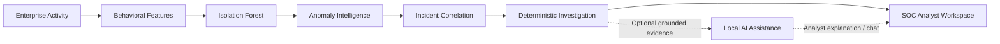
```mermaid
flowchart LR
    A[Enterprise Activity] --> B[Behavioral Features]
    B --> C[Isolation Forest]
    C --> D[Anomaly Intelligence]
    D --> E[Incident Correlation]
    E --> F[Deterministic Investigation]
    F --> G[SOC Analyst Workspace]

    F -. Optional grounded evidence .-> H[Local AI Assistance]
    H -. Analyst explanation / chat .-> G
```

At runtime, an always-on **Event Processor** independently discovers newly committed security events, constructs incremental behavioral features, scores them using the governed **Isolation Forest v1.2** production detector, persists anomaly intelligence, and performs deterministic multi-signal incident correlation.

The result is presented through a routed React-based **Security Operations workspace** where an analyst can move from enterprise posture to incidents, individual anomalies, affected identities, reconstructed timelines, deterministic investigation guidance, model intelligence, runtime architecture, and optional incident-scoped **Local AI** assistance.

> **The simulator generates the world. SENTINEL independently observes, scores, correlates, and investigates it.**

SENTINEL deliberately separates **operational inference** from **controlled evaluation**. Synthetic attack ground truth is never supplied to the production feature vector, anomaly detector, correlation engine, deterministic investigation layer, operational APIs, or Local AI evidence. Ground truth exists only within isolated evaluation workflows.

> **Ground truth belongs to evaluation, never inference.**

The project also separates its two synthetic workflows:

> **The benchmark proves SENTINEL; the live simulator demonstrates SENTINEL.**

The reproducible benchmark evaluates detection and incident recovery against private controlled ground truth, while the live simulator produces evolving ordinary enterprise telemetry that SENTINEL must independently analyze.

---

<p align="center">
  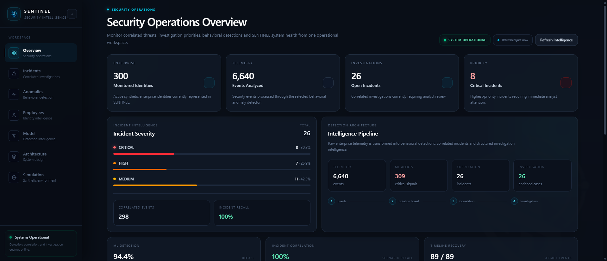
</p>

<p align="center">
  <em>
    SENTINEL Security Operations Overview — behavioral detection, correlated incidents,
    evaluation intelligence, and runtime status in one operational workspace.
  </em>
</p>

---

## Table of Contents

- [Overview](#overview)
- [What SENTINEL Does](#what-sentinel-does)
- [Key Capabilities](#key-capabilities)
- [More Than an Anomaly Detector](#more-than-an-anomaly-detector)
- [Operational and Evaluation Planes](#operational-and-evaluation-planes)
- [System Architecture](#system-architecture)
- [Security Operations Workspace](#security-operations-workspace)
- [Incident Correlation & Deterministic Investigation](#incident-correlation--deterministic-investigation)
- [Behavioral Anomaly Detection & Explainability](#behavioral-anomaly-detection--explainability)
- [Employee & Identity Intelligence](#employee--identity-intelligence)
- [Machine Learning Engineering & Evaluation](#machine-learning-engineering--evaluation)
- [Synthetic Enterprise, Live Simulation & Benchmark Separation](#synthetic-enterprise-live-simulation--benchmark-separation)
- [Optional Grounded Local AI & Ollama](#optional-grounded-local-ai--ollama)
- [MLOps & Production Model Governance](#mlops--production-model-governance)
- [Production Runtime, Docker & Nginx](#production-runtime-docker--nginx)
- [Testing, CI/CD & DevSecOps](#testing-cicd--devsecops)
- [Technology Stack](#technology-stack)
- [Repository Structure](#repository-structure)

<br>

- [Getting Started — Clone, Configure & Run](#getting-started-clone-configure-run)
- [Utilities, Simulation & Controlled Evaluation](#utilities-simulation--controlled-evaluation)
  - [Employee Generator](#employee-generator)
  - [Live Enterprise Simulator](#live-enterprise-simulator-section)
  - [Controlled Reproducible Benchmark](#controlled-reproducible-benchmark)
  - [Historical Event Backfill](#historical-event-backfill)
  - [Advanced Maintenance & Verification Utilities](#advanced-maintenance--verification-utilities)

<br>

- [Ollama Installation & Local AI Verification](#ollama-installation--local-ai-verification)
- [API & Operational Endpoints](#api--operational-endpoints)
- [Design Decisions & Current Limitations](#design-decisions--current-limitations)
- [Troubleshooting](#troubleshooting-section)
- [Release & Versioning](#release--versioning)
- [Author](#author)
- [License](#license)

---

## What SENTINEL Does

SENTINEL is designed around a simple idea:

> **Security telemetry becomes useful only when it can be transformed into context, incidents, investigation, and decision support.**

The platform therefore does more than assign anomaly scores. It connects the complete operational workflow from enterprise activity to analyst investigation.

### From telemetry to investigation


```mermaid
flowchart LR
    A[Enterprise Security Events]
    B[Persistent Event Store]
    C[Always-On Processing]
    D[Behavioral Feature Engineering]
    E[Isolation Forest v1.2]
    F[Anomaly Intelligence]
    G[Multi-Signal Correlation]
    H[Deterministic Investigation]
    I[Analyst Workspace]

    A --> B
    B --> C
    C --> D
    D --> E
    E --> F
    F --> G
    G --> H
    H --> I
```

New events are persisted as ordinary observable telemetry. The always-on **Event Processor** independently discovers them, constructs the production feature set, performs anomaly scoring, persists model output, and evaluates whether related signals should create or update a correlated security incident.

The investigation layer then converts correlated evidence into structured analyst-facing intelligence such as:

- incident summaries
- affected identities
- behavioral indicators
- event timelines
- severity rationale
- key findings
- recommended investigation steps
- analyst questions
- conditional containment guidance

This deterministic workflow remains available regardless of whether the optional **Local AI** integration is enabled.

---

## Key Capabilities

| Area | SENTINEL Capability |
| --- | --- |
| **Security Telemetry** | Persistent enterprise events stored in PostgreSQL and processed independently of the simulator |
| **Behavioral Detection** | Governed **Isolation Forest v1.2** detector using a fixed 17-feature production schema |
| **Incremental Processing** | Always-on Event Processor for newly committed events, anomaly scoring, and incident correlation |
| **Anomaly Intelligence** | Historical anomaly percentile, raw detector context, risk classification, feature signals, and complete recorded feature snapshots |
| **Incident Correlation** | Deterministic multi-signal rules that combine related security activity into investigation-level incidents |
| **Investigation Intelligence** | Structured findings, severity reasoning, indicators, timeline reconstruction, investigation priorities, analyst questions, and response guidance |
| **Identity Intelligence** | Employee-centered security views combining profile context, behavioral baselines, activity, anomalies, risk, and incident relationships |
| **SOC Investigation UX** | Routed React workspaces for operational queues, incidents, anomalies, employees, model intelligence, architecture, and simulation |
| **Synthetic Enterprise** | Live role-driven enterprise activity with configurable simulated time, event generation, and controlled attack campaigns |
| **Controlled Benchmark** | Deterministic seed-based benchmark isolated from the operational database and evaluated against private ground truth |
| **Ground-Truth Isolation** | Synthetic attack labels are excluded from operational Events, production features, scoring, correlation, investigation, APIs, and Local AI evidence |
| **Local AI Assistance** | Optional Ollama-based incident explanation and analyst chat grounded only in controlled deterministic evidence |
| **MLOps Governance** | Production model manifest, artifact integrity checks, feature-order enforcement, preprocessing validation, and model lineage |
| **Runtime Observability** | Persistent processor state, health, heartbeat, counters, detector lineage, backlog, simulation state, and operational status APIs |
| **Production Packaging** | Dockerized FastAPI backend, Event Processor, PostgreSQL, and Nginx-served React frontend |
| **Automated Testing** | Isolated backend, frontend, integration, and production-style browser E2E test environments |
| **CI/CD & DevSecOps** | GitHub Actions gates for versioning, secrets, dependencies, static security, containers, model governance, backend, frontend, and E2E validation |

---

## More Than an Anomaly Detector

A central design goal of SENTINEL is to avoid treating anomaly detection as the final answer.

A single unusual event may not provide enough context for an analyst. SENTINEL therefore separates several stages that are often collapsed into one:


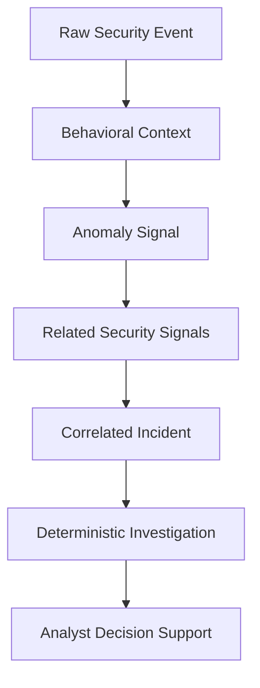
```mermaid
flowchart TD
    A[Raw Security Event]
    B[Behavioral Context]
    C[Anomaly Signal]
    D[Related Security Signals]
    E[Correlated Incident]
    F[Deterministic Investigation]
    G[Analyst Decision Support]

    A --> B
    B --> C
    C --> D
    D --> E
    E --> F
    F --> G
```

This separation allows the platform to distinguish between:

- **unusual behavior** detected by machine learning
- **incident context** created by correlation
- **investigation reasoning** generated deterministically
- **human-readable explanation** optionally produced by Local AI

The machine-learning model therefore does not decide whether an employee is compromised, and the language model does not decide whether an incident exists.


Each layer has a deliberately bounded responsibility.

---

## Operational and Evaluation Planes

SENTINEL keeps its live operational workflow separate from its controlled evaluation workflow.

### Operational Plane

The operational system works only with observable enterprise telemetry:

```text
Events
  → Feature Engineering
  → Isolation Forest
  → Anomaly Intelligence
  → Incident Correlation
  → Deterministic Investigation
  → Analyst Workspace
```

### Evaluation Plane

The controlled benchmark maintains private synthetic truth for measuring system performance:

```text
Controlled Synthetic Campaigns
  → Private Ground Truth
  → Benchmark Scoring
  → Detection Evaluation
  → Incident Recovery Evaluation
```

Private benchmark or simulator labels are not supplied to operational inference.

This separation allows SENTINEL to evaluate known synthetic attacks without leaking the answer into the detector being evaluated.

> **The benchmark proves SENTINEL; the live simulator demonstrates SENTINEL.**

---

## System Architecture

SENTINEL is organized around a deliberately separated operational pipeline.

The simulator, machine-learning detector, correlation engine, deterministic investigation layer, API, frontend, benchmark environment, and optional Local AI each have distinct responsibilities.

<p align="center">
  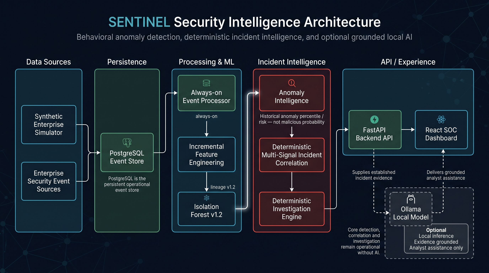
</p>

<p align="center">
  <em>
    SENTINEL v1.0.0 architecture — continuously processed enterprise telemetry,
    governed behavioral detection, deterministic incident intelligence,
    and optional grounded Local AI.
  </em>
</p>

---

### Architecture at a Glance

The primary operational path is:


```mermaid
flowchart LR
    A[Enterprise Event Sources]
    B[(PostgreSQL)]
    C[Always-On Event Processor]
    D[Incremental Feature Engineering]
    E[Isolation Forest v1.2]
    F[Anomaly Intelligence]
    G[Deterministic Multi-Signal Correlation]
    H[Deterministic Investigation]
    I[FastAPI]
    J[React SOC Workspace]

    A --> B
    B --> C
    C --> D
    D --> E
    E --> F
    F --> G
    G --> H
    H --> I
    I --> J
```

The core pipeline remains operational without either the simulator or the Local AI layer.

The simulator is an **event source**, not part of the detection logic.

Ollama is an **optional analyst-assistance layer**, not part of anomaly detection, incident creation, severity assignment, or deterministic investigation.

---

### Always-On Event Processing

A persistent **Event Processor** is responsible for continuously discovering newly committed events and moving them through the operational pipeline.

Its responsibilities include:

1. discovering new `Event` rows
2. reconstructing the required behavioral context
3. generating the canonical production feature vector
4. scoring the event with the selected detector
5. persisting `AnomalyScore` intelligence
6. evaluating deterministic incident-correlation rules
7. creating or updating correlated incidents
8. maintaining persistent runtime state and health information

Conceptually:

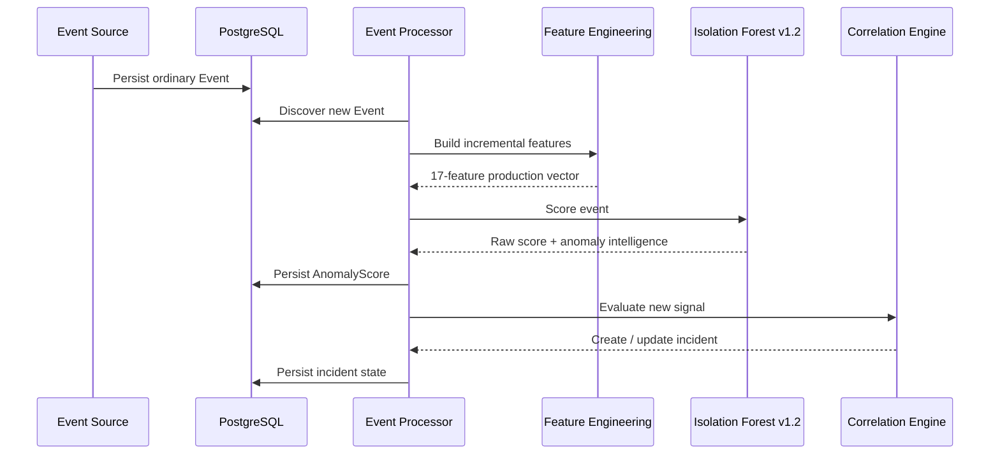
```mermaid
sequenceDiagram
    participant S as Event Source
    participant DB as PostgreSQL
    participant P as Event Processor
    participant F as Feature Engineering
    participant M as Isolation Forest v1.2
    participant C as Correlation Engine

    S->>DB: Persist ordinary Event
    P->>DB: Discover new Event
    P->>F: Build incremental features
    F-->>P: 17-feature production vector
    P->>M: Score event
    M-->>P: Raw score + anomaly intelligence
    P->>DB: Persist AnomalyScore
    P->>C: Evaluate new signal
    C-->>P: Create / update incident
    P->>DB: Persist incident state
```

The processor runs independently of the simulator.

Stopping the simulator therefore stops only the creation of new synthetic activity. It does **not** stop SENTINEL's backend, Event Processor, existing investigations, APIs, or frontend.

> **Stopping the simulator does not stop SENTINEL.**

---

### Operational Data Plane

The operational data plane contains only information that SENTINEL would be allowed to observe in a real monitoring environment.

This includes:

- employee identity and behavioral baselines
- authentication activity
- file activity
- network activity
- timestamps
- source and destination context
- transfer volumes
- incremental behavioral features
- anomaly scores
- incidents
- incident-event relationships
- deterministic investigation output
- runtime state

Operational inference does **not** receive synthetic attack labels.

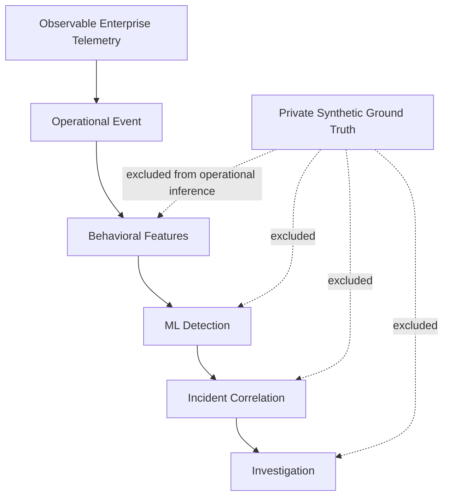
```mermaid
flowchart TD
    A[Observable Enterprise Telemetry]
    B[Operational Event]
    C[Behavioral Features]
    D[ML Detection]
    E[Incident Correlation]
    F[Investigation]

    A --> B
    B --> C
    C --> D
    D --> E
    E --> F

    X[Private Synthetic Ground Truth]

    X -. excluded from operational inference .-> C
    X -. excluded .-> D
    X -. excluded .-> E
    X -. excluded .-> F
```

This prevents the detector or downstream investigation pipeline from learning the answer from the simulation framework that generated the scenario.

---

### Simulator Boundary

The live simulator exists to generate an evolving enterprise environment.

It can produce:

- normal employee activity
- authentication events
- file activity
- network activity
- role-driven behavioral patterns
- simulated working-hour behavior
- controlled security campaigns
- configurable simulated time
- configurable event rates
- configurable attack-campaign rates

Its operational responsibility ends when it writes an ordinary `Event` row.

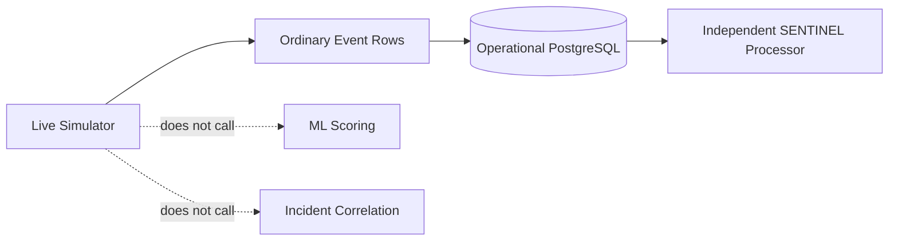
```mermaid
flowchart LR
    A[Live Simulator]
    B[Ordinary Event Rows]
    C[(Operational PostgreSQL)]
    D[Independent SENTINEL Processor]

    A --> B
    B --> C
    C --> D

    A -. does not call .-> X[ML Scoring]
    A -. does not call .-> Y[Incident Correlation]
```

The simulator does not directly invoke:

- feature engineering
- anomaly scoring
- incident correlation
- deterministic investigation
- Local AI

This boundary allows the platform to demonstrate whether SENTINEL can independently recognize suspicious behavior rather than simply reacting to simulator instructions.

> **The simulator generates the world. SENTINEL independently observes, scores, correlates, and investigates it.**

---

### Benchmark Boundary

The controlled benchmark serves a different purpose from the live simulator.

The benchmark is a reproducible evaluation environment designed to answer:

> **How well does the detector and incident pipeline recover known controlled security scenarios?**

It operates against its own isolated PostgreSQL environment and private ground truth.

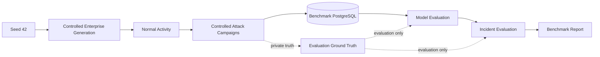
```mermaid
flowchart LR
    A[Seed 42]
    B[Controlled Enterprise Generation]
    C[Normal Activity]
    D[Controlled Attack Campaigns]
    E[(Benchmark PostgreSQL)]
    F[Model Evaluation]
    G[Incident Evaluation]
    H[Benchmark Report]

    A --> B
    B --> C
    C --> D
    D --> E
    E --> F
    F --> G
    G --> H

    D -. private truth .-> T[Evaluation Ground Truth]
    T -. evaluation only .-> F
    T -. evaluation only .-> G
```

The benchmark database is separate from the operational database.

Running the benchmark therefore does not:

- alter the live employee population
- pollute operational event history
- modify the live Event Processor state
- create operational incidents
- change live runtime health

The two workflows are intentionally different:

> **The benchmark proves SENTINEL; the live simulator demonstrates SENTINEL.**

---

### Ground Truth Belongs to Evaluation

SENTINEL treats synthetic ground truth as privileged evaluation metadata.

Legacy ground-truth fields were removed from the operational `Event` model and database schema.

Private truth is stored separately and may be used only by controlled evaluation workflows.

The selected production feature schema contains **17 features** and no ground-truth fields.

This separation is enforced across:

- production feature engineering
- model scoring
- Event Processor logic
- incident correlation
- incident persistence
- deterministic investigation
- operational APIs
- anomaly analysis
- Local AI evidence

> **Ground truth belongs to evaluation, never inference.**

---

### Deterministic Security Core

SENTINEL intentionally keeps its security decision pipeline deterministic after machine-learning scoring.

The Isolation Forest identifies unusual behavior.

It does **not** decide that an attack occurred.

The correlation engine evaluates observable signals and relationships.

The deterministic investigation layer then converts established incident evidence into structured investigation intelligence.

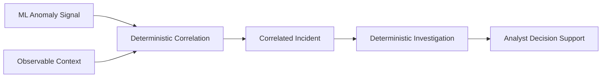
```mermaid
flowchart LR
    A[ML Anomaly Signal]
    B[Observable Context]
    C[Deterministic Correlation]
    D[Correlated Incident]
    E[Deterministic Investigation]
    F[Analyst Decision Support]

    A --> C
    B --> C
    C --> D
    D --> E
    E --> F
```

This provides an inspectable boundary between:

- **machine-learning detection**
- **security correlation**
- **investigation reasoning**
- **optional generative explanation**

The platform can therefore continue to detect, correlate, reconstruct, and investigate incidents even when no language model is available.

---

### Optional Local AI Boundary

Local AI operates only after deterministic evidence already exists.

The Local AI layer receives a controlled representation of established incident evidence through the FastAPI backend.

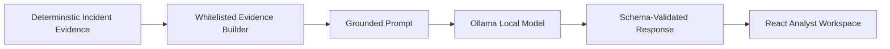
```mermaid
flowchart LR
    A[Deterministic Incident Evidence]
    B[Whitelisted Evidence Builder]
    C[Grounded Prompt]
    D[Ollama Local Model]
    E[Schema-Validated Response]
    F[React Analyst Workspace]

    A --> B
    B --> C
    C --> D
    D --> E
    E --> F
```

The language model does **not** control:

- anomaly detection
- anomaly scoring
- risk classification
- incident creation
- incident correlation
- severity assignment
- deterministic investigation logic

Instead, it provides optional:

- incident explanation
- structured analyst summaries
- investigation assistance
- incident-scoped conversational analysis

The Local AI service is therefore an enhancement to the analyst experience rather than a dependency of the security pipeline.

---

### Runtime Service Model

The standard Docker Compose runtime contains four always-on services:

```text
postgres
backend
event-processor
frontend
```

Their responsibilities are separated:

| Service | Responsibility |
| --- | --- |
| **PostgreSQL** | Persistent operational security state |
| **Backend** | FastAPI APIs, investigation services, runtime intelligence, model access |
| **Event Processor** | Independent incremental feature engineering, anomaly scoring, and incident correlation |
| **Frontend** | Production React SOC workspace served through Nginx |

Additional capabilities are exposed through optional Compose profiles:

| Profile | Services / Purpose |
| --- | --- |
| **simulation** | Live synthetic enterprise activity |
| **benchmark** | Isolated controlled benchmark and dedicated benchmark database |
| **utilities** | One-shot operational utilities such as employee generation and historical backfill |

Ollama remains **host-managed and optional** rather than being bundled into the core SENTINEL runtime.

---

### Runtime Observability

SENTINEL does not infer platform health by inspecting the Docker socket.

Operational state is persisted and exposed through application-level runtime telemetry.

The Event Processor maintains information such as:

- operational state
- worker identity
- runtime version
- activation time
- heartbeat
- selected detector lineage
- events processed
- anomaly scores created
- incidents created
- incidents updated
- live processing backlog
- most recent processing error

Runtime health can therefore be reasoned about from SENTINEL's own state rather than from container existence alone.

Simulation status is intentionally tracked separately from core platform health.

This means:

```text
Simulator STOPPED
        ≠
SENTINEL unhealthy
```

---

### Core Architectural Principles

| Principle | Meaning |
| --- | --- |
| **Independent Detection** | Event sources generate telemetry; SENTINEL independently decides what is unusual |
| **No Ground-Truth Leakage** | Synthetic attack labels never enter the operational feature or investigation pipeline |
| **Deterministic Core** | Incident correlation and investigation remain inspectable and do not depend on an LLM |
| **Evidence Before AI** | Generative AI receives established deterministic evidence rather than raw unrestricted system state |
| **Benchmark Isolation** | Controlled evaluation cannot contaminate operational state |
| **Canonical Model Boundary** | Production scoring uses one governed selected-detector contract |
| **Persistent Runtime State** | Processor health and lineage are stored as application state |
| **Simulator Independence** | SENTINEL continues operating when the simulator is stopped |
| **Explicit Backfill** | Historical processing is separate from live Event Processor behavior |
| **Appropriate Complexity** | The architecture avoids distributed infrastructure that the current scale does not require |
| **Local-First AI** | Optional analyst AI can run through Ollama without a paid external AI dependency |
| **Observable Boundaries** | Simulator, benchmark, operational inference, deterministic intelligence, and Local AI remain architecturally distinct |

These boundaries are deliberate.

SENTINEL is designed not as a collection of disconnected ML, backend, frontend, and simulation components, but as a system in which **each layer has a clearly defined responsibility and trust boundary**.

---

## Security Operations Workspace

SENTINEL presents its detection and investigation pipeline through a routed Security Operations workspace designed around how an analyst actually moves through security evidence.

The frontend is not a collection of disconnected charts.

It is structured around a progression from:

```text
Enterprise posture
    → prioritized security activity
    → correlated incidents
    → individual detections
    → affected identities
    → investigation context
```

The interface therefore separates **operational queues** from **dedicated investigation workspaces**, allowing analysts to move between high-level posture and detailed evidence without losing context.

---

### Analyst-Centered Information Architecture

The application uses stable routed workspaces rather than keeping investigation state inside a single dashboard page.

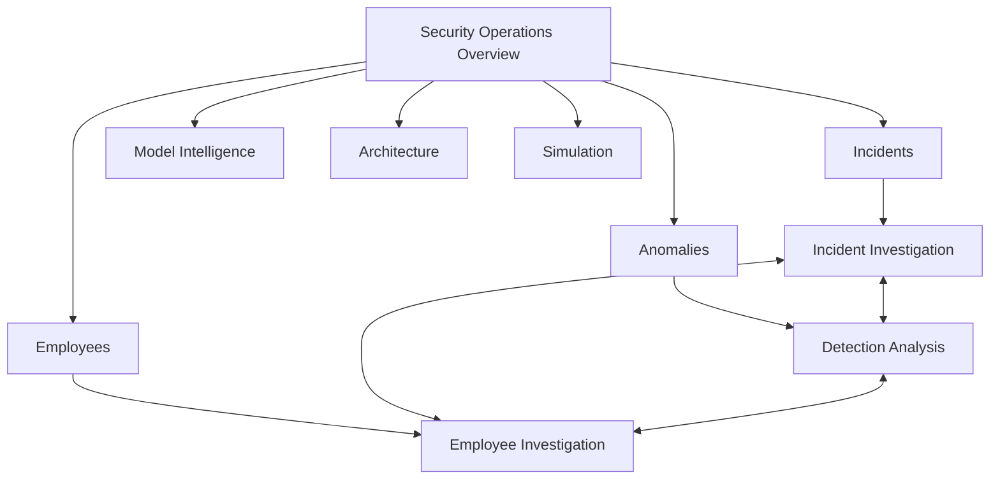
```mermaid
flowchart TD
    O[Security Operations Overview]

    O --> I[Incidents]
    O --> A[Anomalies]
    O --> E[Employees]
    O --> M[Model Intelligence]
    O --> R[Architecture]
    O --> S[Simulation]

    I --> ID[Incident Investigation]
    A --> AD[Detection Analysis]
    E --> ED[Employee Investigation]

    ID <--> AD
    ID <--> ED
    AD <--> ED
```

Primary routes include:

```text
/                           Security Operations Overview

/incidents                  Incident operations queue
/incidents/:incidentId      Incident investigation workspace

/anomalies                  Behavioral detection queue
/anomalies/:eventId         Detection analysis workspace

/employees                  Identity intelligence directory
/employees/:userId          Employee investigation workspace

/model                      Model intelligence
/architecture               Runtime and system architecture
/simulation                 Synthetic environment visibility
```

This route model gives each major investigation object a stable location and allows direct navigation, browser history, deep links, reloads, and cross-investigation workflows to behave naturally.

---

### Security Operations Overview

The Overview workspace provides the highest-level view of the current security environment.

It brings together:

- monitored identities
- analyzed event volume
- open and critical incidents
- incident severity distribution
- correlated event volume
- production detection context
- model and incident evaluation intelligence
- recent prioritized incidents
- platform runtime status
- manual and automatic intelligence refresh

The purpose of the page is not to expose every available record.

Instead, it provides an operational starting point from which an analyst can identify what requires attention and move directly into deeper investigation.

---

### Incident Operations Queue

The `/incidents` workspace is a dedicated queue for correlated security cases.

<p align="center">
  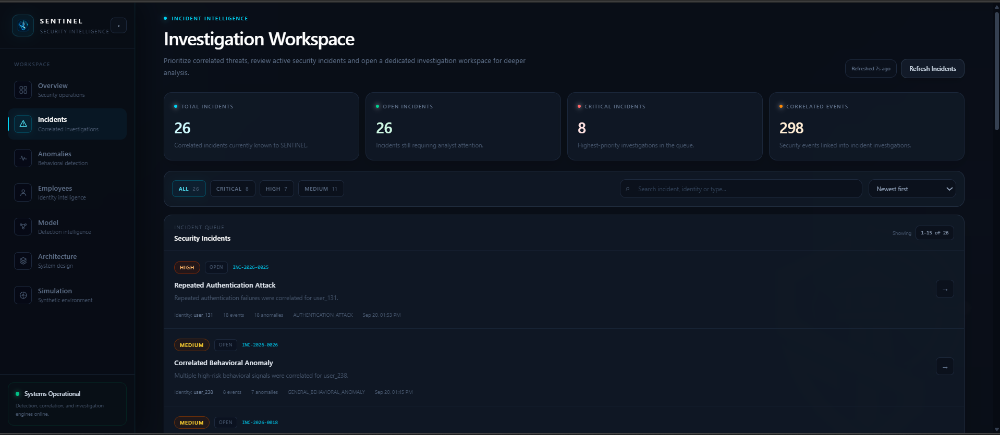
</p>

<p align="center">
  <em>
    Incident Operations — correlated investigations prioritized by severity,
    operational state, and security context.
  </em>
</p>

The queue provides:

- incident search
- severity filtering
- sorting
- pagination
- operational KPI cards
- affected identities
- incident types
- correlated event counts
- severity-aware presentation
- explicit refresh
- last-refreshed state
- direct navigation into investigation workspaces

Queue browsing is intentionally separated from investigation-detail rendering.

Selecting an incident opens its dedicated route:

```text
/incidents/:incidentId
```

This keeps the queue focused on triage while allowing the detail workspace to concentrate on investigation.

---

### Behavioral Detection Queue

The `/anomalies` workspace provides a ranked view of behavioral detections produced by the selected production detector.

It includes:

- anomaly search
- risk-level filtering
- server-side pagination
- model summary context
- risk distribution
- configured alert threshold
- event identity
- affected user
- detection percentile
- severity-aware presentation
- direct navigation into individual detection analysis

Selecting a detection opens:

```text
/anomalies/:eventId
```

The queue therefore remains an operational detection surface rather than trying to display every feature and explanation inline.

---

### Identity Intelligence Workspace

SENTINEL also supports investigation from the perspective of the affected identity.

The `/employees` workspace provides:

- workforce search
- department context
- behavioral risk summaries
- anomaly indicators
- incident context
- links into individual employee investigations

Selecting an employee opens:

```text
/employees/:userId
```

This adds an entity-centered investigation path alongside the incident-centered and event-centered workflows.

An analyst can therefore ask not only:

> **What happened in this incident?**

but also:

> **What has been happening around this identity over time?**

---

### Routed Investigation Workspaces

Detailed investigation is intentionally moved away from queue pages.

Each investigation object receives its own workspace:

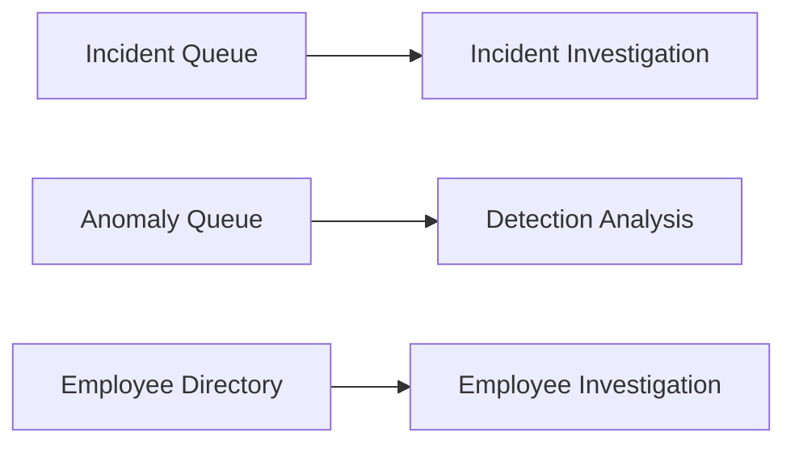
```mermaid
flowchart LR
    IQ[Incident Queue]
    ID[Incident Investigation]

    AQ[Anomaly Queue]
    AD[Detection Analysis]

    EQ[Employee Directory]
    ED[Employee Investigation]

    IQ --> ID
    AQ --> AD
    EQ --> ED
```

This allows each detailed workspace to expose richer context without overwhelming its corresponding queue.

Dedicated investigation routes also support:

- direct URL access
- browser Back / Forward
- deep-link reloads
- stable nested navigation
- object-specific not-found states
- investigation-specific loading and failure handling

---

### Cross-Linked Investigation

One of the most important frontend behaviors is that incidents, anomaly detections, and identities are not treated as isolated records.

They are connected investigation objects.

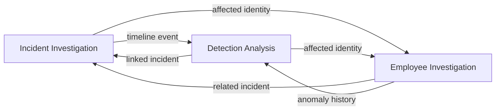
```mermaid
flowchart LR
    I[Incident Investigation]
    A[Detection Analysis]
    E[Employee Investigation]

    I -- timeline event --> A
    A -- linked incident --> I

    I -- affected identity --> E
    E -- related incident --> I

    E -- anomaly history --> A
    A -- affected identity --> E
```

Examples include:

- selecting a scored event from an incident timeline opens its anomaly analysis
- selecting a linked incident from an anomaly page returns to the correlated investigation
- affected identities can be opened from incident context
- employee investigation surfaces related anomalies and incidents
- analysts can move from identity → anomaly → incident and back again

This creates an investigation graph rather than a collection of independent pages.

---

### Live but Stable Operational Refresh

SENTINEL deliberately uses different refresh behavior for different kinds of workspaces.

High-context investigation pages remain current through silent background refresh:

```text
Overview             → automatic + manual refresh
Incident Detail      → automatic + manual refresh
Anomaly Detail       → automatic + manual refresh
```

Operational queues use explicit refresh:

```text
Incidents Queue      → manual refresh
Anomalies Queue      → manual refresh
```

The distinction is intentional.

An investigation workspace benefits from receiving updated intelligence while an analyst is already examining an incident.

A queue, however, should not constantly reshuffle while the analyst is browsing, searching, filtering, or deciding what to open next.

For automatically refreshed workspaces:

- existing information remains visible
- page position remains stable
- the workspace does not return to its initial loading state
- successful refresh updates the last-refreshed indicator
- failed background refreshes preserve the previous valid data

This allows the interface to remain operationally current without becoming visually unstable.

---

### Local AI Session Continuity

Local AI output is scoped to the incident being investigated.

SENTINEL uses lightweight browser-session persistence so completed Local AI investigation results and analyst conversations can survive navigation during the same browser session.

Conceptually:

```text
Incident A
  ├── AI Investigator result
  └── AI Analyst conversation

Incident B
  ├── independent AI Investigator result
  └── independent AI Analyst conversation
```

Returning to a previously investigated incident restores its last known-good Local AI state.

Temporary states such as:

- loading
- timeout
- failed generation
- incomplete questions

are not treated as persisted analyst intelligence.

Local AI runtime availability also remains a live system state rather than a cached assumption.

---

### Resilience and Failure States

Operational software must remain understandable when something goes wrong.

The SENTINEL frontend includes dedicated handling for:

- initial loading
- API failure
- background refresh failure
- invalid incident IDs
- invalid anomaly IDs
- invalid employee routes
- unknown application routes
- Local AI unavailable
- Local AI timeout
- malformed AI responses
- retryable AI failures

Unknown application routes render a dedicated SENTINEL not-found workspace rather than silently redirecting the user elsewhere.

Likewise, invalid investigation identifiers produce object-specific failure states rather than presenting unrelated data.

For background failures, previously valid operational information remains visible wherever possible.

---

### Frontend Design Philosophy

The frontend intentionally avoids unnecessary architectural complexity.

Its core architecture uses:

```text
React
TypeScript
React Router
Tailwind CSS
REST APIs
sessionStorage for optional Local AI continuity
```

No global state-management framework, message broker, or distributed frontend data layer was introduced simply for architectural appearance.

Instead, the interface is organized around:

- routed security objects
- reusable operational components
- explicit API boundaries
- context-aware refresh behavior
- resilient failure states
- predictable analyst navigation

The result is a frontend designed to support investigation rather than merely visualize backend data.

> **SENTINEL's interface is built around the investigation path: posture → incident → evidence → identity → context.**

---

## Incident Correlation & Deterministic Investigation

An anomalous event is not automatically a security incident.

SENTINEL deliberately separates **behavioral anomaly detection** from **security incident reasoning**.

The Isolation Forest answers:

> **How unusual is this event relative to learned historical behavior?**

The correlation engine asks a different question:

> **Do this event and other observable signals form a meaningful security pattern?**

The deterministic investigation layer then asks:

> **What evidence exists, why was this incident formed, and what should an analyst examine next?**

This creates a layered security-intelligence pipeline:

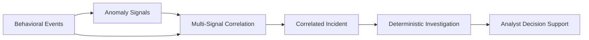
```mermaid
flowchart LR
    A[Behavioral Events]
    B[Anomaly Signals]
    C[Multi-Signal Correlation]
    D[Correlated Incident]
    E[Deterministic Investigation]
    F[Analyst Decision Support]

    A --> B
    B --> C
    A --> C
    C --> D
    D --> E
    E --> F
```

Machine learning therefore contributes evidence without becoming the final security decision-maker.

---

### Multi-Signal Incident Correlation

SENTINEL uses a deterministic correlation engine to combine related security signals into investigation-level incidents.

Correlation evaluates observable context such as:

- affected identity
- temporal proximity
- authentication behavior
- failed-login activity
- source-IP deviation
- file interactions
- outbound transfer volume
- sensitive-resource access
- network destination fan-out
- anomaly severity
- relationships between nearby events

Rather than treating each elevated anomaly as an independent alert, the engine attempts to reconstruct the broader security pattern surrounding the activity.

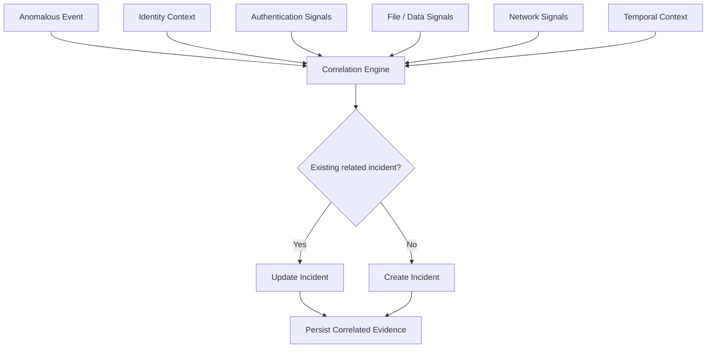
```mermaid
flowchart TD
    A[Anomalous Event]
    B[Identity Context]
    C[Authentication Signals]
    D[File / Data Signals]
    E[Network Signals]
    F[Temporal Context]

    A --> G[Correlation Engine]
    B --> G
    C --> G
    D --> G
    E --> G
    F --> G

    G --> H{Existing related incident?}

    H -- Yes --> I[Update Incident]
    H -- No --> J[Create Incident]

    I --> K[Persist Correlated Evidence]
    J --> K
```

This allows SENTINEL to reason across multiple events instead of relying on a single model score.

---

### Incident Types

The deterministic correlation layer currently recognizes security patterns including:

| Incident Type | Purpose |
| --- | --- |
| `AUTHENTICATION_ATTACK` | Repeated authentication-failure patterns consistent with brute-force behavior |
| `POTENTIAL_ACCOUNT_COMPROMISE` | Authentication and subsequent activity indicating possible account takeover |
| `SUSPICIOUS_DATA_TRANSFER` | Unusual outbound transfer and file-access behavior |
| `NETWORK_RECONNAISSANCE` | Rapid destination fan-out and scanning-like network activity |
| `PRIVILEGED_ACCESS_ANOMALY` | Sensitive or privileged activity outside expected behavioral context |
| `GENERAL_BEHAVIORAL_ANOMALY` | Elevated behavioral activity that warrants investigation but does not satisfy a more specific incident pattern |

These are correlation outcomes derived from observable telemetry.

They are **not simulator scenario labels** and are not copied from private benchmark ground truth.

---

### Incremental Correlation

Incident correlation is part of the live Event Processor workflow.

New anomaly intelligence can therefore create or update an incident without rerunning an offline full-history correlation script.

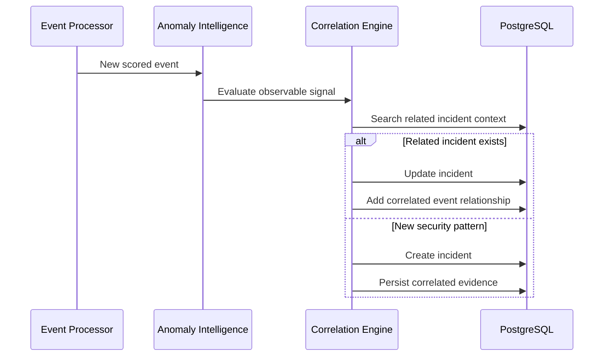
```mermaid
sequenceDiagram
    participant P as Event Processor
    participant A as Anomaly Intelligence
    participant C as Correlation Engine
    participant DB as PostgreSQL

    P->>A: New scored event
    A->>C: Evaluate observable signal
    C->>DB: Search related incident context

    alt Related incident exists
        C->>DB: Update incident
        C->>DB: Add correlated event relationship
    else New security pattern
        C->>DB: Create incident
        C->>DB: Persist correlated evidence
    end
```

The same production correlation and persistence services are also reused by controlled benchmark evaluation rather than maintaining a second benchmark-only incident implementation.
This reduces the risk of evaluating different logic from the logic used operationally.

---

### Correlation Lineage

Incidents preserve the lineage of the components responsible for generating them.
Current canonical lineage includes:

```text
Detector
  isolation-forest 1.2

Correlation Engine
  multi-signal-rules 1.0
```

Persisted lineage allows an incident to remain attributable to the detector and correlation engine that actually produced it.

This becomes especially important when models or correlation logic evolve over time.

A historical incident should not silently appear to have been generated by a newer detector simply because the currently selected production model has changed.

---

### Incident Investigation Workspace

Selecting an incident opens a dedicated investigation route:

```text
/incidents/:incidentId
```

<p align="center">
  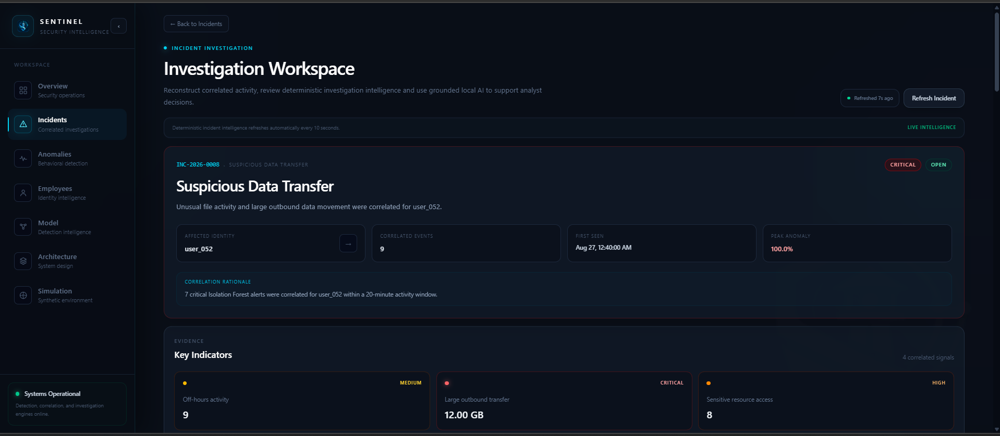
</p>

<p align="center">
  <em>
    Incident Investigation — correlated evidence, affected identity,
    key indicators, severity context, and investigation navigation.
  </em>
</p>

The workspace brings together:

- incident identity and type
- severity and operational state
- affected employee
- correlated-event count
- peak anomaly context
- correlation rationale
- key behavioral indicators
- event timeline
- deterministic investigation findings
- recommended investigation workflow
- decision-support questions
- conditional containment guidance
- optional Local AI assistance

The goal is to transform a correlated alert into an evidence-centered investigation workspace.

---

### Timeline Reconstruction

A correlated incident is not represented only as a summary.

SENTINEL reconstructs the underlying sequence of related activity so the analyst can examine how the security pattern developed over time.

<p align="center">
  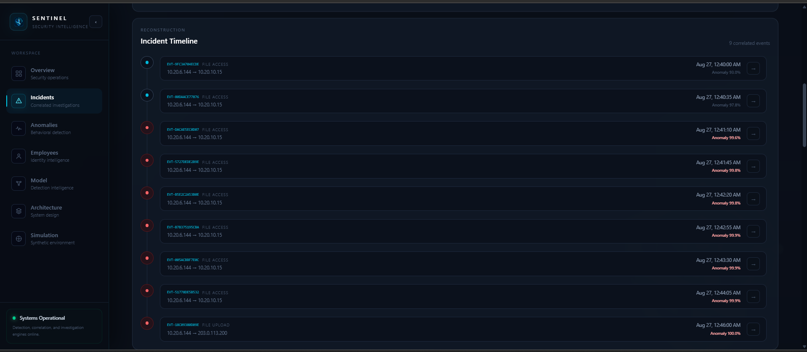
</p>

<p align="center">
  <em>
    Correlated incident timeline — security events remain individually inspectable
    and can be opened directly in the anomaly-analysis workspace.
  </em>
</p>

Timeline entries preserve event-level evidence such as:

- timestamp
- event type
- source context
- destination context
- affected identity
- anomaly intelligence
- risk level
- relationship to the surrounding incident

Scored timeline events are also investigation links.

An analyst can move directly from:

```
Incident
    ↓
Timeline Event
    ↓
Detection Analysis
```

and then return through the detection's linked-incident context.

This keeps incident reasoning traceable back to individual observable events.

---

### Deterministic Investigation Engine

After correlation, SENTINEL generates structured investigation intelligence through deterministic logic.

<p align="center">
  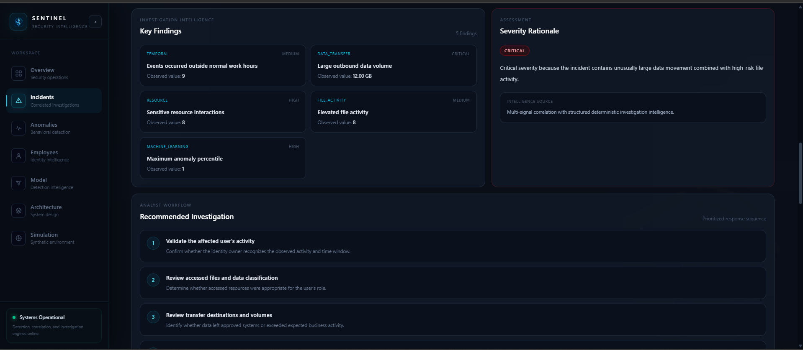
</p>

<p align="center">
  <em>
    Deterministic Investigation — evidence-based findings, severity reasoning,
    structured intelligence, and recommended analyst actions.
  </em>
</p>

The investigation engine produces information including:

- executive incident summary
- severity rationale
- key behavioral findings
- observable indicators
- prioritized investigation steps
- analyst questions
- conditional containment guidance

The output is derived from known incident evidence and predefined security reasoning.

No language model is required.

---

### From Evidence to Analyst Guidance

The deterministic investigation process can be viewed as a transformation from raw correlated evidence into increasingly useful analyst context:

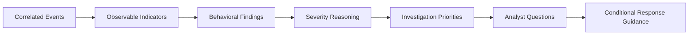
```mermaid
flowchart LR
    A[Correlated Events]
    B[Observable Indicators]
    C[Behavioral Findings]
    D[Severity Reasoning]
    E[Investigation Priorities]
    F[Analyst Questions]
    G[Conditional Response Guidance]

    A --> B
    B --> C
    C --> D
    D --> E
    E --> F
    F --> G
```

This makes the investigation layer inspectable.

An analyst can understand:

- which evidence contributed to the incident
- which behaviors were considered significant
- why the incident received its severity
- what should be verified next
- which response actions may be appropriate if the evidence is confirmed

---

### Why Deterministic Investigation Matters

SENTINEL intentionally does **not** delegate core investigation logic to a language model.

A generative model can help explain evidence, but it should not be the only component deciding:

- what an incident contains
- why an event belongs to an incident
- which severity was assigned
- which evidence actually exists
- whether a security pattern was detected

Keeping this layer deterministic provides:

| Property | Benefit |
| --- | --- |
| **Inspectability** | Investigation findings can be traced to established system evidence |
| **Repeatability** | The same incident state produces consistent deterministic reasoning |
| **Graceful AI Failure** | Core investigation continues even when Ollama is unavailable |
| **Evidence Control** | Security reasoning is not dependent on unrestricted model generation |
| **Clear Trust Boundary** | Generative AI explains evidence after the core system has established it |
| **Testability** | Investigation behavior can be validated through automated tests |

This also creates a clean architectural handoff to the optional Local AI layer:

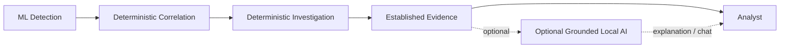
```mermaid
flowchart LR
    A[ML Detection]
    B[Deterministic Correlation]
    C[Deterministic Investigation]
    D[Established Evidence]
    E[Optional Grounded Local AI]
    F[Analyst]

    A --> B
    B --> C
    C --> D
    D --> F
    D -. optional .-> E
    E -. explanation / chat .-> F
```

The analyst never needs Local AI in order to access the underlying investigation.

---

### Detection and Correlation Are Evaluated Separately

SENTINEL also evaluates event-level ML detection separately from incident-level recovery.

This distinction matters because a security campaign may contain multiple related events.

Some individual events may be less anomalous than others, while the complete sequence can still provide enough observable evidence for correlation to reconstruct the incident.

```text
Individual behavioral signals
            ↓
     anomaly detection
            ↓
     correlated context
            ↓
      security incident
            ↓
   timeline reconstruction
```

This means model performance and incident-recovery performance answer different questions:

**Model evaluation**

> How effectively did the detector identify unusual attack-related events?

**Incident evaluation**

> How effectively did the complete security pipeline reconstruct the controlled attack campaigns?

The final controlled benchmark results for these layers are presented separately in the **Machine Learning & Evaluation** section later in this README.

---

### Incident Intelligence Design Principle

SENTINEL's incident architecture can be summarized as:

> **Detect unusual behavior with machine learning. Correlate security context deterministically. Preserve the evidence. Investigate the incident transparently.**

This separation prevents an anomaly score from being treated as a verdict and keeps the full path from telemetry to investigation visible to the analyst.

---

## Behavioral Anomaly Detection & Explainability

SENTINEL uses machine learning to identify behavioral activity that differs from an employee's learned historical context.

The production detector is:

```text
Algorithm          Isolation Forest
Detector           isolation-forest
Version            1.2
Selected Experiment V1
Feature Count      17
Estimators         300
Random State       42
Alert Threshold    99th historical percentile
Feature Schema     1.0
```

The detector is intentionally **unsupervised**.

It does not learn synthetic attack labels and does not attempt to classify an event directly as malicious or benign.

Instead, it identifies behavioral deviation and produces anomaly intelligence that can be combined with surrounding security context.

---

### Detection Pipeline

Each newly committed event is processed using the same governed production feature architecture used by the selected detector.

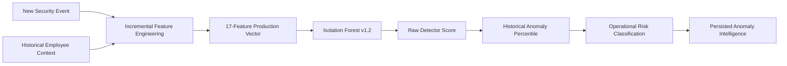
```mermaid
flowchart LR
    A[New Security Event]
    B[Historical Employee Context]
    C[Incremental Feature Engineering]
    D[17-Feature Production Vector]
    E[Isolation Forest v1.2]
    F[Raw Detector Score]
    G[Historical Anomaly Percentile]
    H[Operational Risk Classification]
    I[Persisted Anomaly Intelligence]

    A --> C
    B --> C
    C --> D
    D --> E
    E --> F
    F --> G
    G --> H
    H --> I
```

Feature generation uses observable behavior available before or at the time of the event.

Synthetic scenario labels are never part of the production feature vector.

---

### Historical Anomaly Percentile — Not Attack Probability

One of the most important interpretation rules in SENTINEL is:

```text
99.8% anomaly percentile
            ≠
99.8% probability of attack
```

The anomaly percentile represents **how unusual the event is relative to the learned historical behavioral distribution**.

A very high percentile means that the event is among the most behaviorally unusual events according to the selected model.

It does **not** prove that:

- an account has been compromised
- an attack has occurred
- the employee is malicious
- the event has a corresponding probability of compromise

This distinction is maintained across the frontend, deterministic investigation layer, benchmark interpretation, and Local AI prompts.

> **SENTINEL's anomaly score is a historical anomaly percentile, not a malicious-event probability.**

---

### Production Feature Architecture

The selected production detector uses a fixed **17-feature behavioral schema**.

The feature set combines immediate event attributes with short-window behavioral context.

| Feature Group | Features |
| --- | --- |
| **Time Context** | `hour_sin`, `hour_cos`, `outside_work_hours` |
| **Identity / Baseline Context** | `source_ip_is_baseline`, `remote_work_probability`, `success` |
| **Data Volume** | `bytes_sent`, `bytes_received`, `total_bytes`, `data_volume_ratio` |
| **Authentication Context** | `failed_logins_10m` |
| **Activity Velocity** | `events_5m`, `file_events_30m`, `network_events_5m` |
| **Network Breadth** | `unique_destinations_5m` |
| **Rolling Transfer Context** | `bytes_sent_30m`, `bytes_received_30m` |

The selected model deliberately uses a compact feature representation rather than maximizing feature count.

Feature ordering is governed as part of the production model contract so an event cannot silently be scored using a reordered or incompatible schema.

---

### Incremental Feature Engineering

The same core feature-construction logic supports both historical model evaluation and live operational scoring.

For live events, feature engineering reconstructs recent observable context around the affected employee.

Examples include:

```text
Current event
    +
Recent authentication behavior
    +
Recent file activity
    +
Recent network activity
    +
Recent transfer volume
    +
Identity baseline context
    =
Production feature vector
```

This enables the always-on Event Processor to score each newly discovered event using context that existed at that point in the event stream.

The operational feature builder defaults to excluding evaluation-only metadata.

This keeps benchmark metadata and simulator ground truth outside the production inference path.

---

### Detection Analysis Workspace

Each scored event can be opened in a dedicated route:

```text
/anomalies/:eventId
```

<p align="center">
  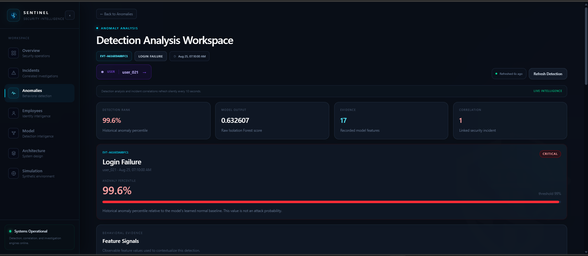
</p>

<p align="center">
  <em>
    Detection Analysis — event identity, anomaly percentile, raw Isolation Forest
    score, detector context, feature intelligence, and correlated incident links.
  </em>
</p>

The workspace exposes both analyst-facing interpretation and lower-level detector context.

It includes:

- event identity
- event type
- affected employee
- event timestamp
- historical anomaly percentile
- raw Isolation Forest score
- operational risk level
- production threshold context
- recorded feature count
- behavioral feature signals
- complete feature snapshot
- detector name and version
- linked security incidents

The goal is to make the model output inspectable rather than presenting only a severity badge.

---

### Why Was This Event Ranked as Unusual?

SENTINEL exposes behavioral signals surrounding an anomalous event so the analyst can understand which contextual conditions are notable.

<p align="center">
  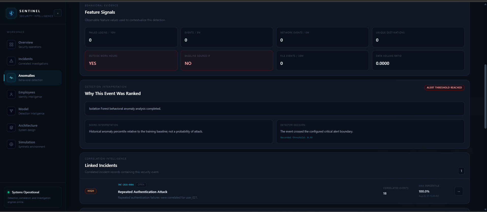
</p>

<p align="center">
  <em>
    Behavioral explainability — anomaly semantics, contextual signals,
    production threshold, and reasons the activity deserves analyst attention.
  </em>
</p>

Examples of interpretable signals include:

- activity outside expected working hours
- whether the source IP matches the employee's baseline
- recent failed authentication activity
- unusually high data-transfer volume
- recent network activity
- number of unique destinations
- file-activity intensity
- short-window event velocity
- comparison with expected identity behavior

These signals do not independently prove malicious activity.

They give the analyst context for **why the event appears behaviorally unusual**.

---

### Complete Feature Snapshot

SENTINEL persists the production feature values associated with scored events.

This gives the investigation interface access to the actual behavioral representation used during inference.

<p align="center">
  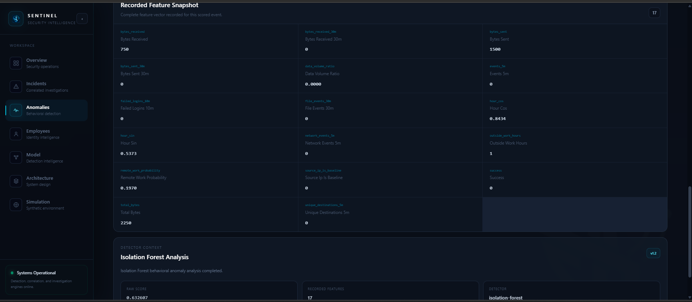
</p>

<p align="center">
  <em>
    Production feature snapshot — the behavioral feature values associated
    with an individual scored security event.
  </em>
</p>

Persisting this feature context supports:

- detection explainability
- reproducible investigation
- model lineage
- later debugging
- analyst review
- validation that the event was scored with the expected feature schema

This also prevents the frontend from having to reconstruct historical feature values after the fact.

---

### Risk Classification

The anomaly percentile is translated into operational risk categories to help analysts prioritize detections.

Conceptually:

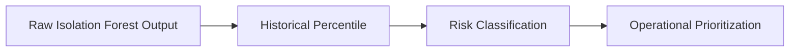
```mermaid
flowchart LR
    A[Raw Isolation Forest Output]
    B[Historical Percentile]
    C[Risk Classification]
    D[Operational Prioritization]

    A --> B
    B --> C
    C --> D
```

Risk classes are an **operational prioritization mechanism**.

They should not be interpreted as certainty that a cyberattack has occurred.

The final incident decision remains the responsibility of the correlation and investigation layers.

---

### Detection Is Evidence, Not a Verdict

SENTINEL deliberately avoids this architecture:

```text
High ML score
    ↓
"Attack detected"
```

Instead:

```text
Behaviorally unusual event
        ↓
Observable context
        ↓
Related signals
        ↓
Deterministic correlation
        ↓
Investigation-level incident
```

This distinction reduces the temptation to treat unsupervised anomaly detection as a security oracle.

The model answers:

> **How unusual is this behavior?**

The wider SENTINEL pipeline answers:

> **Does this activity form a meaningful security pattern that warrants investigation?**

---

### Anomaly-to-Incident Traceability

A detection can be linked to one or more correlated incidents.

The detection workspace therefore exposes incident relationships rather than presenting each ML result in isolation.

```mermaid
flowchart LR
    A[Detection Analysis]
    B[Correlated Incident]
    C[Incident Timeline]
    D[Other Related Detections]

    A --> B
    B --> C
    C --> D
    D --> A
```

This enables an analyst to move between:

```text
individual behavior
        ↕
correlated security context
```

without losing the relationship between the original model signal and the broader incident.

---

### Production Detector Lineage

Every production anomaly score is associated with the detector identity responsible for producing it.

Current production lineage:

```text
Detector Name     isolation-forest
Detector Version  1.2
Feature Schema    1.0
Experiment        V1
```

This matters because model behavior can evolve over time.

Historical scores should remain attributable to the model version that actually produced them rather than silently inheriting the identity of whichever model is currently selected.

The same lineage principle is carried forward into incident correlation and model governance.

---

### Explainability by Design

SENTINEL's explainability approach does not attempt to claim that an unsupervised Isolation Forest provides a human-readable causal explanation for every score.

Instead, the platform exposes the surrounding evidence required to interpret the detection responsibly:

| Layer | What the Analyst Can Inspect |
| --- | --- |
| **Event** | What happened and when |
| **Identity** | Who generated the activity and what their baseline looks like |
| **Model** | Which detector and version scored the event |
| **Raw Output** | The underlying Isolation Forest score |
| **Normalized Intelligence** | Historical anomaly percentile and risk level |
| **Features** | The exact production feature snapshot |
| **Behavioral Context** | Baseline deviations and recent activity |
| **Correlation** | Which incidents include the event |
| **Investigation** | How the signal contributes to wider security reasoning |

This gives analysts a transparent path from:

```text
event
  → features
  → model
  → anomaly intelligence
  → incident
  → investigation
```

rather than presenting an unexplained model result.

---

### Detection Design Principle

SENTINEL's behavioral detection philosophy can be summarized as:

> **Use machine learning to identify unusual behavior, preserve the evidence that produced the score, and let deterministic security context decide what the anomaly means operationally.**

The detector is therefore an important source of security intelligence — but never the sole authority for declaring an incident.

---

## Employee & Identity Intelligence

Security investigations are often easier to understand when activity is viewed around the identity that generated it.

SENTINEL therefore treats employees as first-class security entities rather than displaying them only as usernames attached to individual events.

The identity-intelligence layer combines:

- employee profile context
- department and role
- expected working behavior
- typical source IP
- typical location
- remote-work probability
- historical activity
- anomaly history
- current behavioral risk
- correlated incidents
- recent security events

This creates a persistent analyst view of **who the activity belongs to, what is normal for that identity, and how the current behavior differs from that baseline**.

---

### From Event-Centric to Identity-Centric Investigation

Traditional event views answer questions such as:

> **What happened in this event?**

Incident views answer:

> **What security pattern do these related events form?**

Identity intelligence adds another perspective:

> **What does this activity look like in the context of this employee's behavior over time?**

```mermaid
flowchart LR
    A[Employee Identity]
    B[Behavioral Baseline]
    C[Observed Activity]
    D[Anomaly History]
    E[Correlated Incidents]
    F[Identity Investigation]

    A --> F
    B --> F
    C --> F
    D --> F
    E --> F
```

This means SENTINEL can be investigated through three complementary perspectives:

```text
Event
  → What happened?

Incident
  → What related security pattern exists?

Identity
  → What does this behavior mean for this employee?
```

---

### Simulated Enterprise Population

SENTINEL's operational workforce is **configurable rather than fixed**.

The employee-generation utility can add new synthetic employees to the existing enterprise population without overwriting existing identities. The number of employees visible in a running SENTINEL deployment therefore depends on the data currently present in that environment.

A typical operational setup used during development contains approximately **300 employees**, but this is not a hard-coded platform limit.

The employee generator can create additional role-driven identities across departments such as:

- Engineering
- Sales
- Finance
- IT Operations
- Human Resources

Generated operational identities use Pakistani-style names and organizational context appropriate to the synthetic enterprise used during development.

However, SENTINEL's datasets are not restricted to a single identity style.

The repository also contains a canonical controlled benchmark with **100 benchmark employees** used for reproducible ML and incident evaluation. Those benchmark identities originate from the earlier controlled dataset and do not necessarily follow the same localized naming style as employees produced by the newer operational employee generator.

Depending on the state and history of a local deployment, the operational database may therefore contain identities originating from more than one synthetic generation workflow.

The important distinction is not the naming style of an employee, but the purpose of the workflow:

```text
Operational employee generation
    → configurable / additive workforce
    → used by the live SENTINEL environment

Controlled benchmark population
    → canonical 100-employee dataset
    → used for reproducible evaluation
```

The benchmark itself remains isolated when the dedicated benchmark workflow is executed, even though identities originating from earlier project datasets may also exist in a long-lived development database.

Thus the operational synthetic enterprise supports a configurable workforce assembled from persisted synthetic identities and additive employee generation.

The baseline distribution used by the operational environment during development and testing was:

| Department | Employees | Share |
| --- | ---: | ---: |
| **Engineering** | 84 | 28% |
| **Sales** | 66 | 22% |
| **Finance** | 54 | 18% |
| **IT Operations** | 54 | 18% |
| **Human Resources** | 42 | 14% |
| **Total** | **300** | **100%** |

Newer employees produced by the operational employee generator use Pakistani-style identity and corporate context, while persisted identities originating from earlier controlled datasets may use different synthetic naming conventions. Behavioral modeling remains driven by role, department, configured baselines, and observed activity rather than by identity naming style.

---

### Behavioral Identity Baselines

Each simulated employee carries behavioral context that can be used to interpret future activity.

Examples include:

- department
- job role
- expected working hours
- typical source IP
- typical location
- remote-work probability
- expected login behavior
- expected file activity
- expected transfer behavior

These values are not attack labels.

They represent the contextual baseline against which observable behavior can be interpreted.

```mermaid
flowchart TD
    A[Employee Profile]

    A --> B[Working Hours]
    A --> C[Typical Source IP]
    A --> D[Location Context]
    A --> E[Remote-Work Probability]
    A --> F[Login Baseline]
    A --> G[File-Activity Baseline]
    A --> H[Transfer Baseline]

    B --> I[Behavioral Context]
    C --> I
    D --> I
    E --> I
    F --> I
    G --> I
    H --> I

    I --> J[Feature Engineering & Investigation]
```

These baselines help SENTINEL distinguish between activity that is merely unusual in absolute terms and activity that is unusual **for the identity that generated it**.

---

### Employee Directory

The `/employees` route provides a dedicated identity-intelligence directory.

<p align="center">
  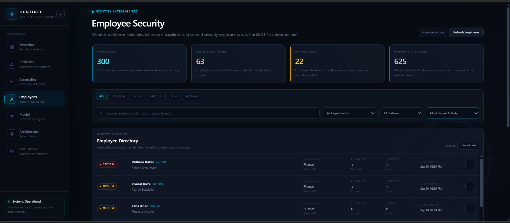
</p>

<p align="center">
  <em>
    Employee Security Directory — workforce identity context,
    behavioral risk, anomalies, and incident visibility.
  </em>
</p>

The directory provides an operational view of the workforce with capabilities including:

- employee search
- identity lookup
- department visibility
- job-role context
- behavioral risk summaries
- anomaly indicators
- incident context
- navigation into employee investigations

The purpose is not employee administration.

It is **security-oriented identity analysis**.

---

### Employee Investigation Workspace

Each employee can be opened through a dedicated route:

```text
/employees/:userId
```

<p align="center">
  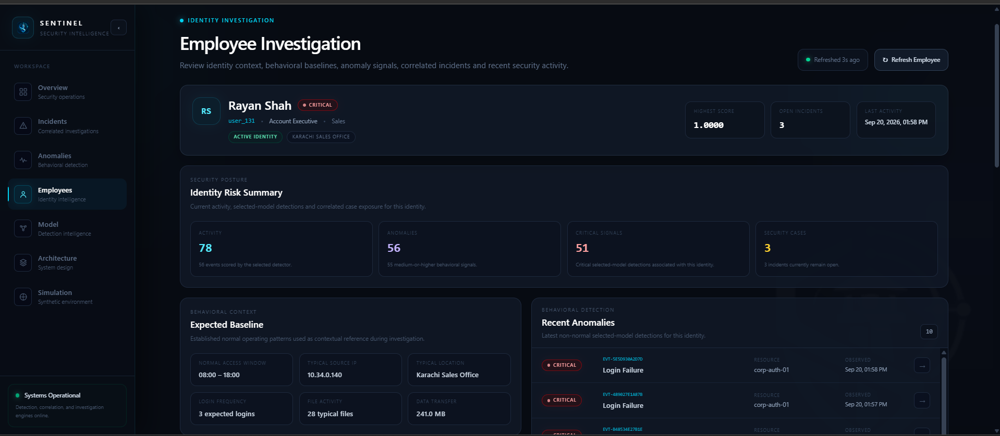
</p>

<p align="center">
  <em>
    Employee Investigation — identity profile, behavioral baseline,
    security activity, anomalies, risk, and related incidents.
  </em>
</p>

The workspace combines identity context with security intelligence including:

- employee identity
- department
- job role
- working-hour baseline
- typical source IP
- location context
- behavioral profile
- total activity
- scored-event count
- anomaly count
- elevated anomaly count
- critical anomaly count
- highest observed risk
- correlated incidents
- recent security activity

This gives the analyst a persistent entity-centered view rather than forcing them to reconstruct employee context from individual event pages.

---

### Security Activity Around an Identity

The employee workspace brings together activity that would otherwise be distributed across multiple sections of the platform.

<p align="center">
  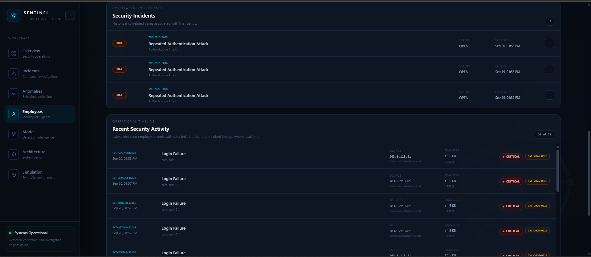
</p>

<p align="center">
  <em>
    Identity-centered activity intelligence — recent behavioral detections,
    security events, risk progression, and investigation relationships.
  </em>
</p>

Conceptually:

```mermaid
flowchart LR
    A[Employee]
    B[Recent Events]
    C[Anomalies]
    D[Critical Signals]
    E[Incidents]
    F[Identity Risk Context]

    A --> B
    B --> C
    C --> D
    C --> E
    D --> F
    E --> F
```

This enables questions such as:

- Has this employee produced repeated elevated anomalies?
- Is current behavior consistent with the employee's usual working context?
- Are multiple anomalies connected to one or more incidents?
- Has the employee recently interacted with sensitive resources?
- Is unusual transfer or network behavior isolated or recurring?
- Does the identity appear across multiple investigations?

The identity view therefore provides longitudinal context that is difficult to see from a single event.

---

### Selected-Detector Consistency

Identity-level anomaly and risk metrics are calculated using the **selected production detector lineage**.

SENTINEL does not silently mix historical outputs from unrelated detector versions into current identity metrics.

Conceptually:

```text
Employee
   ↓
Events scored by selected detector lineage
   ↓
Current anomaly/risk metrics
   ↓
Identity intelligence
```

This keeps employee-level security summaries consistent with the production detector currently represented throughout the platform.

It also prevents identity risk counts from becoming misleading as detector versions evolve.

---

### Identity ↔ Incident ↔ Detection Navigation

Identity intelligence is integrated into the broader investigation graph.

```mermaid
flowchart LR
    E[Employee Investigation]
    A[Detection Analysis]
    I[Incident Investigation]

    E -- anomaly history --> A
    A -- affected identity --> E

    E -- related incidents --> I
    I -- affected identity --> E

    A -- linked incident --> I
    I -- timeline event --> A
```

An analyst can therefore move naturally between:

```text
Employee
   ↕
Detection
   ↕
Incident
```

without losing investigative context.

For example:

```text
Employee Investigation
        ↓
Elevated Behavioral Detection
        ↓
Linked Incident
        ↓
Incident Timeline
        ↓
Another Related Detection
        ↓
Back to Employee Context
```

This makes identity intelligence part of the investigation workflow rather than a standalone reporting feature.

---

### Identity Context in Incident Investigation

When an incident is created, the affected employee is not treated merely as a string identifier.

SENTINEL can connect the incident back to:

- employee profile
- department
- role
- expected behavioral context
- related anomaly history
- previous or concurrent incidents

This enables the incident workspace to answer both:

> **What happened?**

and:

> **Who was affected, and what does normal behavior look like for this identity?**

That distinction is particularly important for behavioral anomaly detection because the meaning of an action often depends on who performed it.

---

### Enterprise Behavior Is Role-Driven

The synthetic enterprise is designed so employees do not all behave identically.

Activity can vary according to:

- department
- role
- working schedule
- configured behavioral baseline
- remote-work probability
- expected resource interaction
- transfer patterns
- active simulation windows

This creates a more meaningful environment for behavioral anomaly detection than simply generating random events around interchangeable users.

```mermaid
flowchart TD
    A[Department & Role]
    B[Behavioral Baseline]
    C[Simulated Activity]
    D[Observable Events]
    E[Behavioral Detection]

    A --> B
    B --> C
    C --> D
    D --> E
```

The detector still sees only the observable features available to the production pipeline.

It does not receive private knowledge of whether the simulator intentionally generated an attack campaign.

---

### Identity Intelligence Without Ground-Truth Leakage

Employee intelligence remains part of the operational data plane.

It may use observable context such as:

```text
role
department
working hours
typical IP
activity history
anomaly history
incident relationships
```

It does not expose or rely upon private synthetic attack labels.

```mermaid
flowchart LR
    A[Employee Baseline]
    B[Observed Events]
    C[Selected Detector Scores]
    D[Incidents]
    E[Employee Security Intelligence]

    A --> E
    B --> E
    C --> E
    D --> E

    X[Private Ground Truth]
    X -. excluded .-> E
```

This preserves the same architectural trust boundary used throughout SENTINEL:

> **The system may know what is normal for an identity without being told which events the simulator intended to be malicious.**

---

### Why Identity Intelligence Matters

Behavioral security analytics is inherently contextual.

Consider an identical action performed by two different employees.

For one identity, it may be routine.

For another, it may represent a significant departure from expected behavior.

SENTINEL therefore combines:

```text
Identity
   +
Baseline
   +
Recent Activity
   +
Anomaly History
   +
Incident Context
   =
Investigation Context
```

The identity layer helps bridge the gap between a numerical anomaly signal and the human question:

> **Is this activity unusual for this person, and does it connect to a wider security pattern?**

---

### Identity Intelligence Design Principle

SENTINEL's identity-intelligence philosophy can be summarized as:

> **Security activity should be understood not only as isolated events, but in the behavioral context of the identities that generated them.**

By connecting employee baselines, event history, anomaly intelligence, and incident relationships, SENTINEL supports an investigation workflow that is simultaneously:

- event-centered
- incident-centered
- identity-centered

That gives analysts multiple paths into the same underlying evidence while preserving a consistent operational security model.

---

## Machine Learning Engineering & Evaluation

SENTINEL's machine-learning layer is designed as an engineering system rather than a standalone model experiment.

The production detector is the result of a controlled workflow covering:

```text
behavioral feature design
        ↓
chronological training
        ↓
candidate model experiments
        ↓
controlled evaluation
        ↓
objective model comparison
        ↓
production selection
        ↓
governed model promotion
        ↓
operational scoring
```

The selected production detector is:

| Property | Production Configuration |
| --- | --- |
| **Algorithm** | Isolation Forest |
| **Detector** | `isolation-forest` |
| **Version** | `1.2` |
| **Selected Experiment** | `V1` |
| **Production Status** | `production` |
| **Feature Schema** | `1.0` |
| **Features** | `17` |
| **Estimators** | `300` |
| **Random State** | `42` |
| **Alert Threshold** | `99th historical percentile` |
| **Training Rows** | `1,952` |
| **Evaluation Rows** | `3,951` |

The model is unsupervised.

Synthetic attack labels are used only for controlled evaluation and never as production model inputs.

---

### Model Intelligence Workspace

SENTINEL exposes the machine-learning lifecycle through a dedicated Model Intelligence workspace rather than hiding the detector behind the API.

<p align="center">
  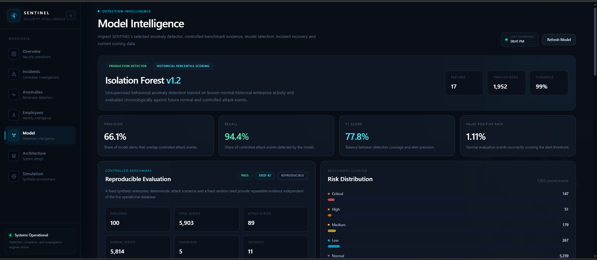
</p>

<p align="center">
  <em>
    Model Intelligence — selected detector, production configuration,
    evaluation metrics, benchmark provenance, and incident-recovery context.
  </em>
</p>

The workspace presents information including:

- selected detector and version
- experiment identity
- feature count
- training and evaluation population
- alert threshold
- event-level benchmark metrics
- incident-level evaluation
- controlled benchmark provenance
- feature architecture
- model comparison
- production model status

The goal is to make the ML lifecycle visible and inspectable instead of presenting anomaly detection as a black box.

---

### Chronological Evaluation Strategy

Security telemetry is temporal.

SENTINEL therefore avoids treating future activity as if it were interchangeable with historical behavior through a random train/test split.

Instead, the evaluation strategy follows the direction in which an operational detector would actually be used:

```mermaid
flowchart LR
    A[Historical Enterprise Activity]
    B[Training Baseline]
    C[Future Enterprise Activity]
    D[Normal + Controlled Attack Activity]
    E[Model Evaluation]

    A --> B
    B --> C
    C --> D
    D --> E
```

Conceptually:

```text
PAST
  ↓
learn behavioral baseline
  ↓
deploy detector
  ↓
score FUTURE activity
```

This preserves the temporal meaning of behavioral anomaly detection.

The model learns from earlier activity and is evaluated against later activity containing both normal behavior and controlled attack scenarios.

---

### Why Isolation Forest?

SENTINEL uses Isolation Forest because the detection problem is framed around **behavioral deviation**, not supervised attack classification.

The detector is asked to identify events that are difficult to reconcile with the learned behavioral distribution.

That makes it suitable for signals such as:

- unusual working-hour activity
- non-baseline source context
- abnormal transfer volume
- unusual short-window activity
- authentication bursts
- file-activity deviations
- network fan-out
- combinations of multiple behavioral changes

The model does not require a production event to carry an attack label.

Instead:

```text
observable behavior
       ↓
feature representation
       ↓
Isolation Forest
       ↓
degree of unusualness
```

Security meaning is added later by deterministic correlation and investigation.

---

### Model Experimentation

SENTINEL did not assume that adding more features would automatically create a better detector.

Two candidate feature architectures were evaluated against the same controlled benchmark.

<p align="center">
  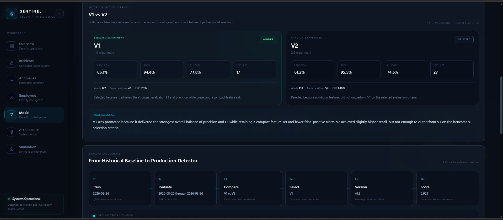
</p>

<p align="center">
  <em>
    Model Selection — controlled comparison between candidate feature
    architectures before production promotion.
  </em>
</p>

The final comparison was:

| Model | Features | TP | FP | FN | Precision | Recall | F1 | False-Positive Rate |
| --- | ---: | ---: | ---: | ---: | ---: | ---: | ---: | ---: |
| **V1 — Selected** | **17** | **84** | **43** | **5** | **66.14%** | **94.38%** | **77.78%** | **1.113%** |
| V2 | 27 | 85 | 54 | 4 | 61.15% | 95.51% | 74.56% | 1.398% |

V2 recovered one additional attack event, but did so with a larger feature representation and substantially more false positives.

V1 remained selected because it provided:

- higher precision
- higher F1
- fewer false positives
- lower false-positive rate
- a smaller 17-feature representation
- nearly identical recall

The selection therefore reflects an engineering tradeoff rather than simply choosing the experiment with the highest single metric.

> **More features did not automatically produce the better production detector.**

---

### Production Feature Set

The selected V1 detector uses the following 17 features:

```text
hour_sin
hour_cos
outside_work_hours
source_ip_is_baseline
remote_work_probability
bytes_sent
bytes_received
total_bytes
data_volume_ratio
success
failed_logins_10m
events_5m
file_events_30m
network_events_5m
unique_destinations_5m
bytes_sent_30m
bytes_received_30m
```

These features combine:

```mermaid
flowchart TD
    A[Production Feature Set]

    A --> B[Temporal Context]
    A --> C[Identity / Baseline Context]
    A --> D[Transfer Volume]
    A --> E[Authentication Context]
    A --> F[Activity Velocity]
    A --> G[Network Breadth]
    A --> H[Rolling Behavioral Context]
```

The production schema deliberately excludes:

- attack labels
- simulator scenario labels
- benchmark truth
- private evaluation metadata

The model must infer unusualness from observable behavior alone.

---

### Controlled Benchmark

Model evaluation is performed through a deterministic, isolated benchmark rather than against the evolving operational database.

The canonical benchmark uses:

| Benchmark Property | Value |
| --- | --- |
| **Seed** | `42` |
| **Employees** | `100` |
| **Normal Events** | `5,814` |
| **Controlled Attack Events** | `89` |
| **Total Events** | `5,903` |
| **Attack Campaigns** | `5` |
| **Selected Experiment** | `V1` |
| **Production Detector** | `isolation-forest v1.2` |

The benchmark performs the full controlled evaluation lifecycle:

```mermaid
flowchart TD
    A[Reset Isolated Benchmark DB]
    B[Generate Canonical Employees]
    C[Generate Normal Activity]
    D[Inject Controlled Campaigns]
    E[Validate Dataset]
    F[Build Behavioral Features]
    G[Train V1]
    H[Train V2]
    I[Compare Experiments]
    J[Select Production Candidate]
    K[Score Benchmark Events]
    L[Correlate Incidents]
    M[Evaluate Detection]
    N[Evaluate Incident Recovery]
    O[Build Evaluation Registry]
    P[Verify Canonical Results]

    A --> B
    B --> C
    C --> D
    D --> E
    E --> F
    F --> G
    F --> H
    G --> I
    H --> I
    I --> J
    J --> K
    K --> L
    K --> M
    L --> N
    M --> O
    N --> O
    O --> P
```

The use of a fixed seed and isolated environment makes the benchmark reproducible and prevents live operational history from affecting controlled model evaluation.

---

### Event-Level Detection Results

For the selected V1 production detector, the canonical benchmark produced:

| Metric | Result |
| --- | ---: |
| **True Positives** | 84 |
| **False Positives** | 43 |
| **True Negatives** | 3,819 |
| **False Negatives** | 5 |
| **Precision** | **66.14%** |
| **Recall** | **94.38%** |
| **F1 Score** | **77.78%** |
| **False-Positive Rate** | **1.113%** |

The confusion matrix can be viewed as:

#### Confusion Matrix

| Prediction \ Actual | **Normal** | **Attack** |
| --- | ---: | ---: |
| **Normal** | 3,819 | 5 |
| **Alert** | 43 | 84 |

**Interpretation:**

- **True Negatives (TN):** 3,819 normal events correctly remained unalerted
- **False Negatives (FN):** 5 attack events were not alerted
- **False Positives (FP):** 43 normal events generated an alert
- **True Positives (TP):** 84 attack events were alerted

The detector therefore recovered most controlled attack events while maintaining a low false-positive rate across the benchmark population.

These metrics describe performance on SENTINEL's controlled synthetic benchmark.

They should **not** be interpreted as claims about performance on arbitrary real-world enterprise environments.

---

### Scenario-Level Event Recovery

The five controlled attack campaigns test different behavioral patterns.

Event-level recovery for the canonical benchmark was:

| Controlled Scenario | Attack Events Detected |
| --- | ---: |
| **Account Takeover** | 8 / 8 |
| **Brute Force** | 18 / 18 |
| **Data Exfiltration** | 6 / 9 |
| **Insider Threat** | 13 / 14 |
| **Network Scan** | 39 / 40 |

This is useful because aggregate recall alone can hide differences between attack patterns.

For example, the detector fully recovered the authentication-focused campaigns while some individual events inside the data-exfiltration, insider-threat, and network-scan scenarios were less anomalous at the event level.

That is one reason SENTINEL evaluates the downstream correlation layer separately.

---

### Event Detection vs Incident Recovery

An attack campaign is usually more than one event.

SENTINEL therefore measures both:

```mermaid
flowchart LR
    A[Controlled Attack Events]
    B[Event-Level ML Detection]
    C[Multi-Signal Correlation]
    D[Incident Recovery]
    E[Timeline Recovery]

    A --> B
    B --> C
    C --> D
    D --> E
```

The selected detector achieved:

```text
Event-level attack recall
94.38%
```

The deterministic correlation layer then produced:

| Incident Metric | Result |
| --- | ---: |
| **True-Positive Incidents** | 5 |
| **False-Positive Incidents** | 3 |
| **Attack Campaigns Recovered** | **5 / 5** |
| **Incident Precision** | **62.50%** |
| **Incident Recall** | **100%** |
| **Incident F1** | **76.92%** |
| **Attack Timeline Recovery** | **89 / 89 events** |
| **Timeline Recovery** | **100%** |

This demonstrates an important property of the architecture:

```text
Some individual attack events
may not cross the ML threshold
            ↓
related observable evidence remains
            ↓
multi-signal correlation reconstructs context
            ↓
complete attack campaign is recovered
```

Event-level detection and incident-level recovery therefore measure different capabilities.

A detector can miss an individual low-signal event while the wider security pipeline still reconstructs the complete campaign from correlated evidence.

---

### Why Recall Is Not the Only Metric

For a security detection system, maximizing recall without considering false positives can create an unusable alert stream.

SENTINEL therefore considers several metrics together:

```text
Recall
  → How much controlled attack activity was recovered?

Precision
  → How much alerting corresponded to controlled attack activity?

False-Positive Rate
  → How often was normal benchmark behavior incorrectly elevated?

F1
  → How well were precision and recall balanced?
```

This is also why V1 remained the production experiment even though V2 achieved slightly higher recall.

The production decision considered the operational cost of additional false positives.

---

### Reproducible Evaluation Provenance

Evaluation results are not intended to exist as manually copied numbers in the frontend.

The benchmark produces artifacts that record model and evaluation provenance.

The controlled workflow maintains consistency across information including:

```text
Promoted Model Manifest
        ↕
Selected-Model Evaluation
        ↕
Model Experiment Comparison
        ↕
Incident Evaluation
        ↕
Evaluation Registry
        ↕
Benchmark Report
```

These artifacts identify the canonical experiment behind the production detector and its reported metrics.

A benchmark-provenance validator verifies that the selected production model and the evaluation evidence belong to the same controlled experiment.

This reduces the risk of presenting metrics from one experiment while deploying an artifact from another.

---

### From Experiment to Production

The machine-learning lifecycle does not end when an experiment produces good metrics.

SENTINEL separates:

```mermaid
flowchart LR
    A[Experiment]
    B[Controlled Evaluation]
    C[Model Comparison]
    D[Production Selection]
    E[Governed Artifact]
    F[Operational Scoring]

    A --> B
    B --> C
    C --> D
    D --> E
    E --> F
```

The selected detector is promoted into a governed production contract with explicit:

- detector identity
- version
- experiment identity
- feature schema
- feature ordering
- preprocessing expectations
- training configuration
- artifact identity
- evaluation provenance

The deeper integrity and artifact-governance mechanisms are covered later in the **MLOps & Model Governance** section.

---

### ML Engineering Design Principle

SENTINEL's machine-learning philosophy can be summarized as:

> **Train chronologically, evaluate reproducibly, compare experiments objectively, promote deliberately, and never confuse behavioral anomaly scores with attack probabilities.**

The goal is not simply to produce the largest possible model metric.

The goal is to build a detector whose:

- inputs are controlled
- behavior is measurable
- lineage is known
- limitations are visible
- evaluation is reproducible
- operational meaning is clearly bounded

That turns anomaly detection from an isolated experiment into a maintainable component of the wider security platform.

---

## Synthetic Enterprise, Live Simulation & Benchmark Separation

SENTINEL includes a synthetic enterprise environment so the complete security pipeline can be exercised without requiring access to real organizational telemetry.

The synthetic environment serves two deliberately different purposes:

```mermaid
flowchart TD
    A[Synthetic Enterprise]

    A --> B[Operational Workforce]
    A --> C[Live Simulator]
    A --> D[Controlled Benchmark]

    B --> E[Configurable Employee Population]
    C --> F[Evolving Enterprise Telemetry]
    D --> G[Reproducible Security Evaluation]

    F --> H[Operational SENTINEL Pipeline]
    G --> I[Isolated Benchmark Pipeline]
```

These workflows share security-domain concepts but have intentionally different trust boundaries.

> **The live simulator demonstrates SENTINEL. The benchmark evaluates SENTINEL.**

---

### Configurable Synthetic Workforce

SENTINEL's operational employee population is **not fixed at 300 identities**.

The repository includes an additive employee-generation utility that can expand the current operational workforce by any requested positive number of employees.

For example:

```bash
python scripts/generate_employees.py --count 10
```

adds 10 new employees.

A deterministic base seed can also be supplied:

```bash
python scripts/generate_employees.py --count 100 --seed 42
```

The CLI contract is:

```text
--count N
    Required.
    Number of new employees to add.

--seed N
    Optional.
    Base generation seed.
    Default: 42.
```

The generator is intentionally **additive**.

Every run:

1. inspects the current employee population
2. determines the highest existing generated `user_NNN` identifier
3. continues numbering from the next available generated identity
4. examines the current department distribution
5. determines where each new employee should be allocated
6. creates localized synthetic employee profiles
7. persists the new identities without replacing existing employees

Existing employee records are not moved, rewritten, or deleted.

```mermaid
flowchart LR
    A[Existing Workforce]
    B[Inspect Highest User ID]
    C[Inspect Department Distribution]
    D[Request N New Employees]
    E[Build Balanced Department Plan]
    F[Generate New Profiles]
    G[Expanded Workforce]

    A --> B
    A --> C
    D --> E
    C --> E
    B --> F
    E --> F
    F --> G
```

This means a deployment can start with one workforce size and grow over time without regenerating the entire company.

---

### Department-Aware Workforce Balancing

Employee generation does not assign departments independently using a simple random draw.

Before each employee is added, SENTINEL evaluates the **complete current workforce** against the configured workforce proportions.

The current target distribution is:

| Department | Target Share |
| --- | ---: |
| **Engineering** | 28% |
| **Sales** | 22% |
| **Finance** | 18% |
| **IT Operations** | 18% |
| **Human Resources** | 14% |

For each new employee, the generator:

```text
calculates the next workforce size
        ↓
computes the ideal employee count
for each department at that size
        ↓
compares ideal counts with
the current distribution
        ↓
finds the department with
the largest relative deficit
        ↓
assigns the next employee there
        ↓
repeats for the next employee
```

This has several useful properties:

- overrepresented departments naturally receive fewer additions
- underrepresented departments automatically catch up
- both small and large employee batches improve overall balance
- existing employees never need to be reassigned
- when the final workforce size allows the configured proportions to resolve exactly, the workforce can land exactly on the target distribution

For example:

```text
Existing workforce
        120
         +
Requested additions
        180
         =
Resulting workforce
        300
```

The 180 new employees are not simply distributed according to a fresh 28/22/18/18/14 split.

Instead, they are allocated according to the **deficits in the existing 120-person population**, so that the complete resulting workforce moves toward the configured department proportions.

This makes employee generation appropriate for repeatedly expanding a long-lived operational environment.

---

### Deterministic but Additive Employee Generation

The employee generator also avoids restarting the same synthetic identity sequence every time the same seed is reused.

The requested seed is combined with the next generated employee number to derive an **effective run seed**.

Conceptually:

```text
requested seed
     +
current workforce position
     ↓
effective generation seed
```

This means:

```bash
--seed 42
```

can still be reused for reproducible operational generation without repeatedly generating the same sequence of employee profiles on later additive runs.

Generated identifiers continue after the highest standard `user_NNN` identity already present.

For example:

```text
Highest existing generated identity:
user_125

Next additive generation begins at:
user_126
```

---

### Operational Localization and Benchmark Identities

Employees generated through the **operational employee generator** use Pakistani/Karachi-localized synthetic identity context.

Behavioral characteristics remain driven by factors such as:

- department
- job role
- working hours
- expected source context
- remote-work behavior
- file activity
- network behavior
- transfer behavior

The canonical benchmark population serves a different purpose.

It is generated through a separate reproducible workflow and does not necessarily use the same localized naming style as newer operational employee generation.

A long-lived development database may therefore contain persisted synthetic identities originating from different stages or generation workflows.

That does not affect the security model.

SENTINEL reasons about employees through their behavioral and organizational context rather than their naming style.

The dedicated benchmark workflow itself remains isolated from the operational database.

---

### Live Enterprise Simulator

The live simulator creates an evolving synthetic corporate environment around the persisted employee population.

It generates ordinary enterprise activity such as:

- authentication activity
- file activity
- network activity
- data transfers
- working-hour behavior
- role-driven employee activity

Controlled attack campaigns may optionally be introduced into the same event stream.

<p align="center">
  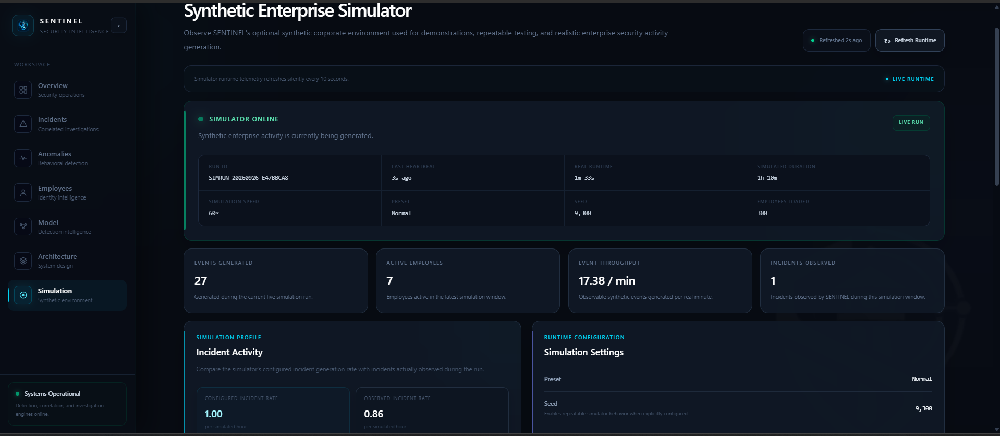
</p>

<p align="center">
  <em>
    Simulation Runtime — simulated clock, workforce activity,
    generated telemetry, throughput, scenario configuration,
    and observed downstream security intelligence.
  </em>
</p>

The simulator maintains its own:

- simulation run identity
- random seed
- simulated clock
- worker identity
- runtime status
- employee refresh cycle
- generated-event counters
- event-rate controls
- attack-campaign configuration
- private simulation ground truth

However, it does **not** determine whether its own activity is anomalous.

---

### Simulator Default: Normal Activity Only

Automatic attack injection is disabled by default.

The standard Docker configuration uses:

```text
SENTINEL_SIM_PRESET=normal
SENTINEL_SIM_ATTACK_RATE=0
```

Therefore, starting the simulator with its default configuration produces:

> **normal synthetic corporate activity only**

No automatic attack campaigns are scheduled.

The simulator can therefore be used simply to generate ordinary evolving enterprise telemetry and observe how the always-on SENTINEL pipeline processes it.

---

### Simulation Presets

Three convenience presets are available:

| Preset | Expected Attack Campaign Rate | Scenario Cooldown |
| --- | ---: | ---: |
| **`normal`** | `0 / simulated hour` | 360 simulated minutes |
| **`realistic`** | `0.25 / simulated hour` | 360 simulated minutes |
| **`demo`** | `1.0 / simulated hour` | 60 simulated minutes |

Their intended use is:

```text
normal
    → ordinary enterprise activity
    → no automatic attacks

realistic
    → occasional attack campaigns
    → approximately one campaign every four simulated hours on average

demo
    → frequent security scenarios
    → approximately one campaign per simulated hour on average
```

A preset can be selected when starting the simulator.

For example:

```bash
SENTINEL_SIM_PRESET=demo \
docker compose --profile simulation up -d --force-recreate simulator-worker
```

The normal preset remains the default.

---

### Custom Attack Campaign Rate

The preset attack rate can be overridden directly with:

```text
SENTINEL_SIM_ATTACK_RATE
```

This value represents the **expected number of injected attack campaigns per simulated hour**.

Examples:

| Value | Interpretation |
| ---: | --- |
| `0` | Disable automatic attack campaigns |
| `0.25` | Approximately one campaign every four simulated hours |
| `0.5` | Approximately one campaign every two simulated hours |
| `1.0` | Approximately one campaign per simulated hour |
| `2.0` | Approximately two campaigns per simulated hour |

For example:

```bash
SENTINEL_SIM_ATTACK_RATE=0.5 \
docker compose --profile simulation up -d --force-recreate simulator-worker
```

or:

```bash
SENTINEL_SIM_ATTACK_RATE=1 \
docker compose --profile simulation up -d --force-recreate simulator-worker
```

An explicitly supplied `SENTINEL_SIM_ATTACK_RATE` takes precedence over the selected preset's default attack rate.

---

### Campaign Rate Is Not Incident Rate

This distinction is essential:

```text
SENTINEL_SIM_ATTACK_RATE=1
            ≠
exactly one SENTINEL incident per hour
```

The configuration controls **synthetic campaign injection**, not detection results.

The simulator schedules campaigns independently.

Those campaigns produce ordinary observable events.

SENTINEL must then independently:

```mermaid
flowchart LR
    A[Injected Synthetic Campaign]
    B[Ordinary Event Rows]
    C[Event Processor]
    D[Feature Engineering]
    E[Isolation Forest]
    F[Anomaly Intelligence]
    G[Deterministic Correlation]
    H[Possible Incident]

    A --> B
    B --> C
    C --> D
    D --> E
    E --> F
    F --> G
    G --> H
```

A configured rate of `1.0` therefore means approximately one **injected campaign** per simulated hour over time.

It does not guarantee:

- exactly one campaign in every individual hour
- exactly one detected incident
- immediate detection
- a one-to-one mapping between campaign and incident

Incident creation remains the responsibility of SENTINEL's independent detection and correlation pipeline.

---

### Stochastic Campaign Scheduling

Automatic campaigns are scheduled using an **exponential inter-arrival model**.

This means the configured attack rate is a long-run expected rate rather than a fixed timer.

For example:

```text
Attack rate = 1.0 / hour

Expected mean interval ≈ 60 simulated minutes
```

but actual intervals may be:

```text
34 minutes
91 minutes
17 minutes
73 minutes
...
```

while averaging toward the configured rate over a sufficiently long simulation.

The simulator also enforces a minimum delay of one simulated minute between scheduling decisions.

This makes live activity less mechanically predictable than injecting an attack at an exact fixed interval.

---

### Supported Attack Campaign Families

The live simulator can generate five security-scenario families:

| Scenario | Relative Selection Weight |
| --- | ---: |
| **Brute Force** | 24% |
| **Account Takeover** | 22% |
| **Data Exfiltration** | 18% |
| **Insider Threat** | 14% |
| **Network Scan** | 22% |

Campaigns may contain multiple related events and internal attack stages.

Those simulator-private stage labels remain outside observable `Event` records.

The operational detector therefore sees the resulting behavior, not the simulator's explanation of what it intended to generate.

---

### Simulation Time and Throughput Controls

The simulator exposes several runtime controls through environment configuration.

The standard Docker defaults include:

| Variable | Default | Purpose |
| --- | --- | --- |
| `SENTINEL_SIM_PRESET` | `normal` | Convenience simulation profile |
| `SENTINEL_SIM_ATTACK_RATE` | `0` | Expected campaigns per simulated hour |
| `SENTINEL_SIM_SEED` | `9300` | Reproducible simulator seed in the Compose runtime |
| `SENTINEL_SIM_TICK_SECONDS` | `1` | Real-time delay between simulator ticks |
| `SENTINEL_SIM_SPEED` | `1` | Simulated minutes advanced per real second |
| `SENTINEL_SIM_HEARTBEAT_SECONDS` | `5` | Runtime heartbeat interval |
| `SENTINEL_SIM_EMPLOYEE_REFRESH_SECONDS` | `30` | Employee-population refresh interval |
| `SENTINEL_SIM_MAX_EVENTS_PER_TICK` | `100` | Global event cap per tick |
| `SENTINEL_SIM_MAX_EVENTS_PER_EMPLOYEE_PER_TICK` | `3` | Per-employee event cap per tick |
| `SENTINEL_SIM_SCENARIO_COOLDOWN_MINUTES` | preset-dependent | Minimum scenario reuse/cooldown control |
| `SENTINEL_SIM_MAX_CONCURRENT_ATTACKS` | `1` | Maximum concurrently active attack episodes |

`SENTINEL_SIM_SPEED` represents **simulated minutes per real second**.

For example:

```text
SENTINEL_SIM_SPEED=1
    → 1 simulated minute per real second

SENTINEL_SIM_SPEED=60
    → 60 simulated minutes per real second
```

This allows demonstrations to accelerate the synthetic enterprise clock without changing the architecture of the downstream detection pipeline.

---

### Reproducible Simulation Seeds

The live simulator supports deterministic random seeding through:

```text
SENTINEL_SIM_SEED
```

The standard Docker Compose runtime defaults to:

```text
9300
```

A custom seed can be supplied when a repeatable simulation sequence is useful.

For example:

```bash
SENTINEL_SIM_SEED=12345 \
docker compose --profile simulation up -d --force-recreate simulator-worker
```

Normal employee behavior and attack scheduling use controlled random streams so changes in one area do not unintentionally redefine attack scheduling for a fixed scenario seed.

---

### Simulator Independence

The simulator writes ordinary `Event` rows into the operational PostgreSQL database.

It intentionally does **not** call:

- the ML scoring service
- the Event Processor
- the incident-correlation engine
- deterministic investigation
- Local AI

```mermaid
flowchart LR
    S[Simulator]
    E[Ordinary Event]
    DB[(PostgreSQL)]
    P[Always-On Event Processor]
    M[ML Detection]
    C[Incident Correlation]

    S --> E
    E --> DB
    DB --> P
    P --> M
    M --> C

    S -. no direct call .-> M
    S -. no direct call .-> C
```

The Event Processor independently discovers the newly committed event.

This provides an important architectural property:

> **The simulator cannot tell SENTINEL that something is malicious. It can only generate behavior for SENTINEL to observe.**

Stopping the simulator therefore does not stop the security platform.

---

### Private Simulation Ground Truth

When the simulator intentionally injects a controlled attack campaign, it may record private truth describing what it generated.

That truth is stored separately from the observable `Event`.

Operational events do not carry fields such as:

```text
is_injected_anomaly
scenario_type
attack_stage
```

as production inference signals.

Instead:

```mermaid
flowchart TD
    A[Simulator]

    A --> B[Observable Event]
    A --> C[Private Simulation Ground Truth]

    B --> D[(Operational Event Store)]
    D --> E[SENTINEL Detection Pipeline]

    C --> F[(Private Ground-Truth Store)]
    F -. evaluation only .-> G[Controlled Validation]

    C -. never supplied .-> E
```

This allows the project to know what happened for later evaluation without allowing the detector to know the answer during inference.

---

### Live Simulator vs Controlled Benchmark

The live simulator and benchmark are intentionally separate systems.

| | Live Simulator | Controlled Benchmark |
| --- | --- | --- |
| **Purpose** | Demonstrate evolving runtime behavior | Measure reproducible detection quality |
| **Database** | Operational PostgreSQL | Dedicated benchmark PostgreSQL |
| **Workforce** | Configurable persisted operational identities | Canonical reproducible benchmark population |
| **Event Stream** | Continually evolving | Fixed controlled dataset |
| **Seed** | Configurable | Canonical seed `42` |
| **Attack Timing** | Stochastic / configurable | Deterministic controlled injection |
| **Ground Truth** | Private simulation truth | Private benchmark truth |
| **Event Processor** | Independent always-on operational processor | Controlled benchmark workflow |
| **Primary Question** | How does SENTINEL behave over time? | How well does SENTINEL recover known scenarios? |

The benchmark therefore does not exist merely as a faster version of the live simulator.

It is a separate evaluation environment with different requirements.

---

### Benchmark Isolation

The benchmark operates against a dedicated PostgreSQL database.

Its controlled workflow can:

- reset the benchmark database
- create the canonical benchmark workforce
- generate normal activity
- inject controlled scenarios
- train and compare models
- score benchmark events
- correlate benchmark incidents
- read private benchmark truth
- calculate event-level metrics
- calculate incident-level metrics
- build the evaluation registry
- verify canonical provenance

without changing the operational SENTINEL environment.

```mermaid
flowchart LR
    subgraph Operational
        A[Live / Historical Events]
        B[(Operational PostgreSQL)]
        C[Event Processor]
        A --> B --> C
    end

    subgraph Benchmark
        D[Controlled Generator]
        E[(Benchmark PostgreSQL)]
        F[Benchmark Runner]
        G[Private Ground Truth]
        D --> E --> F
        G --> F
    end
```

This ensures controlled experiments cannot:

- pollute operational event history
- change live incidents
- change processor state
- change live employee security history
- alter the running simulation
- contaminate runtime health metrics

---

### Canonical Benchmark Population

The controlled benchmark deliberately differs from additive operational workforce generation.

Canonical company generation uses:

```text
employee count = 100
seed           = 42
```

and requires an **empty benchmark employee table**.

If employees are already present, canonical generation fails rather than silently creating a different benchmark population.

This preserves benchmark reproducibility.

Operational generation, by contrast, is intentionally additive:

```text
Canonical benchmark
    → empty database required
    → fixed reproducible population
    → controlled evaluation

Operational employee generator
    → existing workforce allowed
    → configurable number of additions
    → balanced population growth
```

The two workflows therefore solve different problems and should not be treated interchangeably.

---

### Synthetic Enterprise Design Principle

SENTINEL's synthetic environment is built around one core rule:

> **Generate realistic observable behavior without giving the detection pipeline privileged knowledge of why that behavior was generated.**

That principle applies whether activity originates from:

- ordinary employee simulation
- an automatically scheduled live attack campaign
- a controlled benchmark scenario
- existing persisted synthetic telemetry

The synthetic enterprise creates the conditions.

The security platform must still perform the detection.

> **The simulator generates the world. SENTINEL independently observes, scores, correlates, and investigates it.**

---

## Optional Grounded Local AI & Ollama

SENTINEL includes an optional local generative-AI layer for incident explanation and analyst assistance.

The Local AI layer is intentionally **not part of the detection decision path**.

It operates only after SENTINEL has already:

```text
observed the event
        ↓
engineered behavioral features
        ↓
scored the event
        ↓
correlated an incident
        ↓
generated deterministic investigation intelligence
        ↓
assembled trusted operational evidence
```

Only then can the optional language model assist the analyst.


```mermaid
flowchart LR
    A[Security Events]
    B[Isolation Forest]
    C[Deterministic Correlation]
    D[Deterministic Investigation]
    E[Whitelisted AI Evidence]
    F[Grounded Prompt]
    G[Local Ollama Model]
    H[Schema Validation]
    I[Analyst Workspace]

    A --> B
    B --> C
    C --> D
    D --> E
    E --> F
    F --> G
    G --> H
    H --> I

    D --> I
```
The direct `Deterministic Investigation → Analyst Workspace` path is important.

Even when Local AI is disabled, unavailable, slow, or returns invalid output, the underlying incident evidence and deterministic investigation remain available.

> **Local AI augments investigation. It does not define the investigation.**

---

### Why Local AI Is Optional
Ollama does not ship as part of SENTINEL's Docker stack.

It is a separate, host-managed local dependency that users may choose to install and run.

SENTINEL itself remains fully functional without it.

By default:

```text
OLLAMA_ENABLED=false
```

The normal security platform can therefore operate with:

```text
PostgreSQL
FastAPI
Event Processor
React / Nginx
```

without requiring any language model.

If Local AI is enabled, the backend connects to Ollama running independently on the host.

In the Docker runtime, SENTINEL reaches the host-managed Ollama service through:

```text
http://host.docker.internal:11434
```

The default configured model is:

```text
llama3.2:3b
```

A later section of this README explains how to install Ollama, pull the model, enable the integration, and verify that SENTINEL can reach it.

---

### Local AI Configuration
The default Local AI configuration is:
| Setting | Default |
|---|---|
| Enabled | `false` |
| Provider | Ollama |
| Model | ``llama3.2:3b`` |
| Local Ollama Port | `11434` |
| Generation Timeout | 90 seconds |
| Temperature | `0` |
| Prediction Limit | `280` |
| Context Window | `4096` |
| Keep Alive | `10m` |


The configuration deliberately favors constrained, repeatable analyst-oriented generation rather than highly creative output.

A temperature of `0`, structured prompting, limited evidence, and schema validation are used together to reduce unnecessary model variability.

---

### Evidence Before Generation
The Local AI model does not receive unrestricted database access.

Before any generation request is made, SENTINEL creates a dedicated **AI-safe evidence package**.

```mermaid
flowchart TD
    A[Correlated Incident]
    B[Deterministic Investigation]
    C[Identity Context]
    D[Selected-Detector Timeline]
    E[Correlation Signals]

    A --> F[AI Evidence Builder]
    B --> F
    C --> F
    D --> F
    E --> F

    F --> G[Explicit Whitelisted Evidence Package]
    G --> H[Ground-Truth Safety Validation]
    H --> I[Grounded Prompt]
    I --> J[Ollama]
```
The evidence package contains controlled operational information such as:
- incident identity
- incident type
- severity
- incident status
- first and last observed timestamps
- correlated event count
- anomaly count
- maximum anomaly percentile
- incident summary
- correlation rationale
- indicators
- employee user ID
- department
- job role
- expected working hours
- typical location
- detector and correlation lineage
- deterministic investigation findings
- severity rationale
- investigation steps
- analyst questions
- conditional containment actions
- selected-detector event timeline

Each timeline entry is also explicitly whitelisted.
It may include:
- event ID
- timestamp
- event type
- employee user ID
- source IP
- destination IP
- source location
- resource context
- bytes sent and received
- event success state
- anomaly percentile
- risk level
- correlation score
- correlation reason

The model is therefore given a structured security evidence package rather than unrestricted application state.

---

### Privacy-Conscious Identity Context
The AI evidence layer intentionally sends the internal SENTINEL user identifier rather than the employee's display name.

For identity context, the model may receive information such as:

```text
user_id
department
job_role
normal_start_hour
normal_end_hour
typical_location
```

This gives the model useful behavioral context without unnecessarily including every identity field available in the database.

---

### Ground-Truth Leakage Protection
The Local AI layer follows the same trust boundary as the rest of SENTINEL.

Simulator and evaluation truth must never become evidence for the language model.

Explicitly forbidden ground-truth keys include:

```text
is_injected_anomaly
scenario_type
simulation_batch
```

The evidence builder does not copy unrestricted `Event.event_metadata` into the AI package.

After the package is built, SENTINEL recursively scans the final structure again for forbidden ground-truth fields.

```mermaid
flowchart LR
    A[Operational Evidence]
    B[Explicit Whitelist]
    C[Construct AI Package]
    D[Recursive Safety Check]
    E{Forbidden GT field?}
    F[Reject Package]
    G[Allow Prompt Construction]

    A --> B
    B --> C
    C --> D
    D --> E

    E -- Yes --> F
    E -- No --> G
```
If forbidden evaluation metadata is detected, AI generation is stopped rather than allowing contaminated evidence to reach the model.

>**The AI may explain what SENTINEL observed. It may not see the simulator's private answer key.**
 ---

### Structured AI Investigator
SENTINEL provides a structured AI Investigator inside the incident workspace.
<p align="center">
  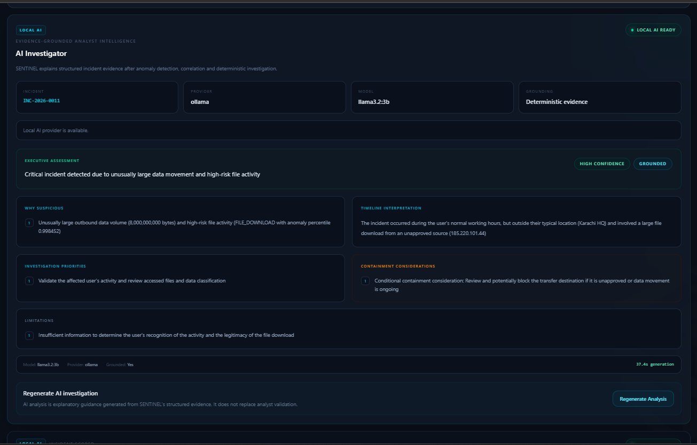
</p>

<p align="center">
  <em>
    Grounded Local AI — incident-scoped interpretation generated from
    deterministic SENTINEL evidence rather than unrestricted model context.
  </em>
</p>

The structured investigation response contains:

```text
Executive Assessment
Why Suspicious
Timeline Interpretation
Investigation Priorities
Containment Considerations
Confidence
Limitations
```

The model is asked to organize and explain the evidence already established by SENTINEL.

It is not asked to independently determine whether the incident exists.

---

### Structured Output Contract
SENTINEL does not accept arbitrary free-form model output for the structured AI Investigator.

The generation flow is:

```mermaid
sequenceDiagram
    participant S as SENTINEL
    participant O as Ollama
    participant V as Pydantic Validator
    participant U as Analyst UI

    S->>O: Grounded prompt + expected JSON schema
    O-->>S: Generated JSON
    S->>V: Validate generated content

    alt Schema valid
        V-->>S: Valid structured investigation
        S-->>U: Display AI interpretation
    else Invalid or malformed
        V-->>S: Validation failure
        S-->>U: Controlled AI error state
    end
```
The backend supplies the expected structured-output schema to Ollama and then independently validates the returned JSON using Pydantic.

Malformed JSON or schema-invalid output is rejected.

This prevents arbitrary model text from silently being treated as valid security intelligence.

---

### Incident-Scoped AI Analyst Chat
In addition to the structured investigator, SENTINEL provides conversational follow-up analysis for the currently selected incident.

<p align="center">
  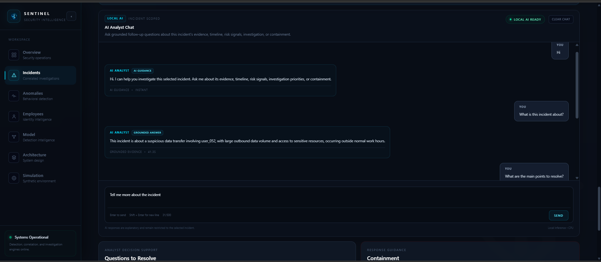
</p>

<p align="center">
  <em>
    Grounded AI Analyst Chat — incident-scoped follow-up analysis generated from
    deterministic SENTINEL evidence rather than unrestricted model context.
  </em>
</p>

The chat is intentionally not a general-purpose assistant.
Its scope is:
```text
current incident
      +
whitelisted evidence
      +
short conversational history
```

An analyst can ask questions such as:

```text
What evidence makes this incident suspicious?

Which event appears most significant?

What happened before the large transfer?

Why was this incident assigned this severity?

What should I investigate first?

Is there evidence that the employee used a new source IP?
```

The assistant must answer only using evidence available for that incident.

---

### Controlled Chat Response Types
Every model-backed chat response is classified into one of four semantic response types:
| Response Type | Meaning |
|---|---|
| `ANSWER` | The question is incident-related and supported by available evidence |
| `INVALID_QUESTION` | The message cannot be interpreted as a meaningful question |
| `OUT_OF_SCOPE` | The question is understandable but unrelated to the selected incident |
| `INSUFFICIENT_EVIDENCE` | The question concerns the incident, but SENTINEL does not have enough evidence to support an answer |


This gives the chat an explicit decision boundary:

```mermaid
flowchart TD
    A[Analyst Message]
    B{Understandable?}
    C[INVALID_QUESTION]
    D{About selected incident?}
    E[OUT_OF_SCOPE]
    F{Evidence sufficient?}
    G[INSUFFICIENT_EVIDENCE]
    H[ANSWER]

    A --> B
    B -- No --> C
    B -- Yes --> D
    D -- No --> E
    D -- Yes --> F
    F -- No --> G
    F -- Yes --> H
```
This is deliberately different from a general chatbot that tries to answer every question.

---

### Deterministic Chat Guard
Not every chat message needs to invoke a language model.

SENTINEL first applies a fast deterministic guard to obvious low-value inputs.

It handles cases such as:
- empty input
- punctuation or symbols only
- numbers only
- repeated-character noise
- common keyboard mash
- simple greetings
- simple help or capability questions

For example:

```text
Hi
Hello
Help
What can you do?
What can I ask?
```

can be handled directly by SENTINEL without an Ollama generation call.
Those deterministic responses report:

```text
generation_duration_ms = 0
```

This improves responsiveness and avoids spending local inference time on messages that do not require model reasoning.

---

### Conversation History Is Context, Not Evidence
The chat accepts only a small recent conversation window.

Current limits include:
| Context | Limit |
|---|---:|
| Analyst question | 500 characters |
| Previous message | 1,200 characters |
| Conversation history | 6 messages |
| Generated chat answer | 1,600 characters |

Only the final six validated messages are included when the grounded prompt is built.

More importantly:


>**Previous assistant messages are conversational context, not authoritative security evidence.**

If previous chat text conflicts with the newly supplied deterministic incident evidence, the deterministic evidence takes precedence.

This prevents a previous generated statement from recursively becoming "evidence" in later answers.

---

### Canonical Guardrail Responses
For non-answer classifications, SENTINEL does not allow the model to invent arbitrary refusal or fallback wording.

After the model response is parsed, the backend deterministically enforces canonical responses for:

```text
INVALID_QUESTION
OUT_OF_SCOPE
INSUFFICIENT_EVIDENCE
```

Conceptually:

```mermaid
flowchart LR
    A[Model Classification]
    B{Response Type}

    B -->|ANSWER| C[Validated Model Answer]
    B -->|INVALID_QUESTION| D[SENTINEL Canonical Response]
    B -->|OUT_OF_SCOPE| D
    B -->|INSUFFICIENT_EVIDENCE| D

    A --> B
```
This means the model may classify a question, but SENTINEL controls the user-facing behavior for important guardrail cases.

---

### Grounded Prompt Rules
The prompt layer explicitly instructs the model to:
- use only supplied incident evidence
- never invent unsupported facts
- never use external knowledge to fill evidence gaps
- preserve numerical values accurately
- keep numbers attached to the correct evidence field
- avoid describing an employee as compromised unless the evidence supports it
- distinguish unusual behavior from confirmed malicious activity
- state when evidence is insufficient
- avoid treating anomaly percentile as attack probability
- use conditional language where certainty is unavailable

These constraints reinforce the same semantics used throughout the deterministic platform.

For example:
```text
99.8% anomaly percentile
```

must remain:

>highly unusual relative to learned behavior

and must not become:

>99.8% probability that the employee is malicious

---

### Local AI Status & Readiness
The backend provides an explicit Local AI readiness check.

The status layer distinguishes between:
```text
AI disabled
      ↓
AI enabled but Ollama unreachable
      ↓
Ollama reachable but configured model missing
      ↓
Local AI ready
```

Status checks verify:
1. whether Local AI is enabled
2. whether the configured Ollama server can be reached
3. whether the requested model is installed

The configured model is not assumed to exist simply because Ollama is running.

This allows the frontend to display meaningful states such as:

```text
Local AI Disabled
Local AI Unavailable
Local AI Available
```

rather than reducing every failure to a generic API error.

---

### Controlled Failure Modes
The Local AI integration explicitly handles several failure classes:
| Condition | SENTINEL Behavior |
|---|---|
| Local AI disabled | Controlled unavailable state |
| Ollama unreachable | Provider unavailable |
| Configured model missing | Model unavailable |
| Generation exceeds timeout | Timeout response |
| Ollama returns non-JSON | Invalid-response failure |
| Output fails schema validation | Invalid-response failure |
| Evidence fails safety validation | AI request rejected |
| Incident does not exist | Incident-specific not-found response |


Generation failures do not corrupt or replace deterministic investigation intelligence.

The analyst can continue examining the incident without Local AI.

---

### Grounded AI Request Flow
The complete AI investigation boundary can be summarized as:

```mermaid
flowchart TD
    A[Selected Incident]
    B[Load Deterministic Evidence]
    C[Build Explicit Whitelist]
    D[Ground-Truth Safety Validation]
    E[Build Grounded Prompt]
    F{Ollama Ready?}
    G[Local Generation]
    H[JSON / Schema Validation]
    I[Validated AI Interpretation]
    J[React Analyst Workspace]
    K[Controlled AI Error State]

    A --> B
    B --> C
    C --> D
    D --> E
    E --> F

    F -- Yes --> G
    F -- No --> K

    G --> H

    H -- Valid --> I
    H -- Invalid --> K

    I --> J
    K --> J
```
The deterministic evidence remains visible regardless of the AI path.

---

### Local-First AI Architecture
SENTINEL deliberately uses a local provider rather than requiring a hosted commercial LLM API.

This provides several useful properties for the project:
- no mandatory external AI service
- no paid inference dependency
- host-local model execution
- explicit model selection
- evidence remains within the local environment
- Local AI can be completely disabled
- core security processing is unaffected by model availability

The default `llama3.2:3b` model is small enough to support local experimentation on modest hardware, although CPU-only inference can take noticeably longer than hosted GPU-backed services.

The default SENTINEL generation timeout is **90 seconds**.

---

### What the LLM Does — and Does Not Do
The architectural boundary is easiest to understand as a responsibility matrix:
| Capability | Deterministic SENTINEL | Local LLM |
|---|:---:|:---:|
| Persist security events | ✅ | ❌ |
| Build behavioral features | ✅ | ❌ |
| Score anomalies | ✅ | ❌ |
| Assign anomaly percentile | ✅ | ❌ |
| Classify operational risk | ✅ | ❌ |
| Correlate incidents | ✅ | ❌ |
| Assign incident severity | ✅ | ❌ |
| Build incident timeline | ✅ | ❌ |
| Generate deterministic findings | ✅ | ❌ |
| Define investigation steps | ✅ | ❌ |
| Explain established evidence conversationally | — | ✅ |
| Produce structured analyst-oriented interpretation | — | ✅ |
| Answer incident-scoped follow-up questions | — | ✅ |


This distinction prevents the generative layer from becoming an opaque replacement for the underlying security architecture.

---

### Grounded AI Design Principle
SENTINEL's Local AI philosophy can be summarized as:

>**Establish the evidence deterministically first. Let AI explain the evidence second.**

The language model is not trusted because it is persuasive.

It is useful because SENTINEL constrains:

```text
what evidence it sees
        +
what role it performs
        +
what output shape it may return
        +
what happens when it fails
```

This gives SENTINEL a hybrid architecture in which deterministic security intelligence remains authoritative while generative AI provides an optional analyst-facing interpretation layer.

---

## MLOps & Production Model Governance

SENTINEL treats the anomaly detector as a **versioned production artifact with an enforceable contract**, not simply as a `.joblib` file that happens to exist in the repository.

The production ML lifecycle is designed around explicit answers to questions such as:

```text
Which detector is approved?
Which experiment produced it?
Which feature schema does it require?
Which preprocessing contract does it expect?
Which exact artifact bytes are trusted?
Which evaluation results belong to it?
Can the runtime prove all of those statements before scoring events?
```

The current promoted detector is:

| Property | Production Value |
| --- | --- |
| **Detector** | `isolation-forest` |
| **Version** | `1.2` |
| **Algorithm** | `IsolationForest` |
| **Promotion Status** | `production` |
| **Selected Experiment** | `V1` |
| **Feature Schema Version** | `1.0` |
| **Feature Count** | `17` |
| **Training Rows** | `1,952` |
| **Estimators** | `300` |
| **Threshold Percentile** | `0.99` |
| **Random State** | `42` |

Production artifact:

```text
ml_engine/models/artifacts/sentinel_iforest_v1_2.joblib
```

Governance manifest:

```text
ml_engine/models/artifacts/sentinel_iforest_v1_2_manifest.json
```

Artifact SHA-256:

```text
b1da87092683ff27ee5ae9004881a9f93def8cce315da4f36195d8153971497c
```

This combination forms the production detector contract.

---

### From Model File to Governed Artifact

Without governance, a production ML system could silently load:

- the wrong experiment
- an old detector version
- a retrained but unapproved artifact
- a model expecting different features
- features in the wrong order
- different preprocessing
- a corrupted artifact
- a manually replaced model file

SENTINEL instead places a validation boundary between the artifact and every production consumer.

```mermaid
flowchart LR
    A[Selected Detector Contract]
    B[Production Manifest]
    C[Artifact SHA-256]
    D[Feature Schema]
    E[Preprocessing Schema]
    F[Training Configuration]
    G[Serialized Model Artifact]
    H[Governance Validator]
    I{Contract Valid?}
    J[Production Scoring]
    K[Fail Closed]

    A --> H
    B --> H
    C --> H
    D --> H
    E --> H
    F --> H
    G --> H

    H --> I

    I -- Yes --> J
    I -- No --> K
```

The model is therefore loaded only after its declared production contract has been validated.

---

### Selected Detector Contract

The application has a canonical selected-detector identity.

For the current release:

```text
name       = isolation-forest
version    = 1.2
experiment = V1
status     = production
```

Runtime code does not discover an arbitrary model by scanning the artifact directory.

Instead, the application knows which detector/version is selected and derives the expected production artifact and manifest from that contract.

Historical artifacts may still coexist in the repository, including earlier detector versions and experimental models.

For example, the artifact directory currently contains older models alongside the selected detector.

That historical presence does **not** make those models production-active.

```text
Available artifact
      ≠
Selected production artifact
```

Only the model satisfying the current selected-detector contract is accepted for operational scoring.

---

### Production Model Manifest

The promoted model is accompanied by a manifest describing its production identity and training contract.

The governance layer requires manifest information including:

```text
model_name
model_version
algorithm
promotion_status
experiment
feature_schema_version
feature_count
feature_columns
log_transform_columns
artifact_filename
artifact_sha256
training_rows
n_estimators
threshold_percentile
random_state
```

Conceptually:

```mermaid
flowchart TD
    A[Production Manifest]

    A --> B[Model Identity]
    A --> C[Experiment Identity]
    A --> D[Promotion State]
    A --> E[Feature Contract]
    A --> F[Preprocessing Contract]
    A --> G[Training Configuration]
    A --> H[Artifact Identity]
    A --> I[Cryptographic Checksum]
```

The manifest is therefore much more than descriptive metadata.

It is an executable contract checked by the production application.

---

### Cryptographic Artifact Integrity

Before SENTINEL deserializes the production model, it calculates the artifact's SHA-256 digest.

The sequence is deliberately:

```text
Locate artifact
      ↓
Load governance manifest
      ↓
Validate declared contract
      ↓
Calculate artifact SHA-256
      ↓
Compare with approved manifest checksum
      ↓
Only then deserialize the model
```

and **not**:

```text
Deserialize arbitrary joblib
      ↓
Check whether it looks correct later
```

This ordering matters because serialized model artifacts are executable trust boundaries.

The current approved checksum is:

```text
b1da87092683ff27ee5ae9004881a9f93def8cce315da4f36195d8153971497c
```

If even one byte of the artifact changes, the computed digest no longer matches the manifest.

The model is rejected.

---

### Fail-Closed Governance

SENTINEL's governance checks are intentionally fail-closed.

Conditions such as the following cause model validation to fail rather than allowing scoring to continue with uncertain state:

- artifact missing
- manifest missing
- manifest is malformed
- selected detector name mismatch
- detector version mismatch
- unexpected algorithm
- promotion status is not `production`
- experiment mismatch
- feature schema version mismatch
- feature count mismatch
- feature ordering mismatch
- preprocessing schema mismatch
- artifact filename mismatch
- invalid SHA-256 format
- artifact checksum mismatch
- artifact cannot be deserialized as the expected detector
- serialized model identity mismatch
- training configuration mismatch
- missing fitted estimator state
- unexpected underlying estimator contract

```mermaid
flowchart TD
    A[Candidate Production Model]
    B{Manifest Valid?}
    C{Identity Valid?}
    D{Feature Contract Valid?}
    E{Checksum Valid?}
    F{Artifact Deserializes?}
    G{Serialized Metadata Valid?}
    H{Fitted Model Valid?}
    I[Approved Runtime Detector]

    X[Reject / Fail Closed]

    A --> B
    B -- No --> X
    B -- Yes --> C
    C -- No --> X
    C -- Yes --> D
    D -- No --> X
    D -- Yes --> E
    E -- No --> X
    E -- Yes --> F
    F -- No --> X
    F -- Yes --> G
    G -- No --> X
    G -- Yes --> H
    H -- No --> X
    H -- Yes --> I
```

The system therefore prefers an explicit operational failure over silently scoring security events with an untrusted detector.

---

### Feature Ordering Is Part of the Model Contract

For many ML pipelines, having the correct set of features is not enough.

The **order** must also match the model's training representation.

SENTINEL therefore validates the exact canonical V1 feature sequence:

```text
hour_sin
hour_cos
outside_work_hours
source_ip_is_baseline
remote_work_probability
bytes_sent
bytes_received
total_bytes
data_volume_ratio
success
failed_logins_10m
events_5m
file_events_30m
network_events_5m
unique_destinations_5m
bytes_sent_30m
bytes_received_30m
```

A manifest containing all 17 features but in a different order does not satisfy the production contract.

```text
Same feature names
      +
Different ordering
      =
Invalid production schema
```

This protects against one of the more subtle forms of ML deployment drift: feeding semantically correct values into the wrong model columns.

---

### Preprocessing Is Also Governed

The feature contract includes more than raw feature names.

SENTINEL also validates the expected preprocessing schema, including the canonical columns requiring transformation before inference.

Conceptually:


```text
Raw behavioral features
        ↓
Canonical feature order
        ↓
Approved preprocessing contract
        ↓
Model-ready matrix
        ↓
Isolation Forest v1.2
```

This prevents a detector trained with one preprocessing strategy from silently receiving a differently transformed production feature matrix.

The feature schema and preprocessing schema therefore evolve as explicit versioned interfaces.

---

### Serialized Artifact Validation

Matching the manifest is not sufficient by itself.

After byte-level checksum validation and safe loading, SENTINEL inspects the serialized detector as well.

The loaded artifact must agree with the production contract on properties such as:

- model name
- model version
- feature schema
- preprocessing schema
- estimator count
- threshold percentile
- random state

The detector must also contain valid fitted model state and the expected underlying scikit-learn estimator.

This produces two layers of verification:

```mermaid
flowchart LR
    A[Manifest Contract]
    B[Artifact Bytes]
    C[SHA-256 Match]
    D[Deserialize]
    E[Serialized Detector Metadata]
    F[Fitted Estimator Contract]
    G[Production Ready]

    A --> C
    B --> C
    C --> D
    D --> E
    E --> F
    F --> G
```

A manifest cannot simply be edited to disguise an incompatible serialized detector.

---

### Runtime Model Preflight

Model governance is not limited to an offline verification script.

The always-on Event Processor performs a selected-model preflight **before it begins consuming Events**.

Conceptually:

```mermaid
sequenceDiagram
    participant W as Event Processor
    participant G as Governance Layer
    participant A as Model Artifact
    participant DB as Event Stream

    W->>G: Load selected production model
    G->>A: Validate manifest + checksum + artifact

    alt Governance passes
        G-->>W: Valid production detector
        W->>DB: Begin consuming Events
    else Governance fails
        G-->>W: ModelGovernanceError
        W--xDB: Do not begin production scoring
    end
```

This means an invalid model cannot quietly enter service simply because a container started successfully.

The scoring worker must first prove that its detector satisfies the production contract.

---

### Single Selected-Model Scoring Boundary

Production scoring is centralized around the selected detector.

The scoring service loads and caches the governed production model so SENTINEL does not deserialize the artifact for every event.

```text
Validated selected model
        ↓
cached production detector
        ↓
event scoring
        ↓
AnomalyScore
        ↓
detector_name + detector_version persisted
```

Persisted anomaly scores therefore carry detector lineage.

For the current production model:

```text
detector_name    = isolation-forest
detector_version = 1.2
```

This lineage propagates into later security intelligence.

---

### Detector Lineage Through the Security Pipeline

Model provenance does not disappear after scoring.

SENTINEL preserves detector identity through operational entities.

```mermaid
flowchart LR
    A[Governed Model]
    B[Anomaly Score]
    C[Incident]
    D[Investigation]
    E[Employee Intelligence]
    F[AI Evidence]

    A -->|name + version| B
    B -->|lineage| C
    C --> D
    C --> E
    C --> F
```

This means analysts and downstream services can distinguish:

```text
anomaly scored by isolation-forest v1.2
```

from historical output produced by another detector version.

It also prevents security summaries from silently mixing incompatible model generations.

---

### Incident Provenance

Incidents preserve detector and correlation provenance explicitly.

A correlated incident is therefore associated not only with its security classification but also with information such as:

```text
detector_name
detector_version
correlation_engine
correlation_version
```

Incident updates must remain consistent with the established provenance.

This prevents an existing incident from being silently evolved using evidence derived from incompatible detector/correlation lineages.

The result is a traceable path from:

```text
production model
      ↓
anomaly
      ↓
incident
      ↓
investigation
```

---

### Production Build Validation

The backend production image validates the promoted detector during image construction.

The Docker build checks the model governance contract and reports the approved detector identity and checksum before completing the production image.

Conceptually:

```text
docker build
    ↓
install production dependencies
    ↓
copy production model + manifest
    ↓
run model governance validation
    ↓
PASS
    ↓
complete production image
```

If the checked-in model does not satisfy governance requirements, the production image build fails.

This moves ML integrity validation earlier in the deployment lifecycle instead of waiting for the application to encounter a bad artifact at runtime.

---

### Governance at Multiple Boundaries

The same production contract is enforced at multiple stages:

| Boundary | Purpose |
| --- | --- |
| **Explicit verification script** | Developer/release-time governance validation |
| **Automated tests** | Regression protection for governance invariants |
| **Docker image build** | Prevent invalid model packaging |
| **Runtime model loading** | Prevent untrusted model use |
| **Event Processor preflight** | Prevent event consumption with invalid detector |
| **GitHub Actions CI** | Prevent invalid production-model changes from passing release validation |

This gives SENTINEL defense in depth around model deployment.

```mermaid
flowchart LR
    A[Model Change]
    B[Tests]
    C[Governance Script]
    D[CI Gate]
    E[Docker Build]
    F[Runtime Preflight]
    G[Operational Scoring]

    A --> B
    B --> C
    C --> D
    D --> E
    E --> F
    F --> G
```

The model is therefore checked repeatedly as it moves from repository state to production execution.

---

### Explicit Governance Verification

SENTINEL provides a dedicated verification utility:

```bash
python scripts/verify_model_governance.py
```

For the current release, successful verification confirms:

```text
selected detector identity        ✓
production promotion status       ✓
artifact filename                 ✓
artifact SHA-256 integrity        ✓
canonical feature order           ✓
preprocessing schema              ✓
training configuration            ✓
serialized detector identity      ✓
fitted training state             ✓
sklearn estimator contract        ✓
```

A successful report identifies the approved detector as:

```text
isolation-forest v1.2
```

with feature schema:

```text
1.0
```

and production status:

```text
production
```

---

### Evaluation Artifact Registry

Model governance answers:

> **Can this exact detector be trusted as the selected production artifact?**

Evaluation provenance answers a different question:

> **Do the benchmark results shown for this detector actually belong to the same experiment that produced the promoted model?**

SENTINEL maintains a canonical evaluation registry:

```text
ml_engine/evaluation/evaluation_registry.json
```

The registry consolidates evaluation components including:

```text
selected production model
        +
selected-model evaluation
        +
candidate model experiments
        +
incident evaluation
        +
benchmark provenance
```

This gives the dashboard and release process a canonical evaluation view instead of relying on manually copied metric values.

---

### Benchmark Provenance

SENTINEL provides a separate provenance verifier:

```bash
python scripts/verify_benchmark_provenance.py
```

For the canonical release, it verifies:

| Property | Canonical Value |
| --- | --- |
| **Benchmark Seed** | `42` |
| **Selected Experiment** | `V1` |
| **Production Detector** | `isolation-forest v1.2` |
| **Feature Count** | `17` |
| **Training Rows** | `1,952` |
| **Evaluation Rows** | `3,951` |
| **Ground-Truth Batch** | `phase3_attack_batch_01` |

Cross-artifact validation covers:

```text
promoted model manifest
selected-model evaluation
model experiment comparison
evaluation registry
benchmark report
incident evaluation
canonical benchmark signature
```

All of those artifacts must agree on the canonical experiment.

---

### Model Integrity vs Evaluation Provenance

SENTINEL deliberately separates two related but different concepts:

```mermaid
flowchart TD
    A[Production ML Trust]

    A --> B[Model Governance]
    A --> C[Benchmark Provenance]

    B --> D[Is this exact artifact approved?]
    B --> E[Is its feature contract correct?]
    B --> F[Has the artifact been modified?]

    C --> G[Do these metrics belong to this model?]
    C --> H[Do evaluation artifacts agree?]
    C --> I[Was the canonical benchmark used?]
```

Model governance protects the **runtime detector**.

Benchmark provenance protects the **claims made about that detector**.

Both are required for a trustworthy production ML story.

---

### Preventing Silent Model Drift

The governance architecture is specifically designed to prevent silent changes such as:

```text
Replacing the .joblib file
        ↓
without updating governance
        ↓
REJECTED
```

```text
Changing feature order
        ↓
without a new schema contract
        ↓
REJECTED
```

```text
Changing model version
        ↓
while leaving selected detector at v1.2
        ↓
REJECTED
```

```text
Marking an experiment artifact
as production without promotion
        ↓
REJECTED
```

```text
Showing metrics from V2
for a V1 production artifact
        ↓
PROVENANCE VALIDATION FAILURE
```

This turns model changes into explicit engineering decisions rather than invisible file replacements.

---

### Model Versions and Historical Artifacts

SENTINEL may retain older model artifacts for reproducibility and development history.

Their existence is useful for:

- experiment comparison
- regression investigation
- reproducibility
- model evolution
- historical evaluation

but they remain distinct from the **selected production detector**.

```text
Historical model artifact
        ≠
Promoted production model
```

Promotion is an explicit state represented by the selected-detector contract and governance manifest.

---

### ML Changes Require Contract Changes

A meaningful production model change may require coordinated updates across several interfaces.

For example:

```text
new feature
   ↓
feature schema change
   ↓
retraining
   ↓
new experiment evaluation
   ↓
new artifact
   ↓
new checksum
   ↓
new manifest
   ↓
production selection
   ↓
governance validation
```

This discourages changing ML behavior implicitly.

The model artifact, preprocessing, feature schema, evaluation evidence, and selected-detector identity are treated as connected release concerns.

---

### Production ML Trust Chain

The complete trust chain can be summarized as:

```mermaid
flowchart TD
    A[Controlled Training Data]
    B[Canonical Feature Schema]
    C[Model Experiment]
    D[Controlled Evaluation]
    E[Production Selection]
    F[Governance Manifest]
    G[SHA-256 Protected Artifact]
    H[Build-Time Validation]
    I[Runtime Preflight]
    J[Operational Event Scoring]
    K[Persisted Detector Lineage]
    L[Incident Provenance]

    A --> B
    B --> C
    C --> D
    D --> E
    E --> F
    E --> G
    F --> H
    G --> H
    H --> I
    I --> J
    J --> K
    K --> L
```

At each stage, SENTINEL preserves enough information to identify which model produced operational security intelligence.

---

### MLOps Design Principle

SENTINEL's production-model philosophy can be summarized as:

> **A model is not production-ready because a `.joblib` file exists. It is production-ready only when its identity, artifact integrity, feature contract, preprocessing, training configuration, evaluation provenance, and runtime compatibility can all be verified.**

The result is an ML deployment architecture designed to resist:

- accidental artifact replacement
- silent model drift
- feature-order drift
- preprocessing drift
- incorrect version selection
- unapproved model promotion
- incompatible serialized artifacts
- benchmark/result mismatches

This keeps the production detector reproducible, traceable, and operationally accountable throughout SENTINEL's security pipeline.

---

## Production Runtime, Docker & Nginx

SENTINEL is packaged as a containerized multi-service application with a deliberately small default runtime.

A normal deployment consists of four continuously running services:

```text
postgres
backend
event-processor
frontend
```

Optional workflows such as benchmarking, workforce generation, historical backfill, and live simulation are placed behind explicit Docker Compose profiles and do not become part of the normal runtime unless requested.

```mermaid
flowchart LR
    U[Browser]
    N[Nginx / React Frontend]
    B[FastAPI Backend]
    P[(PostgreSQL)]
    E[Event Processor]

    U -->|HTTP :8080| N
    N -->|/api/*| B
    B --> P
    E --> P

    B -. operational API .-> E
```

The default deployment therefore separates:

- public web access
- application API execution
- background event processing
- persistent storage

while keeping internal services off the host network surface.

---

### Default Runtime Topology

Running the default Compose stack starts:

| Service | Role | Normal Runtime |
| --- | --- | :---: |
| **`postgres`** | Operational PostgreSQL database | ✅ |
| **`backend`** | FastAPI API and application services | ✅ |
| **`event-processor`** | Always-on ML scoring and incident-processing worker | ✅ |
| **`frontend`** | React application served through Nginx | ✅ |
| `benchmark-postgres` | Isolated benchmark database | Profile only |
| `benchmark-runner` | One-shot canonical benchmark | Profile only |
| `employee-generator` | Additive workforce utility | Profile only |
| `event-backfill` | Historical event processing utility | Profile only |
| `simulator-worker` | Optional live corporate simulator | Profile only |

The default path is therefore intentionally:

```text
docker compose up
        ↓
PostgreSQL
FastAPI
Event Processor
React + Nginx
```

not:

```text
every development / evaluation utility
running at the same time
```

This keeps normal platform operation separate from evaluation and maintenance workflows.

---

### Nginx as the Public Gateway

The frontend container is the public entry point to SENTINEL.

By default, Docker publishes:


```text
host :8080
   ↓
frontend container :80
```

through:

```text
${FRONTEND_PORT:-8080}:80
```

The normal application is therefore available at:

```text
http://localhost:8080
```

The frontend container serves both:

1. the compiled React application
2. reverse-proxied API requests to FastAPI

```mermaid
flowchart LR
    A[Browser]
    B["Nginx :80"]
    C[React Static Assets]
    D["FastAPI backend:8000"]

    A --> B
    B -->|SPA / static assets| C
    B -->|/api/*| D
```

The browser does not need to communicate directly with the backend container.

---

### Internal-Only Backend

FastAPI listens on:

```text
0.0.0.0:8000
```

inside the Docker network.

The default Compose file uses:

```text
expose:
  - "8000"
```

rather than publishing port `8000` to the host.

As a result:

```text
Browser
   ✕
direct FastAPI access through host :8000

Browser
   ↓
Nginx :8080
   ↓
Docker network
   ↓
FastAPI :8000
```

This reduces the normal externally exposed surface and establishes Nginx as the single application gateway.

A separate development Compose configuration can intentionally expose the backend when direct debugging access is required.

---

### Internal-Only PostgreSQL

The operational PostgreSQL service follows the same principle.

PostgreSQL exposes:

```text
5432
```

inside the Compose network but does not publish that port to the host in the default deployment.

```mermaid
flowchart LR
    B[FastAPI]
    E[Event Processor]
    DB[(PostgreSQL :5432)]

    B --> DB
    E --> DB

    H[Host Network]
    H -. not published by default .-> DB
```

Application services connect using the Docker service name:

```text
postgres:5432
```

The database credentials are constructed from:

```text
POSTGRES_USER
POSTGRES_PASSWORD
POSTGRES_DB
```

and `POSTGRES_PASSWORD` must be explicitly provided through the environment.

The default Compose configuration does not silently fall back to a weak production database password.

---

### Same-Origin API Routing

The production frontend is built with:

```text
VITE_API_BASE_URL=/api/v1
```

This means browser requests use the same application origin as the React interface.

For example:

```text
Browser request:
http://localhost:8080/api/v1/incidents

        ↓

Nginx

        ↓

http://backend:8000/api/v1/incidents
```

The Nginx configuration deliberately uses:

```nginx
location /api/ {
    proxy_pass http://backend:8000;
}
```

without a trailing slash on `proxy_pass`.

This preserves the original request URI rather than rewriting the `/api/...` path before FastAPI receives it.

The gateway also forwards standard proxy context including:

```text
Host
X-Real-IP
X-Forwarded-For
X-Forwarded-Proto
```

---

### React SPA Deep-Link Support

SENTINEL uses routed React workspaces such as:

```text
/incidents/INC-2026-0001
/anomalies/<event-id>
/employees/<user-id>
```

A direct browser request to one of these paths must still load the React application.

Nginx therefore uses:

```nginx
try_files $uri $uri/ /index.html;
```

for the application route.

Conceptually:

```text
GET /incidents/INC-2026-0001
        ↓
No physical file exists
        ↓
Nginx returns index.html
        ↓
React Router resolves the route
        ↓
Incident Investigation Workspace
```

Without this fallback, refreshing or directly opening a deep link would produce a server-side `404`.

---

### Static Asset Caching

Fingerprint-based frontend assets under:

```text
/assets/
```

are served with long-lived immutable caching:

```text
max-age=31536000
immutable
```

The main SPA route is served with:

```text
Cache-Control: no-cache
```

This gives SENTINEL two useful caching behaviors:

```text
Fingerprint assets
    → aggressively cacheable

Application entry point
    → revalidated
```

so deployment updates can replace the application shell while unchanged hashed assets remain efficiently cached.

---

### Health-Gated Startup

The Compose stack does not rely only on container process creation order.

Core dependencies use health checks.

The startup chain is approximately:

```mermaid
flowchart TD
    A[PostgreSQL Starts]
    B{PostgreSQL Healthy?}
    C[Backend Starts]
    D[Alembic Upgrade]
    E[FastAPI Starts]
    F{Backend Healthy?}
    G[Event Processor Starts]
    H[Frontend Starts]
    I{Frontend Healthy?}

    A --> B
    B -- Yes --> C
    C --> D
    D --> E
    E --> F

    F -- Yes --> G
    F -- Yes --> H
    H --> I
```

The operational database health check uses `pg_isready`.

The backend health check requests:

```text
http://127.0.0.1:8000/health
```

The frontend health check requests:

```text
http://127.0.0.1/healthz
```

This means dependent services wait for meaningful health boundaries rather than simply waiting for another container to exist.

---

### Schema-Ready Backend Boundary

The backend container starts with:

```text
alembic upgrade head
        ↓
uvicorn
```

using the command:

```text
alembic -c alembic.ini upgrade head
&&
uvicorn app.main:app --host 0.0.0.0 --port 8000
```

The backend therefore does not become healthy until the database schema has been migrated and the API is running.

This health boundary is reused by downstream services.

For example:

```text
PostgreSQL healthy
        ↓
Backend migrates schema
        ↓
Backend becomes healthy
        ↓
Event Processor starts
        ↓
Optional utilities may run
```

That reduces race conditions between schema creation and workers attempting to access newer tables.

---

### Always-On Event Processor

The Event Processor is a normal production service, not a simulator feature.

Its responsibilities include:

```text
discover new Events
      ↓
build incremental features
      ↓
score with selected production detector
      ↓
persist anomaly intelligence
      ↓
perform incremental correlation
      ↓
create / evolve Incidents
      ↓
refresh deterministic investigations
```

Its default runtime configuration includes:

```text
SENTINEL_PROCESSOR_POLL_SECONDS=1
SENTINEL_PROCESSOR_BATCH_SIZE=100
SENTINEL_PROCESSOR_WORKER_ID=processor-docker
```

The processor waits for the backend health boundary before starting, but it does **not** depend on the optional simulator.

This distinction is intentional:

> **SENTINEL processes Events regardless of where those Events came from.**

---

### Simulator Independence at Runtime

The optional simulator uses the `simulation` Compose profile.

Normal:

```bash
docker compose up -d
```

does not require it.

When explicitly enabled:

```bash
docker compose \
  --profile simulation \
  up -d simulator-worker
```

the simulator waits for the schema-ready backend and writes ordinary Events into PostgreSQL.

It intentionally does not depend on the Event Processor.

```mermaid
flowchart LR
    S[Simulator]
    DB[(Operational DB)]
    P[Event Processor]

    S -->|writes Events| DB
    P -->|discovers Events independently| DB
```

The processor therefore remains an independent consumer of operational telemetry.

---

### Profile-Gated Runtime Extensions

Additional workflows are deliberately separated using Compose profiles.

**Benchmark**

```text
profile: benchmark
```

starts:

```text
benchmark-postgres
benchmark-runner
```

against a dedicated evaluation database.

**Utilities**

```text
profile: utilities
```

provides one-shot operations such as:

```text
employee-generator
event-backfill
```

**Simulation**

```text
profile: simulation
```


provides:

```text
simulator-worker
```


This design prevents maintenance or evaluation containers from becoming accidental long-running production dependencies.

---

### Persistent Database Storage

The operational PostgreSQL database persists through the named Docker volume:

```text
sentinel_postgres_data
```

The benchmark has a separate volume:

```text
sentinel_benchmark_postgres_data
```

This mirrors the architectural separation between operational and evaluation environments.

```mermaid
flowchart LR
    A[Operational PostgreSQL]
    B[(sentinel_postgres_data)]

    C[Benchmark PostgreSQL]
    D[(sentinel_benchmark_postgres_data)]

    A --> B
    C --> D
```

The two workflows therefore do not share a database volume.

---

### Backend Runtime Hardening

The backend container uses several runtime safeguards.

It runs as:

```text
UID 10001
GID 10001
```

rather than as the root account.

Docker Compose additionally configures:

```text
no-new-privileges:true
cap_drop:
  - ALL
read_only: true
```

The application filesystem is therefore immutable during normal runtime.

A limited temporary filesystem remains available at:

```text
/tmp
```

with:

```text
rw
noexec
nosuid
size=64m
```

Conceptually:

```mermaid
flowchart TD
    A[Backend Container]
    A --> B[Unprivileged UID/GID]
    A --> C[No New Privileges]
    A --> D[Drop Linux Capabilities]
    A --> E[Read-Only Root Filesystem]
    A --> F[Restricted /tmp]
```

These measures reduce the amount of operating-system authority available to the API process if the application were ever compromised.

---

### Event Processor Runtime Hardening

The Event Processor uses the same backend image and applies the same key runtime restrictions:

```text
user: 10001:10001
no-new-privileges:true
cap_drop: ALL
read_only: true
```

with a restricted temporary filesystem.

Because both API and worker use the same governed application image, they also share the same production ML code and artifact contract.

The processor does not require Ollama and explicitly runs with:

```text
OLLAMA_ENABLED=false
```

Local AI therefore remains an API-side optional analyst capability rather than a dependency of event processing.

---

### Read-Only ML Mounts

The backend mounts production ML assets as read-only:

```text
./ml_engine/evaluation
    → /app/ml_engine/evaluation:ro

./ml_engine/models/artifacts
    → /app/ml_engine/models/artifacts:ro
```

The Event Processor shares the production image containing the governed detector.

This reinforces the principle that production runtime services should consume model/evaluation artifacts rather than modify them.

Model generation and benchmark workflows are handled separately.

---

### Runtime Package-Manager Hardening

The backend image installs dependencies during image creation and then removes Python package-management tooling from the runtime image.

Removed components include:

```text
pip
pip3
pip3.14
ensurepip
```

This occurs only after:

1. dependencies have been installed
2. the production model-governance preflight has passed

The running container therefore does not require the ability to install Python packages.

This reduces runtime attack surface and helps keep deployed dependencies tied to the built image rather than mutable container state.

---

### Build-Time Model Governance

The backend image cannot complete successfully unless the selected production model passes governance validation.

During image construction SENTINEL verifies:

- detector identity and version
- production promotion status
- manifest schema
- artifact filename
- SHA-256 integrity
- feature ordering
- preprocessing schema
- training configuration
- serialized detector metadata
- fitted model state
- underlying scikit-learn estimator contract

```mermaid
flowchart TD
    A[Build Backend Image]
    B[Install Dependencies]
    C[Copy Application]
    D[Copy ML Artifacts]
    E[Validate Production Model]
    F{Governance Pass?}
    G[Continue Image Build]
    H[Build Fails]

    A --> B
    B --> C
    C --> D
    D --> E
    E --> F

    F -- Yes --> G
    F -- No --> H
```

This prevents an invalid detector from being packaged unnoticed into a deployable backend image.

---

### Production Frontend Image

The frontend uses a multi-stage Docker build.

```mermaid
flowchart LR
    A["Node 22 Alpine"]
    B[npm ci]
    C[Vite Production Build]
    D[Compiled dist/]
    E[Nginx Alpine Runtime]
    F[Production Frontend]

    A --> B
    B --> C
    C --> D
    D --> E
    E --> F
```

The build stage:

```text
installs Node dependencies
builds the React application
produces static assets
```

The runtime stage contains Nginx and the compiled application rather than the Node development server.

Production therefore does not require Vite or the frontend development environment to remain active.

---

### Frontend Runtime Security Update

The Nginx runtime image applies available security updates to:

```text
libexpat
```

during the production image build.

This is part of SENTINEL's container-hardening workflow and aligns with the later CI container-vulnerability checks.

---

### Resource Guardrails

Core services include explicit CPU, memory, process, and shutdown limits.

| Service | Memory Limit | CPU Limit | PID Limit |
| --- | ---: | ---: | ---: |
| PostgreSQL | 768 MiB | 1.0 | 128 |
| FastAPI Backend | 1 GiB | 1.5 | 64 |
| Event Processor | 768 MiB | 1.5 | 64 |
| Frontend / Nginx | 128 MiB | 0.5 | 64 |

These are not performance guarantees.

They are runtime guardrails intended to prevent one service from consuming unbounded host resources during normal local deployment.

---

### Graceful Shutdown

Services are also given explicit shutdown windows.

| Service | Grace Period |
| --- | --- |
| PostgreSQL | `60s` |
| Backend | `30s` |
| Event Processor | `30s` |
| Frontend | `15s` |

The longer PostgreSQL period allows checkpoint and WAL activity to finish cleanly.

The Event Processor receives time to handle termination and persist runtime state before Docker escalates termination.

---

### Bounded Container Logging

Long-running services use Docker's `json-file` logging driver with bounded rotation:

```text
max-size: 10m
max-file: 3
```

This prevents application logs from growing indefinitely on a long-running development or demonstration host.

---

### Restart Policies

Normal long-running services use:

```text
restart: unless-stopped
```

including:

- PostgreSQL
- backend
- Event Processor
- frontend
- simulator when explicitly enabled

One-shot workflows such as:

- benchmark runner
- employee generator
- event backfill

use:

```text
restart: "no"
```

This reflects their intended execution model.

```text
daemon / platform service
    → restart unless stopped

explicit maintenance job
    → run once and exit
```

---

### Host-Managed Ollama Boundary

Ollama intentionally remains outside the SENTINEL container stack.

When Local AI is enabled, the backend reaches the host through:

```text
host.docker.internal
```

with the configured Docker-side URL:

```text
http://host.docker.internal:11434
```

Compose maps:

```text
host.docker.internal:host-gateway
```

so the backend can communicate with the independently managed host service.

```mermaid
flowchart LR
    subgraph Docker
        B[FastAPI Backend]
        N[Nginx / React]
        DB[(PostgreSQL)]
        P[Event Processor]
    end

    O[Host-Managed Ollama]

    N --> B
    B --> DB
    P --> DB
    B -. optional Local AI .-> O
```

This preserves the architectural rule established earlier:

> **Ollama is an optional external local capability, not a required SENTINEL runtime service.**

---

### Operational Runtime Separation

The final runtime architecture separates three different categories of execution.

```mermaid
flowchart TD
    A[SENTINEL Docker Runtime]

    A --> B[Core]
    A --> C[Optional Runtime]
    A --> D[One-Shot / Evaluation]

    B --> B1[PostgreSQL]
    B --> B2[FastAPI]
    B --> B3[Event Processor]
    B --> B4[React + Nginx]

    C --> C1[Simulator]

    D --> D1[Employee Generator]
    D --> D2[Event Backfill]
    D --> D3[Benchmark Runner]
    D --> D4[Benchmark PostgreSQL]
```

This avoids turning every project capability into a permanent microservice.

The service boundary follows operational purpose rather than maximizing container count.

---

### Public vs Internal Network Surface

The default deployment can be summarized as:

| Component | Container Port | Host-Published by Default? |
| --- | ---: | --- |
| **Nginx / React** | `80` | ✅ `8080` by default |
| FastAPI | `8000` | ❌ |
| Operational PostgreSQL | `5432` | ❌ |
| Event Processor | — | ❌ |
| Benchmark PostgreSQL | `5432` | ❌ |
| Simulator | — | ❌ |

So the normal external path is:

```text
User
 ↓
localhost:8080
 ↓
Nginx
 ├── React application
 └── /api/* → FastAPI
```

rather than exposing each internal service individually.

---

### Production Runtime Design Principle

SENTINEL's runtime philosophy can be summarized as:

> **Expose one application gateway, keep operational services internal, separate background processing from the API, gate optional workflows behind explicit profiles, and fail deployment boundaries early when dependencies or model contracts are invalid.**

The resulting deployment combines:

- a single public Nginx gateway
- internal-only FastAPI
- internal-only PostgreSQL
- an independent always-on Event Processor
- persistent operational storage
- health-gated startup
- schema migration before API readiness
- non-root backend and worker execution
- dropped Linux capabilities
- read-only backend/worker filesystems
- bounded resources and logs
- build-time ML governance
- profile-separated simulator, benchmark, and maintenance utilities
- optional host-managed Local AI

This keeps the default runtime relatively small while still supporting the wider development, simulation, evaluation, and ML-governance workflows around it.

---

## Testing, CI/CD & DevSecOps

SENTINEL is backed by layered automated validation covering application correctness, production ML behavior, browser-level workflows, dependency security, static analysis, container security, release consistency, and model governance.

The testing strategy is deliberately broader than isolated unit tests.

```text
Unit behavior
      ↓
Database integration
      ↓
Production ML scoring
      ↓
API contracts
      ↓
Frontend behavior
      ↓
Production-style deployed stack
      ↓
Browser journeys
      ↓
Security + governance gates
```

The objective is to validate not only whether individual functions work, but whether the **complete security platform behaves correctly when assembled as a system**.

---

### Test Strategy

SENTINEL uses multiple complementary test layers:

| Layer | Primary Purpose |
| --- | --- |
| **Backend Unit Tests** | Validate services, algorithms, guards, schemas, and internal contracts |
| **Backend Integration Tests** | Validate PostgreSQL-backed security workflows and production ML behavior |
| **API Tests** | Validate FastAPI endpoint contracts |
| **Frontend Component Tests** | Validate React behavior and analyst workflows |
| **Coverage Enforcement** | Prevent substantial untested regressions |
| **Production-Style E2E** | Validate the real deployed application across containers |
| **Security Automation** | Detect secrets, vulnerable dependencies, insecure code, and vulnerable images |
| **Release Validation** | Keep application version sources synchronized |
| **Model Governance** | Verify production detector integrity and provenance |

```mermaid
flowchart TD
    A[Source Change]

    A --> B[Backend Tests]
    A --> C[Frontend Tests]
    A --> D[Security Analysis]
    A --> E[Release Validation]
    A --> F[Model Governance]

    B --> G[Integration Tests]
    C --> H[Frontend Coverage]

    G --> I[Production-Style E2E]
    H --> I

    D --> J[CI Result]
    E --> J
    F --> J
    I --> J
```

No single test layer is expected to establish correctness on its own.

---


### Backend Automated Testing

The backend test environment is isolated from the operational SENTINEL deployment.

It uses:

```text
docker-compose.test.yml
backend/Dockerfile.test
isolated PostgreSQL
Alembic migrations
pytest
pytest-cov
```

Production data is not used by the automated backend suite.

The test container runs the backend regression with coverage enabled.

The final v1.0.0 release-candidate regression produced:

| Backend Result | Value |
| --- | --- |
| **Tests Passed** | **313** |
| **Coverage** | **93.90%** |
| **Required Coverage** | **90%** |
| Known warnings | 1 Starlette/httpx deprecation warning |

The enforced coverage floor means the backend regression cannot pass merely because all executed tests succeed.

Coverage must also remain at or above:

```text
90%
```

---

### Backend Coverage Scope

Backend tests exercise major platform boundaries including:

- FastAPI endpoints
- event ingestion and retrieval
- feature engineering
- incremental feature computation
- production anomaly scoring
- selected-model behavior
- anomaly persistence
- incident correlation
- incident persistence
- incident evolution
- deterministic investigation
- Event Processor runtime behavior
- processor recovery and state
- simulation runtime state
- employee intelligence
- evaluation metrics
- Local AI service boundaries
- AI prompt grounding
- AI evidence safety
- AI chat guard behavior
- ground-truth isolation
- model governance
- evaluation artifact contracts
- benchmark provenance behavior

The backend test suite therefore covers both ordinary application behavior and security-specific architectural invariants.

---

### Production ML Integration Testing

SENTINEL's ML integration tests do not validate only mocked prediction code.

Dedicated integration coverage exercises the **real promoted production artifact**.

Conceptually:

```mermaid
flowchart LR
    A[Test Event]
    B[Real Feature Engineering]
    C[Governed Isolation Forest v1.2]
    D[Production Scoring Service]
    E[(AnomalyScore)]
    F[Persisted Detector Lineage]

    A --> B
    B --> C
    C --> D
    D --> E
    E --> F
```

These tests verify that production scoring:

- loads the selected detector
- uses the expected production feature contract
- generates anomaly intelligence
- persists detector name and version
- preserves the operational scoring contract

This reduces the gap between an ML experiment that passes offline and the model actually used by the deployed application.

---

### Ground-Truth Separation Tests

Because synthetic ground truth exists elsewhere in the project, SENTINEL explicitly tests the trust boundary separating it from operational inference.

Integration and safety tests verify that production scoring can operate without relying on simulator-private truth.

The intended relationship is:

```text
observable Event
      ↓
feature engineering
      ↓
model scoring
```

not:

```text
private simulator label
      ↓
model scoring
```

The same safety philosophy is tested around Local AI evidence generation.

This makes ground-truth separation an automated regression contract rather than a documentation-only promise.

---

### Frontend Automated Testing

The React application uses:

- Vitest
- React Testing Library
- jsdom
- V8 coverage
- oxlint

The final v1.0.0 frontend regression produced:

| Frontend Result | Value |
| --- | --- |
| **Test Files Passed** | **53** |
| **Tests Passed** | **475** |
| **Statement Coverage** | **91.30%** |
| **Branch Coverage** | **85.91%** |
| **Function Coverage** | **96.19%** |
| **Line Coverage** | **91.30%** |

Configured minimum coverage thresholds are:

| Coverage Type | Minimum |
| --- | ---: |
| **Statements** | `90%` |
| **Branches** | `80%` |
| **Functions** | `90%` |
| **Lines** | `90%` |

The frontend CI command is:

```bash
npm run test:coverage
```

which runs:

```text
vitest run --coverage
```

---

### Frontend Coverage Scope

The frontend suite covers behavior across the analyst application, including:

- SOC overview
- incident queue
- incident investigation
- deterministic investigation
- incident timeline
- anomaly intelligence
- anomaly analysis
- employee directory
- employee investigation
- Model Intelligence
- Simulation workspace
- Architecture workspace
- runtime telemetry
- Local AI readiness
- Local AI graceful degradation
- routing
- cross-navigation
- filtering
- pagination
- API client behavior
- accessibility-related interactions

This is particularly important for SENTINEL because the frontend is not merely a visualization layer.

It is the primary investigation interface through which analysts move between identities, detections, incidents, evidence, and model context.

---

### Frontend Build & Lint Gates

Frontend CI performs more than tests.

The workflow runs:

```bash
npm ci
npm run build
npm run lint
npm run test:coverage
```

The production TypeScript/Vite build must therefore succeed before the frontend test job is considered successful.

Linting is performed through:

```text
oxlint
```

This catches code-quality and static issues independently from runtime unit tests.

---

### Production-Style End-to-End Environment

SENTINEL also includes a fully isolated end-to-end environment built specifically to exercise the deployed architecture.

It uses:

```text
docker-compose.e2e.yml
scripts/run_e2e.sh
scripts/seed_e2e.py
frontend/Dockerfile.e2e
Playwright
Chromium
```

The E2E environment contains:

```mermaid
flowchart LR
    B[Browser / Playwright]
    N[Nginx]
    R[React SOC Workspace]
    API[Production FastAPI Image]
    P[Always-On Event Processor]
    DB[(Isolated PostgreSQL)]
    M[Real Isolation Forest]

    B --> N
    N --> R
    N --> API
    API --> DB
    P --> DB
    P --> M
```

This is intentionally much closer to actual runtime behavior than a frontend test backed entirely by mocked API responses.

---

### Real Security Pipeline in E2E

The E2E stack exercises real components including:

- isolated PostgreSQL
- production backend image
- full database migrations
- always-on Event Processor
- real feature engineering
- real Isolation Forest scoring
- anomaly persistence
- deterministic incident correlation
- incident persistence
- deterministic investigation
- production Nginx gateway
- compiled React application
- Playwright browser automation

The E2E suite therefore validates a real path such as:

```text
seed Event
    ↓
PostgreSQL
    ↓
Event Processor discovers Event
    ↓
real feature engineering
    ↓
real production ML scoring
    ↓
anomaly persistence
    ↓
incident correlation
    ↓
deterministic investigation
    ↓
FastAPI
    ↓
Nginx
    ↓
React
    ↓
Playwright assertion
```

This is a significantly stronger integration boundary than testing each layer independently.

---

### Deterministic E2E Seed

The isolated E2E environment begins from a controlled seed containing:

```text
Employee:
e2e_user_001

Events:
5

First event:
E2E-EVT-001

Last event:
E2E-EVT-005
```

Before browser tests begin, the runner waits for processor-backed security intelligence to exist.

It verifies conditions including:

- Event Processor is operational
- expected worker identity is active
- at least 5 events have been processed
- at least 5 anomaly scores exist
- at least 1 incident has been created
- at least 2 incident updates have occurred
- live processor backlog has returned to zero
- processor `last_error` is empty

Only after the backend security pipeline reaches the expected state does browser regression begin.

---

### End-to-End Browser Journeys

The final release-candidate E2E regression passed:

```
13 / 13 Playwright tests
```

Validated journeys include:

- Nginx health
- Nginx → FastAPI proxying
- production SPA loading
- React deep-link routing
- Event Processor-generated incident availability
- overview → incident investigation
- deterministic investigation visibility
- incident → employee navigation
- employee → anomaly navigation
- anomaly → incident navigation
- production model lineage visibility
- architecture/runtime intelligence
- graceful degradation when Local AI is unavailable
- graceful degradation when the simulator is unavailable

This validates both happy paths and important optional-component failure states.

---

### Graceful Degradation Is Tested

Optional components are not assumed to exist during every test.

In particular, SENTINEL validates that:

```text
Local AI unavailable
        ≠
platform unavailable
```

and:

```text
Simulator unavailable
        ≠
security pipeline unavailable
```

This is important because both Local AI and simulation are intentionally outside the deterministic core.

Their absence should produce controlled UI/runtime states, not application failure.

---

### GitHub Actions CI

SENTINEL uses GitHub Actions through:

```text
.github/workflows/ci.yml
```

The workflow runs on:

```text
push → main
pull request → main
```

with repository permissions limited to:

```text
contents: read
```

The CI pipeline currently contains **nine jobs**:

| CI Job | Purpose |
| --- | --- |
| **Secret Scanning** | Detect committed secrets across Git history |
| **Dependency Security** | Audit Python and Node dependencies |
| **Static Security Analysis** | Analyze Python source with Bandit |
| **Container Security** | Scan production images with Trivy |
| **Release Version** | Validate canonical release-version consistency |
| **Model Governance** | Validate production model and benchmark provenance |
| **Backend Tests** | Run isolated PostgreSQL-backed backend regression |
| **Frontend Tests** | Build, lint, test, and enforce frontend coverage |
| **Integration and E2E Tests** | Exercise the deployed production-style stack |

```mermaid
flowchart TD
    A[Push / Pull Request to main]

    A --> B[Secret Scanning]
    A --> C[Dependency Security]
    A --> D[Static Security]
    A --> E[Container Security]
    A --> F[Release Version]
    A --> G[Model Governance]
    A --> H[Backend Tests]
    A --> I[Frontend Tests]
    A --> J[Integration + E2E]

    B --> K[CI Result]
    C --> K
    D --> K
    E --> K
    F --> K
    G --> K
    H --> K
    I --> K
    J --> K
```

The security and correctness checks therefore run as independent release gates rather than as one large opaque command.

---

### Secret Scanning

CI performs repository secret scanning using:

```text
Gitleaks v8.30.1
```

The workflow checks out:

```text
fetch-depth: 0
```

so scanning is not restricted to only the latest commit.

Gitleaks scans the Git history with redacted output.

Conceptually:

```text
complete Git history
        ↓
Gitleaks
        ↓
credential / secret detection
        ↓
CI gate
```

The final v1.0.0 security regression found no committed secrets.

---

### Python Dependency Security

Python dependency security is checked using:

```text
pip-audit
```

CI separately audits:

```text
backend/requirements.txt
backend/requirements-test.txt
```

This means both production dependencies and testing dependencies are examined rather than limiting vulnerability checking to the runtime requirements alone.

The security tooling itself is maintained separately through:

```text
backend/requirements-security.txt
```

The final release-candidate audits reported no known vulnerabilities in the audited Python dependency sets.

---

### Frontend Dependency Security

Frontend dependencies are checked using:

```text
npm audit
```

CI performs two audits:

```bash
npm audit --audit-level=high
```

and:

```bash
npm audit --omit=dev --audit-level=high
```

This separately examines:

1. the complete frontend dependency graph
2. the production-only dependency graph

High-severity findings cause the CI command to fail.

The final v1.0.0 dependency audit reported:

```text
0 vulnerabilities
```

for the validated frontend dependency state.

---

### Static Security Analysis

Python source is analyzed using:

```text
Bandit
```

across:

```text
backend
ml_engine
simulator
scripts
```

while the backend test directory is excluded from the production-code scan.

The final release-candidate Bandit result was:

| Severity | Findings |
| --- | ---: |
| **Low** | **0** |
| **Medium** | **0** |
| **High** | **0** |

Static analysis complements runtime tests by looking for security-sensitive coding patterns that functional tests may not expose.

---

### Production Container Security

SENTINEL builds the actual production backend and frontend images inside CI before scanning them.

The workflow uses:

```text
Trivy 0.67.2
```

and checks:

```text
HIGH
CRITICAL
```

severity vulnerabilities.

The blocking policy uses:

```text
--severity HIGH,CRITICAL
--ignore-unfixed
--exit-code 1
```

This means CI fails when a **fixable HIGH or CRITICAL vulnerability** is detected in either production image.

Unfixed upstream vulnerabilities are excluded from this particular blocking gate.

The final release-candidate image scan reported:

| Image | Fixed HIGH / CRITICAL Findings |
| --- | ---: |
| **Backend** | **0** |
| **Frontend** | **0** |

This scan occurs against built runtime images rather than dependency manifests alone.

---

### Why Dependency and Container Scanning Are Both Used

Dependency auditing and image scanning answer different questions.

```mermaid
flowchart TD
    A[Application Security]

    A --> B[Dependency Audit]
    A --> C[Container Scan]

    B --> D[Python Packages]
    B --> E[Node Packages]

    C --> F[OS Packages]
    C --> G[Runtime Image Contents]
```

For example, a secure Python requirements file does not guarantee that the underlying container operating system contains no vulnerable packages.

SENTINEL therefore checks both layers.

---

### Model Governance as a CI Gate

ML integrity is treated as part of CI rather than as a manual pre-release activity.

The **Model Governance** job executes:


```bash
python scripts/verify_model_governance.py
```

followed by:

```bash
python scripts/verify_benchmark_provenance.py
```

The first validates the deployed artifact contract.

The second validates that the evaluation evidence belongs to the promoted experiment.

So CI checks both:

```text
Can we trust the model artifact?
```

and:

```text
Can we trust the benchmark claims associated with it?
```
---

### Release-Version Consistency

SENTINEL also treats release identity as an automated contract.

The Release Version CI job runs:

```bash
python scripts/verify_release_version.py
```

The release validator ensures the canonical application version remains synchronized across version-bearing project files.

For `v1.0.0`, this includes:

```text
VERSION
backend/app/version.py
frontend/package.json
frontend/package-lock.json
```

Conceptually:

```mermaid
flowchart LR
    A[VERSION]
    B[Backend Version]
    C[Frontend package.json]
    D[Frontend package-lock.json]
    E[Release Validator]

    A --> E
    B --> E
    C --> E
    D --> E

    E --> F{All Match?}
    F -- Yes --> G[Release Gate Pass]
    F -- No --> H[CI Failure]
```

This prevents parts of the application from silently advertising different release versions.

---

### Isolated Backend CI Environment

The Backend Tests job does not point pytest at a developer's existing local database.

It starts:

```text
docker-compose.test.yml
```

and runs the test suite in its own isolated containerized environment.

On completion, CI removes the test environment with:

```text
docker compose \
  -f docker-compose.test.yml \
  down \
  --remove-orphans
```

Importantly, the normal cleanup command does not delete unrelated persistent volumes.

Test infrastructure is therefore treated as disposable while operational data remains separate.

---

### E2E CI Failure Diagnostics

The E2E CI job runs:

```bash
./scripts/run_e2e.sh
```

If regression fails, CI collects Docker service state/log information before cleanup.

This helps distinguish failures such as:

```text
container startup failure
processor failure
backend failure
Nginx failure
browser assertion failure
```

rather than returning only a generic Playwright failure.

---

### CI Security Pipeline

The DevSecOps path can be summarized as:

```mermaid
flowchart LR
    A[Code Change]
    B[Secrets]
    C[Dependencies]
    D[Static Analysis]
    E[Container Images]
    F[Model Artifact]
    G[Release Contract]
    H[Tests]
    I[E2E]
    J[Validated Change]

    A --> B
    A --> C
    A --> D
    A --> E
    A --> F
    A --> G
    A --> H
    A --> I

    B --> J
    C --> J
    D --> J
    E --> J
    F --> J
    G --> J
    H --> J
    I --> J
```

Security validation is therefore integrated into the normal engineering workflow rather than postponed until after application testing.

---

### Defense in Depth

The security posture is intentionally layered.

A single tool is not expected to detect every category of problem.

| Layer | Control |
| --- | --- |
| Source history | Gitleaks |
| Python dependencies | pip-audit |
| Node dependencies | npm audit |
| Python source | Bandit |
| Runtime containers | Trivy |
| ML artifact | SHA-256 + governance validation |
| Benchmark claims | Provenance validation |
| Backend correctness | pytest |
| Frontend correctness | Vitest |
| Browser workflows | Playwright |
| Release identity | Version consistency validation |
| Runtime packaging | Production Docker build |
| Network surface | Nginx gateway + internal services |

This creates overlapping controls around both conventional application security and ML-specific integrity.

---

### Fresh-System Release Candidate Validation

Before the v1.0.0 release candidate was accepted, SENTINEL was also tested from a clean isolated environment rather than only from the long-lived development setup.

Fresh-system validation covered:

- clean release-candidate workspace
- fresh environment configuration
- Docker Compose validation
- fresh production image builds
- OCI image metadata
- runtime package-manager hardening
- backend runtime imports
- fresh PostgreSQL storage
- complete Alembic migration chain
- FastAPI startup
- Event Processor startup
- production model preflight
- Nginx startup
- React HTTP availability
- Nginx → FastAPI proxy behavior
- SPA deep links
- operational API smoke tests
- model telemetry
- complete backend regression
- complete frontend regression
- Dockerized E2E regression

The release-candidate runtime confirmed:

```text
Event Processor operational = true
Processor health            = HEALTHY
Processor version           = 1.0
Detector                    = isolation-forest
Detector version            = 1.2
last_error                  = null
live backlog                = 0
```

This was a fresh deployment validation, not merely another test run against the existing developer environment.

---

### Regression Testing Caught Real Release Defects

The final clean regression was not ceremonial.

It detected stale release-version contracts before `v1.0.0`:

```text
FastAPI root endpoint
    → still reported legacy version 0.1.0
```

and:

```text
backend system test
    → still expected legacy version 0.1.0
```

Both were corrected and the complete backend regression was rerun successfully.

This is a useful example of why release validation exists separately from feature development:

> **A system can be functionally complete while still containing release-contract inconsistencies that only appear during clean validation.**

---

### Final v1.0.0 Validation Snapshot

The final release-candidate verification produced:

| Area | Final Result |
| --- | --- |
| **Backend Tests** | 313 passed |
| **Backend Coverage** | 93.90% |
| **Frontend Test Files** | 53 passed |
| **Frontend Tests** | 475 passed |
| **Frontend Statements** | 91.30% |
| **Frontend Branches** | 85.91% |
| **Frontend Functions** | 96.19% |
| **Frontend Lines** | 91.30% |
| **E2E** | 13 Playwright tests passed |
| **Release Version Contract** | PASS |
| **Model Governance** | PASS |
| **Benchmark Provenance** | PASS |
| **Git Diff Validation** | PASS |
| **Bandit Low / Medium / High** | 0 / 0 / 0 |
| **Frontend npm Audit** | 0 vulnerabilities |
| **Backend Fixed HIGH / CRITICAL Image Findings** | 0 |
| **Frontend Fixed HIGH / CRITICAL Image Findings** | 0 |

These values describe the validated **v1.0.0 release-candidate state** and should not be interpreted as permanently static counts after future development.

---

### CI/CD & DevSecOps Design Principle

SENTINEL's validation philosophy can be summarized as:

> **A release is not trusted because the application starts. It is trusted only after its code, dependencies, model artifact, version contract, containers, security pipeline, and end-to-end operational behavior have all been independently checked.**

The resulting pipeline combines:

```text
correctness
    +
coverage
    +
integration
    +
browser validation
    +
secret scanning
    +
dependency security
    +
static security
    +
container security
    +
ML governance
    +
benchmark provenance
    +
release consistency
```

into a single automated release discipline.

This is especially important for SENTINEL because the platform crosses several engineering domains at once:

- backend services
- machine learning
- PostgreSQL
- asynchronous processing
- frontend investigation workflows
- local generative AI
- synthetic-data infrastructure
- containerized deployment
- security operations

The CI/CD pipeline exists to ensure those layers continue to behave as **one coherent security system** rather than as independently working components.

---

## Technology Stack

SENTINEL combines backend engineering, machine learning, asynchronous processing, relational storage, frontend investigation workflows, containerized deployment, and automated security validation.

The stack is intentionally composed of widely used technologies with clear separation between:

```text
application runtime
      +
machine learning
      +
data persistence
      +
frontend delivery
      +
testing
      +
security automation
      +
deployment
```

---

### Backend & API

The backend is built with Python and FastAPI.

| Technology | Version / Role |
| --- | --- |
| **Python** | `3.14` |
| **FastAPI** | `0.141.1` |
| **Uvicorn** | `0.52.4` |
| **Starlette** | `1.6.0` |
| **Pydantic** | `2.13.4` |
| **pydantic-settings** | `2.15.0` |
| **SQLAlchemy** | `2.0.52` |
| **Alembic** | `1.19.1` |
| **psycopg** | `3.3.4` |
| **httpx** | `0.28.1` |
| **python-dotenv** | `1.2.3` |
| **PyYAML** | `6.0.3` |

The backend is responsible for:

- API delivery
- operational queries
- anomaly intelligence
- incident intelligence
- deterministic investigation
- model governance
- Local AI orchestration
- runtime health and telemetry
- evaluation endpoints

```mermaid
flowchart LR
    A[FastAPI]
    B[SQLAlchemy]
    C[PostgreSQL]
    D[Pydantic]
    E[Alembic]

    A --> B
    B --> C
    D --> A
    E --> C
```

---

### Machine Learning & Data Processing

The ML stack is based on scikit-learn and pandas/NumPy.

| Technology | Version / Role |
| --- | --- |
| **scikit-learn** | `1.9.0` |
| **pandas** | `3.0.5` |
| **NumPy** | `2.5.2` |
| **SciPy** | `1.18.1` |
| **joblib** | `1.5.3` |
| **Faker** | `40.37.0` |

SENTINEL uses these components for:

- feature engineering
- incremental behavioral statistics
- model training
- Isolation Forest inference
- evaluation
- benchmark analysis
- synthetic employee generation
- synthetic enterprise activity generation

The selected production detector is implemented using:

```text
scikit-learn IsolationForest
```

wrapped in SENTINEL's own governed model contract.

---

### Database

SENTINEL uses PostgreSQL for both operational and benchmark storage.

```text
PostgreSQL 17
```

The production Compose runtime uses:

```text
postgres:17-alpine
```

PostgreSQL stores:

- employees
- events
- anomaly scores
- incidents
- incident-event relationships
- processor runtime state
- simulation runtime metadata
- private ground truth
- operational provenance

The benchmark database is deliberately isolated from the operational database.

---

### Frontend

The SOC workspace is built with React and TypeScript.

| Technology | Version |
| --- | --- |
| **React** | `19.2.8` |
| **React DOM** | `19.2.8` |
| **React Router DOM** | `7.18.3` |
| **TypeScript** | `6.0.2` |
| **Vite** | `8.2.2` |
| **Tailwind CSS** | `4.3.3` |
| **`@tailwindcss/vite`** | `4.3.3` |

The frontend provides the analyst-facing interface for:

- security operations overview
- incidents
- anomaly investigation
- identity intelligence
- model intelligence
- simulation runtime
- architecture/runtime intelligence
- Local AI chat

```mermaid
flowchart LR
    A[React]
    B[TypeScript]
    C[Vite]
    D[Tailwind CSS]
    E[React Router]

    A --> B
    B --> C
    A --> D
    A --> E
```
---

### Frontend Build Tooling

The production frontend build uses:

```text
tsc -b
↓
vite build
```

The final compiled application is then served by Nginx.

Development commands include:

```text
vite
vite preview
```

Production does not use the Vite development server.

---

### Container Runtime

SENTINEL uses Docker and Docker Compose for packaging and orchestration.

Core base images include:

| Component | Base Image |
| --- | --- |
| **Backend** | `python:3.14-slim` |
| **Frontend Build Stage** | `node:22-alpine` |
| **Frontend Runtime** | `nginx:alpine` |
| **Operational PostgreSQL** | `postgres:17-alpine` |
| **Benchmark PostgreSQL** | `postgres:17-alpine` |

This gives the project a multi-stage runtime model:

```mermaid
flowchart TD
    A[Python 3.14 Slim]
    B[Backend Runtime]

    C[Node 22 Alpine]
    D[Vite Build]
    E[Nginx Alpine]
    F[Frontend Runtime]

    G[PostgreSQL 17 Alpine]

    A --> B
    C --> D
    D --> E
    E --> F
    G --> H[Operational Data]
```
---

### Reverse Proxy & Static Delivery

The frontend runtime is served through:

```text
Nginx
```

Nginx provides:

- static React delivery
- SPA fallback
- `/api/` reverse proxying
- caching for fingerprinted assets
- health endpoint
- same-origin API routing

This makes Nginx the single public application gateway in the default deployment.

---

### Backend Testing

Backend tests use:

| Technology | Version / Role |
| --- | --- |
| **pytest** | `>=9.0.3,<10` |
| **pytest-cov** | `>=6,<8` |
| **PostgreSQL test container** | isolated integration database |

The backend suite includes:

- unit tests
- API tests
- integration tests
- ML tests
- safety tests
- model-governance tests
- event-processor tests
- benchmark-related tests

---

### Frontend Testing

Frontend testing uses:

| Technology | Version |
| --- | --- |
| **Vitest** | `5.0.1` |
| **React Testing Library** | `16.3.3` |
| **Testing Library User Event** | `14.6.7` |
| **jsdom** | `30.1.1` |
| **V8 Coverage** | via `@vitest/coverage-v8 5.0.1` |
| **Playwright** | `1.63.0` |

Unit/component coverage runs through:

```bash
vitest run --coverage
```

End-to-end browser validation runs through:

```bash
playwright test
```

using Chromium/Desktop Chrome behavior.

---

### Frontend Linting

Frontend linting uses:

```text
oxlint 1.79.0
```

through:

```bash
npm run lint
```

This provides a fast static validation layer in addition to TypeScript compilation and tests.

---

### End-to-End Browser Runtime

Playwright is configured to use:

```text
Chromium
Desktop Chrome profile
1 worker
non-parallel execution
```

in CI:

```text
retries = 2
```

and failure diagnostics retain:

```text
trace
screenshot
video
```

This makes browser-level failures easier to investigate.

---

### Local AI

Local generative AI is provided through:

```text
Ollama
```

with the default model:

```text
llama3.2:3b
```

Ollama remains host-managed and optional.

The backend communicates with it through HTTP using:

```text
httpx
```

The Local AI layer therefore remains isolated from the production anomaly-detection stack.

---

### Security Tooling

SENTINEL's security automation includes:

| Tool | Role |
| --- | --- |
| **Gitleaks** | Secret scanning |
| **pip-audit** `2.10.1` | Python dependency vulnerability scanning |
| **npm audit** | Node dependency vulnerability scanning |
| **Bandit** `1.9.4` | Python static security analysis |
| **Trivy** | Production container vulnerability scanning |

These tools operate alongside regular tests rather than replacing them.

---

### CI/CD Platform

Continuous integration is implemented using:

```text
GitHub Actions
```

CI currently uses:

```text
Python 3.14
Node.js 22
Docker
Docker Compose
```

and validates:

- application correctness
- coverage
- frontend build
- lint
- E2E behavior
- secrets
- dependencies
- source security
- container security
- release versions
- model governance
- benchmark provenance

---

### Development & Production Boundaries

The stack intentionally uses different tools for different purposes.

```mermaid
flowchart TD
    A[SENTINEL Stack]

    A --> B[Application]
    A --> C[ML]
    A --> D[Data]
    A --> E[Frontend]
    A --> F[Testing]
    A --> G[Security]
    A --> H[Deployment]

    B --> B1[FastAPI / SQLAlchemy / Pydantic]
    C --> C1[scikit-learn / pandas / NumPy]
    D --> D1[PostgreSQL]
    E --> E1[React / TypeScript / Vite / Tailwind]
    F --> F1[pytest / Vitest / Playwright]
    G --> G1[Gitleaks / pip-audit / Bandit / Trivy]
    H --> H1[Docker / Compose / Nginx / GitHub Actions]
```

This makes each engineering responsibility explicit rather than mixing runtime, evaluation, development, and security tooling together.

---

### Technology Stack Design Principle

SENTINEL's technology choices follow a simple principle:

> **Use mature tools for each responsibility, keep boundaries explicit, and avoid making optional infrastructure part of the critical detection path.**

The resulting stack combines:

```text
Python + FastAPI
        +
PostgreSQL
        +
scikit-learn
        +
React + TypeScript
        +
Docker + Nginx
        +
pytest + Vitest + Playwright
        +
GitHub Actions
        +
DevSecOps tooling
        +
optional local Ollama
```

into a single end-to-end security engineering platform.

---

## Repository Structure

SENTINEL is organized by responsibility rather than by feature alone.

The repository separates:

```text
application backend
      +
SOC frontend
      +
machine-learning engine
      +
synthetic enterprise simulator
      +
operational / evaluation scripts
      +
testing infrastructure
      +
documentation
      +
deployment and CI configuration
```

This keeps production runtime code distinct from experimentation, simulation, evaluation, and tooling.

### High-Level Layout

```text
sentinel/
│
├── backend/                     # FastAPI application and backend tests
├── frontend/                    # React / TypeScript SOC workspace
├── ml_engine/                   # Feature engineering, ML models and evaluation
├── simulator/                   # Synthetic enterprise and attack simulation
├── scripts/                     # Training, benchmark, validation and utilities
├── docs/                        # README assets and development notes
├── .github/
│   └── workflows/
│       └── ci.yml               # GitHub Actions CI / DevSecOps pipeline
│
├── docker-compose.yml           # Default production-style runtime
├── docker-compose.dev.yml       # Development overrides
├── docker-compose.test.yml      # Isolated backend tests
├── docker-compose.frontend-test.yml
├── docker-compose.e2e.yml       # Production-style E2E stack
│
├── .env.example                 # Environment configuration template
├── .coveragerc                  # Backend coverage configuration
├── pytest.ini                   # pytest configuration
├── VERSION                      # Canonical SENTINEL release version
├── CHANGELOG.md                 # Release history
├── LICENSE                      # MIT license
├── SECURITY.md                  # Security policy and vulnerability reporting
└── README.md                    # Project documentation
```

Local or generated files such as `.env`, `.coverage`, caches, compiled frontend output, Playwright reports, and dependency directories are intentionally omitted from the documentation tree.

---

### Backend

The backend contains the FastAPI application, database models, API schemas, operational services, worker runtime, migrations, governance logic, and automated tests.

```text
backend/
│
├── app/
│   ├── api/                     # FastAPI route modules
│   ├── database/                # SQLAlchemy session / DB dependencies
│   ├── models/                  # Persistent database models
│   ├── schemas/                 # API and service data contracts
│   ├── services/                # Core security intelligence services
│   ├── workers/                 # Always-on background workers
│   │
│   ├── config.py
│   ├── main.py
│   ├── model_governance.py
│   ├── selected_detector.py
│   └── version.py
│
├── alembic/
│   └── versions/                # Database migration history
│
├── tests/
│   ├── api/
│   ├── integration/
│   └── unit/
│
├── Dockerfile
├── Dockerfile.test
├── alembic.ini
├── requirements.txt
├── requirements-test.txt
└── requirements-security.txt
```

The backend structure reflects several distinct runtime responsibilities rather than placing all business logic directly inside API endpoints.

---

### Backend API Layer

FastAPI route modules live under:

```text
backend/app/api/
```

including:

```text
ai.py
anomalies.py
anomaly_feed.py
employees.py
evaluation.py
events.py
incidents.py
ml.py
operations.py
router.py
```

These expose the platform's major operational surfaces:

```text
events
employees
anomalies
incidents
ML intelligence
evaluation intelligence
operations telemetry
grounded Local AI
```

The API layer is kept separate from the implementation-heavy service layer.

---


### Backend Service Layer

Core application logic lives under:

```text
backend/app/services/
```

Key services include:

```text
feature_engineering.py
ml_scoring.py

event_processing.py
event_processor_runtime.py
event_backfill.py

incident_correlation.py
incident_persistence.py
investigation_engine.py

simulation_runtime.py
runtime_status.py

evaluation_ground_truth.py

ai_evidence.py
ai_prompt_builder.py
ai_chat_guard.py
ai_chat_prompt_builder.py
ai_chat_service.py
ollama_service.py
```

Conceptually:

```mermaid
flowchart TD
    A[API Layer]

    A --> B[Feature Engineering]
    A --> C[ML Scoring]
    A --> D[Incident Correlation]
    A --> E[Investigation]
    A --> F[Runtime Intelligence]
    A --> G[Grounded AI]

    H[Event Processor]
    H --> B
    H --> C
    H --> D
    H --> E
```

This structure keeps deterministic security logic reusable outside individual HTTP requests.

---

### Event Processor

The always-on worker is located at:

```text
backend/app/workers/event_processor.py
```

It operates independently from the API request lifecycle and is responsible for continuously processing newly committed Events.

Its supporting runtime logic lives mainly in:

```text
backend/app/services/event_processing.py
backend/app/services/event_processor_runtime.py
```

This separation allows SENTINEL to distinguish:

```text
request / response API work
```

from:

```text
continuous security-event processing
```
---

### Database Models

Persistent SQLAlchemy entities live under:

```text
backend/app/models/
```

including:

```text
employee.py
event.py
anomaly_score.py
incident.py
event_processor_state.py
simulation_run.py
simulation_ground_truth.py
```

These represent the main operational and private-evaluation entities used throughout the system.

---

### API Schemas

Pydantic contracts are stored separately under:

```text
backend/app/schemas/
```

with dedicated schemas for:

```text
events
anomalies
anomaly feed
employees
incidents
ML intelligence
evaluation
operations
AI investigation
AI chat
```

This keeps transport contracts distinct from SQLAlchemy persistence models.

---

### Database Migrations

Alembic migration history lives under:

```text
backend/alembic/versions/
```

The migration sequence captures the evolution of SENTINEL's data model, including:

- employees and events
- anomaly scoring
- incident intelligence
- simulation runtime
- private simulation ground truth
- Event Processor state
- detector provenance
- benchmark provenance
- removal of legacy ground-truth fields
- event-arrival indexing

The migration history therefore documents architectural evolution as well as database evolution.

---

### Backend Test Organization

Backend tests are grouped by test boundary:

```text
backend/tests/
│
├── api/
├── integration/
├── unit/
│
├── conftest.py
└── test_model_governance.py
```

#### Unit

```text
backend/tests/unit/
```

covers focused logic such as:

- feature engineering
- model utilities
- selected detector validation
- investigation logic
- Event Processor behavior
- Local AI services
- AI evidence safety
- AI chat guards
- evaluation metrics
- evaluation registry
- test-environment safety

#### Integration

```
backend/tests/integration/
```

covers real multi-component behavior such as:

- PostgreSQL interaction
- production ML scoring
- Event Processor execution
- incident pipelines
- simulator runtime
- ground-truth separation

#### API


```text
backend/tests/api/
```

validates the external FastAPI contracts.

---

### Frontend

The SOC interface lives under:

```text
frontend/
```

with the production application primarily under:

```text
frontend/src/
```

The high-level structure is:

```text
frontend/
│
├── src/
│   ├── components/
│   ├── pages/
│   ├── services/
│   ├── test/
│   ├── types/
│   ├── utils/
│   │
│   ├── App.tsx
│   ├── index.css
│   └── main.tsx
│
├── e2e/
│   ├── smoke.spec.ts
│   └── soc-journeys.spec.ts
│
├── public/
│
├── Dockerfile
├── Dockerfile.test
├── Dockerfile.e2e
├── nginx.conf
├── package.json
├── package-lock.json
├── vite.config.ts
├── vitest.config.ts
└── playwright.config.ts
```
---

### Frontend Pages

Major routed workspaces live under:

```text
frontend/src/pages/
```

including:

```text
OverviewPage.tsx
IncidentsPage.tsx
IncidentDetailPage.tsx
AnomaliesPage.tsx
AnomalyDetailPage.tsx
EmployeesPage.tsx
EmployeeDetailPage.tsx
ModelPage.tsx
SimulationPage.tsx
ArchitecturePage.tsx
NotFoundPage.tsx
```

This maps closely to the analyst workflow:

```text
Overview
   ↓
Incidents / Anomalies / Employees
   ↓
Detailed Investigation
   ↓
Model / Runtime Context
```

Most page modules have corresponding test files alongside them.

---

### Frontend Components

Reusable SOC interface components live under:

```text
frontend/src/components/
```

and are grouped around concerns such as:

```text
anomalies/
employees/
incidents/
layout/
overview/
shared/
simulation/
```

This allows page-level workspaces to compose smaller domain-specific components rather than implementing entire views monolithically.

---

### Frontend API & Types

Frontend communication with FastAPI is centralized in:

```text
frontend/src/services/api.ts
```

with tests in:

```text
frontend/src/services/api.test.ts
```

Shared frontend type definitions live under:

```text
frontend/src/types/
```

including:

```text
api.ts
ai.ts
```

This gives the React application a defined client-side contract for SENTINEL API and Local AI data.

---

### Frontend Test Infrastructure

Testing helpers live under:

```text
frontend/src/test/
```

including:

```text
setup.ts
render.tsx
RouterWrapper.tsx
http.ts
fixtures/
```

Browser-level E2E tests are deliberately separate:

```text
frontend/e2e/
├── smoke.spec.ts
└── soc-journeys.spec.ts
```

This keeps component tests and deployed-system browser tests as distinct layers.

---

### ML Engine

Machine-learning code and governed artifacts live under:

```text
ml_engine/
```

with four principal concerns:

```text
features/
models/
preprocessing/
evaluation/
```

and generated/processed datasets under:

```text
data/
```

The structure is:

```text
ml_engine/
│
├── features/
│   ├── event_features.py
│   └── feature_sets.py
│
├── preprocessing/
│   └── transforms.py
│
├── models/
│   ├── isolation_forest.py
│   └── artifacts/
│
├── evaluation/
│   ├── metrics.py
│   ├── incident_metrics.py
│   ├── risk.py
│   ├── registry.py
│   ├── evaluation_registry.json
│   └── results/
│
└── data/
    └── processed/
```

This reflects the ML lifecycle:

```mermaid
flowchart LR
    A[Processed Data]
    B[Feature Definitions]
    C[Preprocessing]
    D[Model]
    E[Artifacts]
    F[Evaluation]

    A --> B
    B --> C
    C --> D
    D --> E
    D --> F
```
---

### Governed Model Artifacts
Production and historical model artifacts live under:

```text
ml_engine/models/artifacts/
````

including:

```text
isolation_forest_v1.joblib
isolation_forest_v2.joblib

sentinel_iforest_v1_1.joblib
sentinel_iforest_v1_1_manifest.json

sentinel_iforest_v1_2.joblib
sentinel_iforest_v1_2_manifest.json
```

The currently selected production artifact is:

```text
sentinel_iforest_v1_2.joblib
```

with its governance manifest:

```text
sentinel_iforest_v1_2_manifest.json
```

Historical artifacts remain available for reproducibility and comparison but are not automatically treated as production models.

----

### Evaluation Artifacts
Canonical evaluation intelligence is stored under:

```text
ml_engine/evaluation/
```

with results including:

```text
evaluation_registry.json

results/
├── benchmark_report.json
├── incident_evaluation.json
├── model_comparison.json
└── selected_model_evaluation.json
```

These files support:

- selected-model performance
- candidate-model comparison
- incident evaluation
- benchmark reporting
- evaluation provenance

and are validated against the selected production detector.

---

### Synthetic Enterprise Simulator

The simulator is isolated under:

```text
simulator/
```

and divided by responsibility:

```text
simulator/
│
├── company/
├── generators/
├── runtime/
├── scenarios/
└── validation/
```
---

### Synthetic Workforce
Employee and organization generation lives under:

```text
simulator/company/
```

including:

```text
departments.py
employee_generator.py
localization.py
roles.py
workforce.py
```

This layer defines the synthetic company independently from runtime event generation.

---

### Activity Generation

Normal corporate activity generation lives under:

```text
simulator/generators/
```

including:

```text
event_factory.py
normal_activity.py
```

This generates ordinary Event records using the same operational event schema consumed by SENTINEL.

---

### Simulator Runtime
Continuous simulation behavior lives under:

```text
simulator/runtime/
```

including:

```text
config.py
normal_behavior.py
scenario_orchestrator.py
state.py
worker.py
```

This contains the always-running optional simulation worker rather than one-shot benchmark orchestration.

---

### Attack Scenarios
Supported synthetic attack families are implemented independently under:

```text
simulator/scenarios/
```

including:

```text
account_takeover.py
brute_force.py
data_exfiltration.py
insider_threat.py
network_scan.py
```

Keeping scenarios modular allows campaign logic to evolve without embedding scenario-specific behavior into the Event Processor.

---

### Simulator Validation
Synthetic-dataset validation is isolated under:

```text
simulator/validation/
```

with:

```text
dataset_validator.py
```

This reinforces the separation between:

```text
generating synthetic behavior
```

and:

```text
checking whether generated datasets satisfy expected constraints
```

---

### Scripts & Operational Utilities
Repository-level automation lives under:

```text
scripts/
```

These utilities fall into several groups.

#### Data & Synthetic Enterprise

```text
generate_company.py
generate_employees.py
generate_normal_activity.py
generate_incidents.py
inject_attack_scenarios.py
preview_company.py
seed_initial_data.py
```

#### ML Dataset & Training

```text
build_ml_dataset.py
train_isolation_forest.py
train_isolation_forest_v2.py
train_selected_model.py
score_events_with_selected_model.py
compare_ml_models.py
```

#### Evaluation & Benchmarking

```text
evaluate_incidents.py
build_evaluation_registry.py
run_benchmark.py
```

#### Runtime / Maintenance

```text
backfill_unprocessed_events.py
run_live_scenario_once.py
validate_simulation.py
```


#### Release & Governance

```text
verify_model_governance.py
verify_benchmark_provenance.py
verify_release_version.py
validate_ai_grounding.py
```


#### E2E

```text
seed_e2e.py
run_e2e.sh
```

These scripts are intentionally kept outside application APIs because many represent explicit development, maintenance, evaluation, or release operations.

---

### Documentation Assets
README and portfolio assets live under:

```text
docs/assets/
```

organized as:

```text
docs/assets/
│
├── branding/
│   ├── sentinel-logo.png
│   └── sentinel-title-logo.png
│
├── diagrams/
│   └── sentinel-security-intelligence-architecture.png
│
└── screenshots/
    ├── sentinel-security-operations-overview.png
    ├── sentinel-incidents-queue.png
    ├── sentinel-incident-investigation.png
    ├── sentinel-incident-timeline.png
    ├── sentinel-deterministic-investigation.png
    ├── sentinel-anomaly-intelligence.png
    ├── sentinel-anomaly-explainability.png
    ├── sentinel-anomaly-feature-snapshot.png
    ├── sentinel-detection-analysis.png
    ├── sentinel-employee-security-directory.png
    ├── sentinel-employee-investigation.png
    ├── sentinel-employee-security-activity.png
    ├── sentinel-model-intelligence.png
    ├── sentinel-model-selection.png
    ├── sentinel-simulator-runtime.png
    ├── sentinel-platform-architecture.png
    ├── sentinel-architecture-ai-boundaries.png
    ├── sentinel-grounded-ai-analyst.png
    ├── sentinel-ai-investigator.png
    └── sentinel-ai-scope-guardrail.png
```

Development notes used while building the project documentation remain separated under:

```text
docs/development-notes/
```

rather than mixed with public-facing visual assets.

---

### CI Configuration
GitHub Actions configuration is intentionally small at the repository level:

```text
.github/
└── workflows/
    └── ci.yml
```

The workflow itself orchestrates:

```text
release validation
secret scanning
dependency security
static security
container security
model governance
backend regression
frontend regression
integration / E2E regression
```

This keeps CI behavior version-controlled alongside the application it validates.

---

### Docker Compose Environments

SENTINEL keeps different execution contexts in separate Compose files:

| File | Purpose |
| --- | --- |
| `docker-compose.yml` | Default production-style runtime |
| `docker-compose.dev.yml` | Development overrides / direct debugging |
| `docker-compose.test.yml` | Isolated backend test environment |
| `docker-compose.frontend-test.yml` | Isolated frontend test environment |
| `docker-compose.e2e.yml` | Full production-style end-to-end environment |

This prevents testing or development assumptions from silently leaking into the default deployment configuration.

---

### Release Files

Release-level project metadata is kept at the repository root.

```text
VERSION
CHANGELOG.md
LICENSE
SECURITY.md
README.md
```

The canonical release version originates from:

```text
VERSION
```

and is cross-checked against the backend and frontend version contracts during CI.

---

### Configuration Files

Important configuration is also kept close to the layer that consumes it.

```text
Root
├── .env.example
├── .coveragerc
└── pytest.ini

Backend
├── alembic.ini
├── requirements.txt
├── requirements-test.txt
└── requirements-security.txt

Frontend
├── .env.example
├── .oxlintrc.json
├── package.json
├── tsconfig*.json
├── vite.config.ts
├── vitest.config.ts
└── playwright.config.ts
```

This keeps global project configuration separate from frontend- or backend-specific tooling.

---

### Architectural Boundaries in the Repository

The directory structure mirrors several important architectural boundaries.

```mermaid
flowchart TD
    A[Repository]

    A --> B[backend]
    A --> C[frontend]
    A --> D[ml_engine]
    A --> E[simulator]
    A --> F[scripts]
    A --> G[docs]
    A --> H[CI / Deployment]

    B --> B1[Operational Security Logic]
    C --> C1[Analyst Experience]
    D --> D1[ML + Evaluation]
    E --> E1[Synthetic Environment]
    F --> F1[Explicit Utilities]
    G --> G1[Documentation]
    H --> H1[Release Infrastructure]
```

This separation makes several principles visible directly from the repository:

```text
simulation
    ≠
production detection

ML experimentation
    ≠
selected production model

evaluation artifacts
    ≠
operational database

background processing
    ≠
HTTP request handling

component tests
    ≠
deployed-system E2E tests
```
---

### Repository Structure Design Principle

SENTINEL's repository organization follows a simple rule:

> **Keep production responsibilities explicit, isolate evaluation and simulation concerns, and make important architectural boundaries visible in the filesystem.**

The result is a repository where a new contributor can move from:

```text
backend/
```

to understand platform logic,

```text
ml_engine/
```

to understand the detector,

```text
simulator/
```

to understand synthetic telemetry,

```text
frontend/
```

to understand the analyst experience,

and:

```text
scripts/ + .github/
```

to understand how the system is trained, evaluated, validated, tested, and released.

---

<a id="getting-started-clone-configure-run"></a>
## ⚡ Getting Started — Clone, Configure & Run

This guide takes you from a fresh machine to a running SENTINEL Security Operations workspace.

You do **not** need to install Python, PostgreSQL, Node.js, React, or the ML dependencies manually for the standard setup.

The recommended path uses:

```text
Git
 +
Docker
 +
Docker Compose
```

and lets the containers provide the application runtime.

> **New to the project?**
>
> Follow the steps in order. The standard setup starts only the core SENTINEL platform:
>
> **PostgreSQL → FastAPI → Event Processor → React/Nginx**
>
> Ollama, live simulation, benchmark infrastructure, and maintenance utilities are optional.

---

### 5-Minute Quick Start

If Git and Docker are already working on your machine:

```bash
git clone https://github.com/SM-Hussain08/sentinel.git
cd sentinel

cp .env.example .env
```

Open `.env` and replace:

```text
POSTGRES_PASSWORD=CHANGE_ME_TO_A_STRONG_PASSWORD
```

with your own strong password.

Then start SENTINEL:

```bash
docker compose up -d --build
```

Check the containers:

```bash
docker compose ps
```

When the core services are healthy, open:

```text
http://localhost:8080
```

That is the SENTINEL SOC dashboard.

To follow startup logs:

```bash
docker compose logs -f
```

To stop the application safely:

```bash
docker compose down
```

> **Do not use `docker compose down -v` unless you intentionally want to remove persistent Docker volumes and their stored database data.**

If the quick start worked, SENTINEL is running.

The remainder of this section explains every step in detail.

---

### Before You Start

#### What You Need

For the standard Docker setup, install:

| Requirement | Why It Is Needed |
|---|---|
| **Git** | Clone and update the repository |
| **Docker** | Build and run the application containers |
| **Docker Compose** | Start the multi-service SENTINEL stack |

You do **not** need a local installation of:

- PostgreSQL
- Python 3.14
- FastAPI
- scikit-learn
- Node.js
- React
- Nginx

for the normal containerized setup.

Those dependencies are provided by the Docker images.

---

### Verify the Enviroment

#### Verify Git

Run:

```bash
git --version
```

A working installation should return something similar to:

```text
git version 2.x.x
```

If the command is not found, install Git before continuing.

#### Verify Docker

Run:

```bash
docker --version
```

Then:

```bash
docker compose version
```

Both commands must work.

For example:

```text
Docker version ...
Docker Compose version ...
```

If either command fails, fix Docker before continuing.

---

### Windows + WSL 2 Users

If you are working inside WSL and see a message similar to:

```text
The command 'docker' could not be found in this WSL 2 distro.

We recommend to activate the WSL integration
in Docker Desktop settings.
```

Docker Desktop may be installed on Windows but not connected to the WSL distribution you are using.

Enable **Docker Desktop WSL integration** for that distribution, restart the terminal if necessary, and verify again:

```bash
docker --version
docker compose version
```

Do not continue until both commands work from the **same terminal** where you plan to run SENTINEL.

This distinction matters because:

```text
Docker Desktop running on Windows
              ≠
Docker CLI available inside your WSL distro
```

---

### Check That Docker Is Actually Running

A valid Docker installation is not enough—the Docker daemon must also be running.

Test it with:

```bash
docker info
```

If this returns Docker engine information, the daemon is reachable.

If it reports that it cannot connect to the Docker daemon, start Docker Desktop or the Docker Engine and try again.

---

### Clone SENTINEL

The canonical repository is:

```text
https://github.com/SM-Hussain08/sentinel
```

Clone it:

```bash
git clone https://github.com/SM-Hussain08/sentinel.git
```

Enter the project directory:

```bash
cd sentinel
```

Confirm that you are in the correct repository:

```bash
git remote get-url origin
```

Expected origin:

```text
https://github.com/SM-Hussain08/sentinel.git
```

You should now be inside a repository containing files such as:

```text
README.md
VERSION
docker-compose.yml
backend/
frontend/
ml_engine/
simulator/
scripts/
```

---

### Configure the Environment

SENTINEL ships with a safe configuration template:

```text
.env.example
```

Create your local configuration from it.

#### Linux / macOS / WSL

```bash
cp .env.example .env
```

#### Windows PowerShell

```powershell
Copy-Item .env.example .env
```

Confirm that the file exists:

```bash
ls -la .env
```

Do **not** commit your real `.env` file or publish its credentials.

---

### Required Configuration

The most important first-run setting is the PostgreSQL password.

Open:

```text
.env
```

and find:

```env
POSTGRES_PASSWORD=CHANGE_ME_TO_A_STRONG_PASSWORD
```

Replace the placeholder with your own strong value.

For example:

```env
POSTGRES_PASSWORD=choose_your_own_strong_password_here
```

Do not reuse the example literally for a shared or exposed deployment.

The default database configuration is otherwise:

```env
POSTGRES_USER=sentinel
POSTGRES_DB=sentinel
POSTGRES_HOST=postgres
POSTGRES_PORT=5432
```

Inside Docker, application services communicate with PostgreSQL through:

```text
postgres:5432
```

rather than through `localhost`.

---

### Default Application Configuration

The supplied environment template contains:

```env
APP_NAME=SENTINEL
APP_ENV=production
DEBUG=false
```

The production web gateway defaults to:

```env
FRONTEND_PORT=8080
```

Therefore the normal browser URL is:

```text
http://localhost:8080
```

You can change the host port if `8080` is already occupied.

For example:

```env
FRONTEND_PORT=9090
```

would make the application available at:

```text
http://localhost:9090
```

---

### Event Processor Configuration

The always-on Event Processor is part of normal SENTINEL operation.

Default settings are:

```env
SENTINEL_PROCESSOR_POLL_SECONDS=1
SENTINEL_PROCESSOR_BATCH_SIZE=100
SENTINEL_PROCESSOR_WORKER_ID=processor-docker
```

For an ordinary first run, leave these values unchanged.

The processor continuously:

```text
discovers new Events
       ↓
builds features
       ↓
runs production anomaly scoring
       ↓
persists anomaly intelligence
       ↓
correlates incidents
       ↓
refreshes deterministic investigations
```

It does not require the simulator or Ollama.

---

### Ollama Is Optional

SENTINEL's core platform works without any LLM.

The default configuration is:

```env
OLLAMA_ENABLED=false
```

With Local AI disabled, these features still work normally:

- anomaly detection
- behavioral feature engineering
- anomaly intelligence
- incident correlation
- deterministic investigation
- employee intelligence
- Event Processor
- simulator
- benchmark workflows

For the easiest first setup, keep:

```env
OLLAMA_ENABLED=false
```

You can enable Local AI later.

A dedicated Ollama setup section appears later in this README.

---

### Simulation Is Optional

The `.env` file also contains simulator settings such as:

```env
SENTINEL_SIM_PRESET=normal
SENTINEL_SIM_ATTACK_RATE=0
SENTINEL_SIM_SEED=9300
```

These values do **not** mean the simulator automatically starts.

The simulator is behind an explicit Docker Compose profile.

A normal:

```bash
docker compose up -d
```

starts the core platform without requiring the simulator.

The detailed simulator workflow is documented separately in the Utilities section.

---

### Validate the Docker Configuration

Before building anything, you can ask Docker Compose to validate and resolve the configuration:

```bash
docker compose config
```

If the configuration is valid, Compose prints the resolved stack.

If you forgot to configure the required PostgreSQL password, Compose should fail rather than silently starting with an unspecified production password.

That behavior is intentional.

---

### Core SENTINEL Services

The normal runtime consists of four services:

```text
postgres
backend
event-processor
frontend
```

Their responsibilities are:

| Service | Responsibility |
|---|---|
| `postgres` | Persistent operational database |
| `backend` | FastAPI application and security intelligence API |
| `event-processor` | Continuous event scoring and incident processing |
| `frontend` | React application and public Nginx gateway |

The startup relationship is:

```mermaid
flowchart TD
    A[PostgreSQL]
    B[FastAPI Backend]
    C[Event Processor]
    D[React / Nginx]

    A -->|healthy| B
    B -->|healthy| C
    B -->|healthy| D
```

---

### Build and Start SENTINEL

For the first run, use:

```bash
docker compose up -d --build
```

What this does:

```text
build backend image
       +
build frontend image
       +
create Docker network
       +
create persistent PostgreSQL volume
       +
start PostgreSQL
       +
run database migrations
       +
start FastAPI
       +
validate/start Event Processor
       +
start Nginx/React
```

The first build may take longer because Docker must download base images and install dependencies.

Subsequent starts are normally faster.

---

### What Happens on the First Startup

The dependency chain is intentionally health-gated.

#### 1. PostgreSQL starts

The database begins first.

Compose waits for PostgreSQL's health check to succeed.

#### 2. Backend starts

The backend waits for PostgreSQL to be healthy.

Before FastAPI starts, the backend runs:

```text
alembic upgrade head
```

which applies the current database migration chain.

Then Uvicorn starts FastAPI on internal port:

```text
8000
```

#### 3. Event Processor starts

The Event Processor waits for the backend health boundary.

It then loads and validates the selected production detector before beginning event processing.

#### 4. Frontend starts

The frontend also waits for the backend.

Nginx then serves the React application and proxies API requests to FastAPI.

---

### Check Container Status

Run:

```bash
docker compose ps
```

A healthy installation should eventually show the core services running:

```text
postgres
backend
event-processor
frontend
```

The exact formatting depends on your Docker Compose version.

Give the stack a short period to initialize on the first run.

---

### Watch Startup Logs

If you want to watch the entire startup process:

```bash
docker compose logs -f
```

Press:

```text
Ctrl + C
```

to stop following the logs.

This does **not** stop SENTINEL.

It only exits the log viewer.

---

### View Logs for One Service

#### Backend

```bash
docker compose logs -f backend
```

#### Event Processor

```bash
docker compose logs -f event-processor
```

#### PostgreSQL

```bash
docker compose logs -f postgres
```

#### Frontend / Nginx

```bash
docker compose logs -f frontend
```

This is usually the fastest way to diagnose a service that is not becoming healthy.

---

### Open the SENTINEL Dashboard

Once the stack is healthy, open:

```text
http://localhost:8080
```

You should see the SENTINEL Security Operations workspace.

The browser communicates only with the Nginx frontend gateway.

Conceptually:

```mermaid
flowchart LR
    A[Browser]
    B["localhost:8080<br/>Nginx"]
    C[React]
    D["FastAPI :8000"]
    E[(PostgreSQL)]

    A --> B
    B --> C
    B -->|/api/*| D
    D --> E
```

FastAPI and PostgreSQL are **not directly published to the host** in the normal deployment.

---

### Verify the Frontend Gateway

From a terminal:

```bash
curl http://localhost:8080/healthz
```

Expected response:

```text
healthy
```

This verifies that the Nginx frontend container is reachable.

If `curl` is not installed, opening:

```text
http://localhost:8080
```

in a browser is sufficient for the basic frontend check.

---

### Verify Nginx → FastAPI Proxying

The public frontend gateway also proxies API requests.

Try:

```bash
curl http://localhost:8080/api/v1/operations/status
```

A successful JSON response confirms that the request path is:

```text
browser / curl
      ↓
Nginx
      ↓
FastAPI
```

rather than relying on direct host access to backend port `8000`.

You can also inspect requests directly through the dashboard.

---

### Backend Health Behavior

FastAPI provides:

```text
/health
```

The backend health endpoint verifies **both**:

```text
API execution
    +
PostgreSQL connectivity
```

A healthy response has the form:

```json
{
  "status": "healthy",
  "service": "SENTINEL",
  "database": "connected"
}
```

In the default production-style Compose configuration, backend port `8000` is internal-only.

That means this host command:

```bash
curl http://localhost:8000/health
```

is **not expected to work** unless you deliberately use the development port overlay described below.

This is not a failure.

The public path is Nginx on port `8080`.

---

### Verify the Event Processor

The easiest user-facing verification is through SENTINEL's operations/runtime interface in the dashboard.

You can also inspect its logs:

```bash
docker compose logs --tail=100 event-processor
```

A healthy processor should complete its selected-model preflight and enter its polling loop without a persistent `last_error`.

The processor is a core runtime component.

The simulator is not required for it to run.

---

### Normal First-Run Data State

A fresh installation may initially contain little or no operational activity.

That does **not** mean installation failed.

The core stack and data-generation workflows are deliberately separated.

The base platform can be running correctly while:

```text
Events      = none / few
Anomalies   = none / few
Incidents   = none / few
```

You can add synthetic employees and telemetry later using SENTINEL's explicit utilities and optional simulator.

Those commands are covered in the next README section.

---

### Development Port Overlay

The default runtime intentionally exposes only Nginx.

For debugging, SENTINEL provides:

```text
docker-compose.dev.yml
```

This overlay publishes:

```text
PostgreSQL → host port 5432
FastAPI    → host port 8000
```

Start the development-access version with:

```bash
docker compose \
  -f docker-compose.yml \
  -f docker-compose.dev.yml \
  up -d --build
```

Now direct backend access becomes available at:

```text
http://127.0.0.1:8000
```

and backend health can be checked with:

```bash
curl http://127.0.0.1:8000/health
```

PostgreSQL is also available to local database tools through:

```text
127.0.0.1:5432
```

assuming the default port has not been changed.

> Use the development overlay only when direct backend/database access is actually useful. The standard runtime intentionally keeps these services internal.

---

### Standalone Frontend Development

The frontend environment template also supports a separate Vite development workflow.

Production Docker builds use:

```env
VITE_API_BASE_URL=/api/v1
```

because Nginx proxies same-origin API traffic.

If running Vite separately while the development backend is exposed on port `8000`, the frontend can instead target:

```env
VITE_API_BASE_URL=http://127.0.0.1:8000/api/v1
```

FastAPI explicitly allows local development origins:

```text
http://localhost:5173
http://127.0.0.1:5173
```

The standard Getting Started path does **not** require this mode.

---

### Useful Docker Commands

#### Show service status

```bash
docker compose ps
```

#### Follow all logs

```bash
docker compose logs -f
```

#### Show the last 100 log lines

```bash
docker compose logs --tail=100
```

#### Follow one service

```bash
docker compose logs -f backend
```

#### Restart one service

```bash
docker compose restart backend
```

#### Restart the core stack

```bash
docker compose restart
```

#### Rebuild after source-code changes

```bash
docker compose up -d --build
```

#### Stop containers without removing them

```bash
docker compose stop
```

#### Start stopped containers

```bash
docker compose start
```

#### Stop and remove the current Compose containers/network

```bash
docker compose down
```

The named PostgreSQL volume remains intact with ordinary:

```bash
docker compose down
```

so your persistent database is preserved.

---

### Do Not Delete the Database Accidentally

Avoid:

```bash
docker compose down -v
```

unless you intentionally want Docker Compose to remove associated named volumes.

For SENTINEL, the operational database uses persistent Docker storage.

Deleting the volume can remove the database state associated with that deployment.

Use:

```bash
docker compose down
```

for ordinary shutdown.

---

### Updating SENTINEL

When updating an existing clone:

```bash
git pull
```

Then rebuild the affected images:

```bash
docker compose up -d --build
```

The backend startup runs Alembic migrations before FastAPI becomes ready, so checked-in schema migrations are applied during startup.

After updating, verify:

```bash
docker compose ps
```

and inspect logs if necessary:

```bash
docker compose logs --tail=100
```

---

### Rebuilding From Scratch Without Deleting Data

If you want fresh application containers/images while keeping the database volume:

```bash
docker compose down
docker compose build --no-cache
docker compose up -d
```

Then verify:

```bash
docker compose ps
```

This rebuilds the application without using:

```text
-v
```

so the normal persistent volume is not intentionally removed.

---

### If Port 8080 Is Already in Use

You may see an error indicating that host port `8080` cannot be bound.

Change:

```env
FRONTEND_PORT=8080
```

to another available port, for example:

```env
FRONTEND_PORT=8090
```

Restart:

```bash
docker compose up -d
```

Then open:

```text
http://localhost:8090
```

---

### If Port 5432 or 8000 Is Already in Use

This normally matters only when using:

```text
docker-compose.dev.yml
```

because the default runtime does not publish PostgreSQL or FastAPI.

You can change:

```env
POSTGRES_PORT=5432
BACKEND_PORT=8000
```

to available host ports before starting the development overlay.

Internal container communication still uses the service ports defined by Compose.

---

### If Docker Says `POSTGRES_PASSWORD` Must Be Set

If Compose reports an error similar to:

```text
POSTGRES_PASSWORD must be set in .env
```

verify that:

```text
.env
```

exists in the repository root.

Then check that it contains a real value:

```env
POSTGRES_PASSWORD=your_password_here
```

Do not leave:

```text
CHANGE_ME_TO_A_STRONG_PASSWORD
```

as the final configuration for any real/shared deployment.

---

### If Docker Is Missing Inside WSL

If you see:

```text
The command 'docker' could not be found in this WSL 2 distro
```

the project itself has not failed.

Your WSL environment cannot currently access Docker.

Fix Docker Desktop's WSL integration, open a new terminal if necessary, then verify:

```bash
docker --version
docker compose version
docker info
```

Only after those commands work should you run:

```bash
docker compose up -d --build
```

---

### If a Container Is Unhealthy

First inspect:

```bash
docker compose ps
```

Then inspect the affected service.

For example:

```bash
docker compose logs --tail=200 backend
```

or:

```bash
docker compose logs --tail=200 postgres
```

or:

```bash
docker compose logs --tail=200 event-processor
```

Common startup relationships are:

```text
PostgreSQL unhealthy
       ↓
Backend cannot become ready
       ↓
Event Processor / frontend wait
```

so an upstream database failure can make multiple dependent services appear delayed.

Start debugging from the earliest unhealthy dependency.

---

### If the Dashboard Opens but Shows No Incidents

This can be completely normal on a fresh database.

The default stack does not automatically enable attack simulation.

Check that the platform itself is healthy:

```bash
docker compose ps
```

Then generate or simulate activity using the utilities described in the next section.

SENTINEL intentionally separates:

```text
running the security platform
```

from:

```text
generating synthetic telemetry
```

---

### If Local AI Shows as Unavailable

This is also expected when:

```env
OLLAMA_ENABLED=false
```

The deterministic platform remains operational.

You do not need Ollama to complete the standard setup.

Enable it only after the core system is working.

---

### Optional Compose Profiles

SENTINEL contains additional functionality behind explicit profiles:

| Profile | Purpose |
|---|---|
| `simulation` | Live synthetic enterprise activity |
| `utilities` | One-shot employee generation and historical backfill |
| `benchmark` | Reproducible isolated benchmark |

These are deliberately excluded from the normal first-run path.

Examples are documented in the following Utilities section.

---

### Installation Verification Checklist

After setup, you should be able to confirm:

- [ ] `git --version` works
- [ ] `docker --version` works
- [ ] `docker compose version` works
- [ ] `.env` exists
- [ ] `POSTGRES_PASSWORD` has been changed
- [ ] `docker compose up -d --build` completes
- [ ] `docker compose ps` shows the core services running
- [ ] PostgreSQL becomes healthy
- [ ] FastAPI becomes healthy
- [ ] Event Processor remains running
- [ ] frontend/Nginx becomes healthy
- [ ] `http://localhost:8080` opens
- [ ] `http://localhost:8080/healthz` returns `healthy`
- [ ] API requests through `/api/v1/...` reach FastAPI
- [ ] no core service has a persistent startup error

If those checks pass, the base SENTINEL installation is ready.

---

### Setup Flow at a Glance

```mermaid
flowchart TD
    A[Install Git + Docker]
    B[Verify Docker CLI + Engine]
    C[Clone SENTINEL]
    D[Copy .env.example to .env]
    E[Set Strong PostgreSQL Password]
    F[Keep Ollama Disabled Initially]
    G[Validate Compose Configuration]
    H[Build + Start Core Stack]
    I[PostgreSQL Healthy]
    J[Alembic Migrations]
    K[FastAPI Healthy]
    L[Event Processor Starts]
    M[Nginx / React Starts]
    N[Open localhost:8080]
    O[Verify Platform]
    P[Optional Utilities / Simulator / AI]

    A --> B
    B --> C
    C --> D
    D --> E
    E --> F
    F --> G
    G --> H
    H --> I
    I --> J
    J --> K
    K --> L
    K --> M
    L --> O
    M --> N
    N --> O
    O --> P
```

---

### Recommended First-Time Path

For a first run, keep the setup simple:

```text
1. Install / verify Docker
2. Clone SENTINEL
3. Copy .env.example → .env
4. Change POSTGRES_PASSWORD
5. Leave OLLAMA_ENABLED=false
6. Do not enable simulator yet
7. docker compose up -d --build
8. docker compose ps
9. Open http://localhost:8080
10. Confirm the core platform works
```

After that baseline is healthy, continue to the next sections for:

```text
employee generation
live simulation
attack campaigns
historical backfill
controlled benchmarking
Local Ollama AI
```

This order makes troubleshooting much easier because optional components are added **after** the deterministic core has been proven healthy.

---

## Utilities, Simulation & Controlled Evaluation

Once the core SENTINEL platform is running, optional workflows can be added deliberately.

These utilities are **not part of normal startup**.

They are separated into explicit execution paths so that:

```text
running SENTINEL
        ≠
generating synthetic telemetry
        ≠
running controlled benchmarks
        ≠
performing maintenance jobs
```

SENTINEL provides three optional Docker Compose profiles:

| Profile | Purpose |
|---|---|
| **`utilities`** | Employee generation and historical backfill |
| **`simulation`** | Long-running live enterprise simulation |
| **`benchmark`** | Fully isolated reproducible evaluation |

> **Recommended order**
>
> Start and verify the normal SENTINEL stack first.
>
> Then add only the workflow you actually need.

---

### Utility Quick Reference

| Goal | Command |
|---|---|
| Add 10 employees | `docker compose --profile utilities run --rm employee-generator --count 10` |
| Add 100 employees with seed 42 | `docker compose --profile utilities run --rm employee-generator --count 100 --seed 42` |
| Start normal-only simulator | `docker compose --profile simulation up -d simulator-worker` |
| Start demo attack simulation | See the explicit demo command below |
| Stop simulator | `docker compose --profile simulation stop simulator-worker` |
| Run one BRUTE_FORCE scenario | `docker compose exec backend python /app/scripts/run_live_scenario_once.py BRUTE_FORCE` |
| Inspect backfill eligibility | `docker compose --profile utilities run --rm event-backfill --dry-run` |
| Backfill all eligible Events | `docker compose --profile utilities run --rm event-backfill` |
| Run canonical benchmark | `docker compose --profile benchmark run --rm benchmark-runner` |
| Validate simulation dataset | `docker compose exec backend python /app/scripts/validate_simulation.py` |
| Verify model governance | `docker compose exec backend python /app/scripts/verify_model_governance.py` |
| Verify benchmark provenance | `docker compose exec backend python /app/scripts/verify_benchmark_provenance.py` |
| Verify release version | `docker compose exec backend python /app/scripts/verify_release_version.py` |

---

<br>

## Employee Generator

The operational employee generator adds synthetic employees to the existing SENTINEL company.

It is intentionally:

```text
additive
deterministic
department-aware
localized
non-destructive
```

It does **not** replace the existing workforce.

Each run:

```text
reads current employees
        ↓
finds the next generated user ID
        ↓
balances departments against the full workforce
        ↓
generates new localized identities
        ↓
inserts only the new employees
```

Existing employees are preserved.

---

### Add Employees

To add 10 employees:

```bash
docker compose \
  --profile utilities \
  run --rm employee-generator \
  --count 10
```

To add 100 employees:

```bash
docker compose \
  --profile utilities \
  run --rm employee-generator \
  --count 100
```

The generator waits for the normal backend health boundary, so the operational database schema is already available before insertion begins.

---

### Employee Generator Parameters

The utility supports:

| Parameter | Required? | Default | Meaning |
|---|:---:|---:|---|
| `--count` | ✅ | — | Number of new employees to create |
| `--seed` | ❌ | `42` | Base deterministic random seed |

Example:

```bash
docker compose \
  --profile utilities \
  run --rm employee-generator \
  --count 25 \
  --seed 42
```

---

### Deterministic but Additive Generation

Using the same seed does not mean every invocation blindly generates the same employee IDs.

The utility first examines the existing company and continues after the current generated population.

This allows workflows such as:

```text
Run 1
+10 employees

Run 2
+10 employees

Run 3
+25 employees
```

without overwriting the people created during earlier runs.

The generator reports:

```text
employees before
employees created
created ID range
requested seed
effective run seed
total employees
department distribution
```

after completion.

---

### Workforce Balancing

Department assignment is calculated against the **entire current workforce**, not only against the employees being generated in the current command.

Conceptually:

```text
existing workforce
        +
requested additions
        ↓
compare department distribution
with target workforce weights
        ↓
prefer the largest deficits
        ↓
new balanced workforce
```

This means repeated additions tend to preserve the intended synthetic-company composition rather than gradually drifting toward whichever department happened to be generated most recently.

---

### Localized Operational Identities

The operational employee generator creates synthetic identities designed for the live SENTINEL environment.

These identities use the project's Pakistan/Karachi-oriented localization logic.

The benchmark remains a separate deterministic evaluation workflow and should not be confused with the operational company.

---

<a id="live-enterprise-simulator-section"></a>
## Live Enterprise Simulator

The live simulator generates an evolving stream of synthetic corporate telemetry.

It writes ordinary Events into the operational PostgreSQL database.

The simulator deliberately does **not**:

- score anomalies
- create incidents
- perform incident correlation
- run deterministic investigation
- invoke Ollama
- decide whether SENTINEL detected an attack

Its responsibility ends at synthetic telemetry generation.

```mermaid
flowchart LR
    A[Live Simulator]
    B[(Operational PostgreSQL)]
    C[Event Processor]
    D[Feature Engineering]
    E[Isolation Forest]
    F[Incident Correlation]
    G[Deterministic Investigation]

    A -->|ordinary Events| B
    C --> B
    C --> D
    D --> E
    E --> F
    F --> G
```

The Event Processor independently discovers the newly committed Events and runs the actual SENTINEL security pipeline.

---

### Simulator Requires Employees

The live simulator loads active employees from the operational database.

If no active employees exist, it cannot generate employee behavior.

For a fresh installation, create a workforce first:

```bash
docker compose \
  --profile utilities \
  run --rm employee-generator \
  --count 100 \
  --seed 42
```

Then start simulation.

---

### Start Normal Corporate Activity

The safest default is normal-only activity:

```bash
docker compose \
  --profile simulation \
  up -d simulator-worker
```

The default attack rate is:

```text
0
```

so automatic attack campaigns are disabled.

The simulator still produces ordinary employee activity.

---

### Verify Simulator Status

Check the container:

```bash
docker compose \
  --profile simulation \
  ps simulator-worker
```

Follow its logs:

```bash
docker compose \
  --profile simulation \
  logs -f simulator-worker
```

You can also inspect simulator runtime telemetry from the SENTINEL dashboard.

---

### Stop the Simulator

Stop only the simulator:

```bash
docker compose \
  --profile simulation \
  stop simulator-worker
```

This leaves:

```text
PostgreSQL
FastAPI
Event Processor
Frontend
```

running normally.

To start it again:

```bash
docker compose \
  --profile simulation \
  start simulator-worker
```

---

### Simulator Presets

SENTINEL defines three simulation presets.

| Preset | Expected Attack Rate | Scenario Cooldown |
|---|---:|---:|
| **`normal`** | `0` campaigns / simulated hour | `360` simulated min |
| **`realistic`** | `0.25` campaigns / simulated hour | `360` simulated min |
| **`demo`** | `1.0` campaign / simulated hour | `60` simulated min |

Their intended meanings are:

```text
normal
    → ordinary activity only

realistic
    → occasional attack campaigns

demo
    → intentionally more frequent campaigns
      for demonstrations
```

---

### Important Compose Preset Note

The runtime config supports preset defaults, but Docker Compose also passes simulator environment variables explicitly.

Therefore, when using Compose, the clearest and most deterministic approach is to set the attack rate and cooldown together with the preset.

For example, do **not** rely only on:

```bash
SENTINEL_SIM_PRESET=demo \
docker compose \
  --profile simulation \
  up -d simulator-worker
```

if your `.env` still explicitly contains:

```env
SENTINEL_SIM_ATTACK_RATE=0
SENTINEL_SIM_SCENARIO_COOLDOWN_MINUTES=360
```

because explicit environment values take precedence over the preset defaults.

Use the complete commands below instead.

---

### Realistic Simulation

Run realistic simulation with:

```bash
SENTINEL_SIM_PRESET=realistic \
SENTINEL_SIM_ATTACK_RATE=0.25 \
SENTINEL_SIM_SCENARIO_COOLDOWN_MINUTES=360 \
docker compose \
  --profile simulation \
  up -d \
  --force-recreate \
  simulator-worker
```

This represents a long-run average of approximately:

```text
0.25 campaigns / simulated hour
```

or roughly one campaign per four simulated hours on average.

It is **not** a fixed four-hour timer.

---

### Demo Simulation

For a demonstration-oriented workload:

```bash
SENTINEL_SIM_PRESET=demo \
SENTINEL_SIM_ATTACK_RATE=1 \
SENTINEL_SIM_SCENARIO_COOLDOWN_MINUTES=60 \
docker compose \
  --profile simulation \
  up -d \
  --force-recreate \
  simulator-worker
```

The intended average attack frequency is:

```text
1 campaign / simulated hour
```

This is useful when you want the dashboard to receive meaningful attack-related activity during a shorter demonstration.

---

### Custom Attack Frequency

You are not limited to the presets.

For example:

```bash
SENTINEL_SIM_ATTACK_RATE=0.5 \
docker compose \
  --profile simulation \
  up -d \
  --force-recreate \
  simulator-worker
```

means:

```text
expected campaigns per simulated hour = 0.5
```

which corresponds to an average interval of approximately:

```text
2 simulated hours
```

between campaigns.

Another example:

```bash
SENTINEL_SIM_ATTACK_RATE=2 \
docker compose \
  --profile simulation \
  up -d \
  --force-recreate \
  simulator-worker
```

represents approximately:

```text
2 campaigns / simulated hour
```

on average.

---

### Attack Rate Is Not a Fixed Timer

`SENTINEL_SIM_ATTACK_RATE` is a **long-run expected campaign frequency**.

Attack arrivals are scheduled using an exponential inter-arrival model.

Therefore:

```text
attack rate = 1
```

does **not** mean:

```text
exactly one attack every 60 simulated minutes
```

It means:

```text
mean arrival rate ≈ one campaign per simulated hour
```

Individual campaign gaps can be shorter or longer.

That stochastic timing makes live simulation less mechanically predictable while still remaining reproducible for a fixed seed.

---

### Attack Rate Is Not Incident Rate

Another important distinction:

```text
attack campaigns
        ≠
incidents
```

The simulator injects behavior.

The Event Processor decides what anomaly intelligence exists.

The deterministic correlation engine decides what becomes an incident.

Therefore:

```text
SENTINEL_SIM_ATTACK_RATE=1
```

means approximately one **synthetic attack campaign** per simulated hour.

It does not promise one detected incident per hour.

---

### Supported Attack Campaigns

Automatic and one-shot live simulation use five scenario families:

| Scenario | Description |
|---|---|
| `BRUTE_FORCE` | Repeated credential-access behavior |
| `ACCOUNT_TAKEOVER` | Credential access followed by suspicious post-login activity |
| `DATA_EXFILTRATION` | Collection followed by outbound data movement |
| `INSIDER_THREAT` | Suspicious activity using otherwise valid access |
| `NETWORK_SCAN` | Reconnaissance / discovery-style network activity |

Automatic scenario selection uses the following weights:

| Scenario | Selection Weight |
|---|---:|
| `BRUTE_FORCE` | `0.24` |
| `ACCOUNT_TAKEOVER` | `0.22` |
| `DATA_EXFILTRATION` | `0.18` |
| `INSIDER_THREAT` | `0.14` |
| `NETWORK_SCAN` | `0.22` |

These are simulator-generation weights.

They are not detection probabilities.

---

### Simulator Parameters

The main live simulator controls are:

| Environment Variable | Default | Meaning |
|---|---:|---|
| `SENTINEL_SIM_PRESET` | `normal` | Convenience simulation mode |
| `SENTINEL_SIM_ATTACK_RATE` | `0` | Expected campaigns per simulated hour |
| `SENTINEL_SIM_SEED` | `9300` | Reproducible simulation seed |
| `SENTINEL_SIM_TICK_SECONDS` | `1` | Real seconds between worker ticks |
| `SENTINEL_SIM_SPEED` | `1` | Simulated minutes advanced per real second |
| `SENTINEL_SIM_HEARTBEAT_SECONDS` | `5` | Runtime heartbeat interval |
| `SENTINEL_SIM_EMPLOYEE_REFRESH_SECONDS` | `30` | Active-employee refresh interval |
| `SENTINEL_SIM_MAX_EVENTS_PER_TICK` | `100` | Global Event cap per tick |
| `SENTINEL_SIM_MAX_EVENTS_PER_EMPLOYEE_PER_TICK` | `3` | Per-employee Event cap per tick |
| `SENTINEL_SIM_SCENARIO_COOLDOWN_MINUTES` | `360` | Cooldown before reusing a scenario family |
| `SENTINEL_SIM_MAX_CONCURRENT_ATTACKS` | `1` | Maximum simultaneous attack episodes |
| `SENTINEL_SIM_WORKER_ID` | `simulator-docker` | Worker identity in Compose |
| `SENTINEL_SIM_WORKER_VERSION` | `1.0` | Simulator worker version |

The simulator runtime also supports:

```text
SENTINEL_SIM_INITIAL_HOUR
```

with a runtime default of:

```text
08:00
```

and valid hours from:

```text
0 → 23
```

---

### Simulation Time

The default simulation speed is:

```env
SENTINEL_SIM_SPEED=1
```

meaning:

```text
1 real second
      ↓
1 simulated minute
```

So, approximately:

```text
60 real seconds
      ↓
1 simulated hour
```

This lets a demonstration observe hours of synthetic corporate activity without waiting for hours of wall-clock time.

---

### Reproducible Simulation Seeds

The Compose configuration uses:

```env
SENTINEL_SIM_SEED=9300
```

by default.

For the same simulator implementation and configuration, a fixed seed gives a reproducible random stream.

You can override it:

```bash
SENTINEL_SIM_SEED=12345 \
docker compose \
  --profile simulation \
  up -d \
  --force-recreate \
  simulator-worker
```

Changing the seed changes synthetic scheduling and behavior while leaving the security pipeline itself unchanged.

---

### Single-Worker Safety

The live simulator is designed to prevent two healthy live simulation workers from writing simultaneously.

Before starting, it checks existing live simulation runs.

If another active worker has a recent heartbeat, startup is rejected.

Stale runs can be recovered and marked failed when their heartbeat is sufficiently old.

This protects the live environment from accidental duplicate simulator streams.

---

### Private Simulation Ground Truth

Synthetic attack campaigns need hidden truth for later evaluation.

That truth is stored separately from the observable Event.

Conceptually:

```mermaid
flowchart LR
    S[Simulator]
    E[Observable Event]
    GT[Private Ground Truth]

    S --> E
    S -. evaluation-only .-> GT

    E --> P[Operational Processing]
    GT -. never supplied .-> P
```

The simulator can know:

```text
scenario family
attack stage
whether activity was injected
scenario instance
```

without placing those labels into the operational feature vector.

---

### One-Shot Attack Scenarios

Sometimes you do not want a long-running stochastic simulator.

For demos, debugging, and controlled tests, SENTINEL includes:

```text
scripts/run_live_scenario_once.py
```

This creates **exactly one** attack campaign and then exits.

---

### Run One Scenario

For example:

```bash
docker compose exec backend \
  python /app/scripts/run_live_scenario_once.py \
  BRUTE_FORCE
```

Other valid scenario names are:

```text
ACCOUNT_TAKEOVER
BRUTE_FORCE
DATA_EXFILTRATION
INSIDER_THREAT
NETWORK_SCAN
```

---

### Target a Specific Employee

Example:

```bash
docker compose exec backend \
  python /app/scripts/run_live_scenario_once.py \
  ACCOUNT_TAKEOVER \
  --employee user_001
```

If `--employee` is omitted, an active employee is selected deterministically.

---

### Control One-Shot Selection Seed

The default one-shot selection seed is:

```text
9300
```

Override it with:

```bash
docker compose exec backend \
  python /app/scripts/run_live_scenario_once.py \
  DATA_EXFILTRATION \
  --seed 12345
```

---

### One-Shot Scenario Parameters

| Argument | Required? | Default | Meaning |
|---|:---:|---:|---|
| `scenario_type` | ✅ | — | Attack family to generate |
| `--employee` | ❌ | deterministic selection | Specific active `user_id` |
| `--seed` | ❌ | `9300` | Deterministic employee-selection seed |

---

### What One-Shot Generation Does

The utility:

```text
selects an active employee
        ↓
generates one scenario
        ↓
writes observable Events
        ↓
writes private simulator truth separately
        ↓
records a short SimulationRun
        ↓
exits
```

It does **not** directly run:

```text
anomaly scoring
incident correlation
incident creation
deterministic investigation
Ollama
```

If the normal Event Processor is running, it independently discovers the new Events afterward and processes them normally.

That keeps the demonstration honest:

> **The simulator creates behavior. SENTINEL decides what that behavior means.**

---

### Validate Synthetic Data

SENTINEL includes a read-only dataset validation utility:

```text
scripts/validate_simulation.py
```

Run it against the operational environment with:

```bash
docker compose exec backend \
  python /app/scripts/validate_simulation.py
```

It reports:

- employee count
- total Event count
- normal vs injected Event counts
- ground-truth prevalence
- workforce distribution
- Event-type distribution
- attack scenario counts
- dataset quality checks

The validator does **not** modify the database.

---

## Controlled Reproducible Benchmark

The benchmark is different from the live simulator.

A useful mental model is:

> **The live simulator demonstrates SENTINEL.**
>
> **The benchmark evaluates SENTINEL.**

The benchmark is:

```text
controlled
deterministic
seed-based
repeatable
isolated
evaluation-oriented
```

and runs against its own PostgreSQL database.

---

### Benchmark Isolation

The benchmark uses:

```text
benchmark-postgres
```

with database:

```text
sentinel_benchmark
```

rather than the operational:

```text
sentinel
```

database.

It also enables:

```text
SENTINEL_BENCHMARK_MODE=true
```

The benchmark runner refuses to proceed unless the database configuration satisfies its benchmark-safety boundary.

This protects:

```text
operational Events
operational employees
processor state
live incidents
live history
```

from benchmark resets and synthetic evaluation data.

---

### Run the Canonical Benchmark

With Docker available, run:

```bash
docker compose \
  --profile benchmark \
  run --rm benchmark-runner
```

Compose starts the isolated benchmark PostgreSQL dependency, waits for it to become healthy, runs Alembic migrations, executes the benchmark, and removes the one-shot runner afterward.

If the benchmark image has not yet been built, build it first:

```bash
docker compose \
  --profile benchmark \
  build benchmark-runner
```

then run:

```bash
docker compose \
  --profile benchmark \
  run --rm benchmark-runner
```

---

### What the Benchmark Does

The canonical workflow executes sixteen stages:

```text
01  reset isolated benchmark database
02  generate canonical employees
03  generate deterministic normal activity
04  inject deterministic attack scenarios
05  validate synthetic dataset
06  build feature dataset
07  train/evaluate Isolation Forest V1
08  train/evaluate Isolation Forest V2
09  compare experiments
10  train selected benchmark candidate
11  score benchmark Events
12  generate correlated incidents
13  evaluate incident recovery
14  build evaluation registry
15  verify canonical results
16  write benchmark_report.json
```

This is an end-to-end evaluation workflow rather than only a model-training script.

---

### Canonical Benchmark Contract

The current canonical benchmark expects:

| Item | Expected Value |
|---|---:|
| Seed | `42` |
| Employees | `100` |
| Normal Events | `5,814` |
| Attack Events | `89` |
| Total Events | `5,903` |
| Attack instances | `5` |
| Selected experiment | `V1` |
| Detector | `isolation-forest` |
| Detector version | `1.2` |
| Features | `17` |
| Training rows | `1,952` |
| Evaluation rows | `3,951` |
| Incidents | `11` |

The benchmark also verifies the expected model and incident-level metrics discussed earlier in this README.

---

### Benchmark Does Not Replace the Production Model

During canonical evaluation, the selected model is trained into an **isolated benchmark candidate location**.

The benchmark candidate is separate from the promoted production artifact.

```text
Production artifact
        │
        │ unchanged
        ▼
   Live platform


Benchmark data
        ↓
Candidate training
        ↓
Benchmark candidate
        ↓
Benchmark scoring
        ↓
Evaluation
```

Conceptually:

```mermaid
flowchart TB
    PA["Production Artifact"]
    LP["Live SENTINEL Runtime"]

    BD["Benchmark Data"]
    CT["Candidate Training"]
    BC["Benchmark Candidate"]
    BS["Benchmark Scoring"]
    EV["Evaluation"]

    PA -->|"unchanged"| LP

    BD --> CT
    CT --> BC
    BC --> BS
    BS --> EV
```

This prevents simply running a benchmark from silently replacing the production detector used by the live platform.

>**Production remains untouched while the benchmark independently trains, scores, and evaluates its candidate.**

---

### Benchmark Outputs

The benchmark writes evaluation artifacts under:

```text
ml_engine/evaluation/
```

and processed evaluation data under:

```text
ml_engine/data/
```

Key result files include:

```text
ml_engine/evaluation/results/
├── benchmark_report.json
├── incident_evaluation.json
├── model_comparison.json
└── selected_model_evaluation.json
```

The evaluation registry is stored at:

```text
ml_engine/evaluation/evaluation_registry.json
```

Benchmark candidate model files are kept separately from the promoted production artifact.

---

### Benchmark Persistence

The benchmark database uses its own named volume:

```text
sentinel_benchmark_postgres_data
```

The benchmark runner resets the **benchmark application state** as part of the reproducible workflow.

It does not reset the operational SENTINEL database.

---

### Stop Benchmark Infrastructure

The one-shot runner exits automatically.

If the benchmark PostgreSQL container remains running, stop the benchmark profile with:

```bash
docker compose \
  --profile benchmark \
  stop benchmark-postgres
```

or remove the stopped benchmark container/network context through ordinary Compose cleanup when appropriate.

Do not remove the operational PostgreSQL volume while cleaning benchmark infrastructure.

---

## Historical Event Backfill

The Event Processor is the normal path for newly arriving Events.

Backfill exists for historical or exceptional maintenance cases.

Typical reasons include:

```text
historical Events
older processing bugs
model-version migrations
explicit reprocessing / maintenance
```

The backfill utility is:

```text
scripts/backfill_unprocessed_events.py
```

and is exposed through the `utilities` profile as:

```text
event-backfill
```

---

### Inspect Backfill Before Changing Anything

For a safe first check:

```bash
docker compose \
  --profile utilities \
  run --rm event-backfill \
  --dry-run
```

This reports how many Events are eligible without processing them.

---

### Backfill All Eligible Events

Run:

```bash
docker compose \
  --profile utilities \
  run --rm event-backfill
```

The utility processes Events that are missing a result for the **currently selected detector version**.

For the current release, that means the selected:

```text
isolation-forest v1.2
```

generation.

---

### Backfill One UTC Date

To restrict processing to one Event date:

```bash
docker compose \
  --profile utilities \
  run --rm event-backfill \
  2026-09-18
```

The date format must be:

```text
YYYY-MM-DD
```

and the scope is based on the Event's UTC date.

---

### Dry-Run One Date

```bash
docker compose \
  --profile utilities \
  run --rm event-backfill \
  2026-09-18 \
  --dry-run
```

This lets you inspect the target scope before committing any processing.

---

### Backfill Batch Size

The default discovery batch size is:

```text
100
```

Override it with:

```bash
docker compose \
  --profile utilities \
  run --rm event-backfill \
  --batch-size 250
```

or combine it with a date:

```bash
docker compose \
  --profile utilities \
  run --rm event-backfill \
  2026-09-18 \
  --batch-size 250
```

---

### Backfill Parameters

| Argument | Required? | Default | Meaning |
|---|:---:|---:|---|
| `[date]` | ❌ | all eligible dates | Optional UTC date in `YYYY-MM-DD` |
| `--batch-size` | ❌ | `100` | Discovery batch size |
| `--dry-run` | ❌ | off | Count eligible Events without processing |

---

### Backfill Uses the Real Processing Pipeline

Backfill is not an alternate scoring implementation.

It uses SENTINEL's normal Event-processing services.

That means historical processing follows the same underlying logic for:

```text
feature engineering
        ↓
selected detector scoring
        ↓
anomaly persistence
        ↓
incident correlation
        ↓
deterministic investigation
```

while remaining an explicit one-shot maintenance action.

---

### Backfill Is Not a Second Event Processor

Do not leave backfill running as another daemon.

The architectural distinction is:

```text
event-processor
    → normal always-on operational worker

event-backfill
    → explicit one-shot maintenance utility
```

Backfill does not replace the worker or change its normal activation boundary, heartbeat, or counters.

---

## Advanced Maintenance & Verification Utilities

Several additional scripts are useful when validating a development or release environment.

They are generally not required for ordinary SENTINEL use.

---

### Verify Production Model Governance

Run inside the backend container:

```bash
docker compose exec backend \
  python /app/scripts/verify_model_governance.py
```

This validates the selected production model contract, including:

- identity
- version
- promotion state
- feature schema
- preprocessing
- manifest
- artifact filename
- SHA-256 integrity
- estimator contract
- fitted state

A successful result should report a governance pass.

---

### Verify Benchmark Provenance

Run:

```bash
docker compose exec backend \
  python /app/scripts/verify_benchmark_provenance.py
```

This verifies that the canonical evaluation artifacts remain tied to the expected selected experiment and benchmark provenance.

It complements model governance:

```text
model governance
    → can I trust the deployed artifact?

benchmark provenance
    → can I trust the evaluation evidence attached to it?
```

---

### Verify Release Version

Run:

```bash
docker compose exec backend \
  python /app/scripts/verify_release_version.py
```

This validates consistency between SENTINEL's version-bearing files.

For the current release, the canonical application version is:

```text
1.0.0
```

---

### Build the Evaluation Registry

The benchmark normally performs this automatically.

For explicit development/evaluation work, the registry builder is:

```text
scripts/build_evaluation_registry.py
```

It consolidates selected-model and incident-evaluation information into:

```text
ml_engine/evaluation/evaluation_registry.json
```

This is primarily an evaluation/MLOps utility rather than a routine operational task.

---

### Offline Selected-Model Scoring

The repository also contains:

```text
scripts/score_events_with_selected_model.py
```

This is a thin offline/batch wrapper around the canonical production ML scoring service.

It:

```text
loads persisted Events
      ↓
runs behavioral feature engineering
      ↓
scores with the selected detector
      ↓
computes anomaly percentiles / risk
      ↓
writes AnomalyScore rows
```

It is **not** the recommended live operational path.

For ordinary operation use:

```text
Event Processor
```

and for historical maintenance use:

```text
event-backfill
```

The lower-level scoring wrapper primarily exists for controlled evaluation and explicit development workflows.

---

### Simulation Dataset Validator

Run:

```bash
docker compose exec backend \
  python /app/scripts/validate_simulation.py
```

when you need a read-only summary of the current synthetic dataset.

This is particularly useful after:

- employee generation
- one-shot scenario injection
- live simulation
- development data preparation

It does not modify the database.

---

<br>

### Which Utility Should I Use?

Use this decision table:

| I want to... | Use |
|---|---|
| Add people to the operational company | `employee-generator` |
| Continuously generate normal enterprise telemetry | `simulator-worker` with attack rate `0` |
| Continuously generate normal + occasional attacks | `simulator-worker` with custom rate / realistic config |
| Generate attack activity quickly for a demo | `simulator-worker` in explicit demo configuration |
| Inject one exact attack family | `run_live_scenario_once.py` |
| Evaluate SENTINEL reproducibly | `benchmark-runner` |
| Check how much old data needs processing | `event-backfill --dry-run` |
| Process old/unprocessed Events | `event-backfill` |
| Verify production model integrity | `verify_model_governance.py` |
| Verify evaluation provenance | `verify_benchmark_provenance.py` |
| Verify release version consistency | `verify_release_version.py` |
| Inspect synthetic dataset quality | `validate_simulation.py` |

---

### Recommended Demo Workflow

For someone demonstrating SENTINEL for the first time:

```text
1. Start the core platform
2. Add employees
3. Start normal simulation
4. Confirm Events appear
5. Inject one controlled scenario
6. Let Event Processor detect independently
7. Investigate resulting anomalies/incidents
```

Example:

```bash
# 1. Core stack
docker compose up -d

# 2. Add a synthetic workforce
docker compose \
  --profile utilities \
  run --rm employee-generator \
  --count 100 \
  --seed 42

# 3. Start ordinary corporate activity
docker compose \
  --profile simulation \
  up -d simulator-worker

# 4. Inject one controlled attack campaign
docker compose exec backend \
  python /app/scripts/run_live_scenario_once.py \
  ACCOUNT_TAKEOVER

# 5. Watch operational processing
docker compose logs -f event-processor
```

Then open:

```text
http://localhost:8080
```

and investigate what SENTINEL independently detected.

---

### Recommended Continuous Demo Workflow

If you want attacks to arrive automatically:

```bash
SENTINEL_SIM_PRESET=demo \
SENTINEL_SIM_ATTACK_RATE=1 \
SENTINEL_SIM_SCENARIO_COOLDOWN_MINUTES=60 \
docker compose \
  --profile simulation \
  up -d \
  --force-recreate \
  simulator-worker
```

Then monitor:

```bash
docker compose logs -f simulator-worker
```

and separately:

```bash
docker compose logs -f event-processor
```

The two log streams represent different responsibilities:

```text
simulator-worker
    → what synthetic behavior was generated

event-processor
    → what SENTINEL independently inferred
```

---

### Utility Safety Boundaries

The optional tooling follows several important boundaries:

```text
employee generator
    → additive, does not overwrite workforce

simulator
    → creates Events, does not detect them

one-shot scenario
    → creates one campaign, does not create incidents

benchmark
    → isolated database, does not evaluate on operational history

backfill
    → explicit one-shot maintenance, not another daemon

ground truth
    → evaluation-only, never an ML input
```

These boundaries are central to SENTINEL's design.

They prevent convenience tooling from quietly bypassing the system that is supposed to be evaluated.

---

### Utility Flow at a Glance

```mermaid
flowchart TD
    A[Core SENTINEL Healthy]

    A --> B[Employee Generator]
    B --> C[Operational Workforce]

    C --> D[Live Simulator]
    C --> E[One-Shot Scenario]

    D --> F[Observable Events]
    E --> F

    F --> G[Event Processor]
    G --> H[Anomaly Intelligence]
    H --> I[Incidents]
    I --> J[Investigation]

    A --> K[Historical Backfill]
    K --> G

    A --> L[Isolated Benchmark]
    L --> M[Benchmark PostgreSQL]
    M --> N[Evaluation Artifacts]

    N --> O[Model / Benchmark Provenance]
```

---

### Utilities Design Principle

SENTINEL's utility layer follows one rule:

> **Generation, evaluation, maintenance, and operational inference should remain separate even when they share the same codebase.**

That means:

```text
synthetic behavior generation
        ≠
anomaly detection

ground truth
        ≠
model input

benchmark evaluation
        ≠
live operational history

maintenance backfill
        ≠
always-on event processing
```

This separation makes the utilities useful for demonstrations, testing, research, and maintenance without weakening the credibility of the actual security pipeline.

---

## Ollama Installation & Local AI Verification

SENTINEL's Local AI layer is optional.

The complete deterministic security platform works without Ollama:

```text
Event ingestion
      ↓
Feature engineering
      ↓
Isolation Forest
      ↓
Anomaly intelligence
      ↓
Incident correlation
      ↓
Deterministic investigation
```

Ollama is added **after** those stages as an analyst-assistance layer.

```text
Deterministic SENTINEL evidence
             ↓
        Grounded prompt
             ↓
       Local Ollama model
             ↓
   Explanatory AI assistance
```

> **Recommended setup order**
>
> 1. Get core SENTINEL working first.
> 2. Install Ollama on the host machine.
> 3. Pull the configured model.
> 4. Verify Ollama independently.
> 5. Enable Local AI in `.env`.
> 6. Recreate the backend container.
> 7. Verify SENTINEL reports Local AI as available.

---

### Local AI Quick Start

If Ollama is already installed and running:

```bash
ollama pull llama3.2:3b
```

Confirm the model exists:

```bash
ollama list
```

Then change this in SENTINEL's `.env`:

```env
OLLAMA_ENABLED=true
OLLAMA_MODEL=llama3.2:3b
```

Recreate the backend:

```bash
docker compose up -d --force-recreate backend
```

Then verify through SENTINEL:

```bash
curl http://localhost:8080/api/v1/ai/status
```

A ready installation should report:

```json
{
  "enabled": true,
  "available": true,
  "provider": "ollama",
  "model": "llama3.2:3b",
  "message": "Local AI provider is available."
}
```

If that works, SENTINEL's Local AI layer is ready.

---

### How Ollama Fits Into SENTINEL

Ollama is deliberately **not** a SENTINEL Docker Compose service.

It runs independently on the host computer.

```mermaid
flowchart LR
    subgraph Docker["SENTINEL Docker"]
        N[Nginx / React]
        B[FastAPI]
        P[Event Processor]
        DB[(PostgreSQL)]
    end

    O["Host Ollama<br/>:11434"]

    N --> B
    B --> DB
    P --> DB

    B -. optional AI requests .-> O
```

This architecture keeps Local AI independent from the critical security pipeline.

If Ollama stops:

```text
Local AI
   ✕
unavailable
```

but:

```text
Detection
Correlation
Deterministic investigation
Employee intelligence
Security operations
```

remain available.

---

### SENTINEL's Default Ollama Configuration

The default project configuration is:

```env
OLLAMA_ENABLED=false
OLLAMA_BASE_URL=http://127.0.0.1:11434
OLLAMA_MODEL=llama3.2:3b

OLLAMA_TIMEOUT_SECONDS=90
OLLAMA_TEMPERATURE=0
OLLAMA_NUM_PREDICT=280
OLLAMA_CONTEXT_WINDOW=4096
OLLAMA_KEEP_ALIVE=10m
```

These values control SENTINEL's AI integration.

| Setting | Default | Purpose |
|---|---:|---|
| `OLLAMA_ENABLED` | `false` | Master Local AI switch |
| `OLLAMA_BASE_URL` | `http://127.0.0.1:11434` | Host-side Ollama address |
| `OLLAMA_MODEL` | `llama3.2:3b` | Required local model |
| `OLLAMA_TIMEOUT_SECONDS` | `90` | Maximum generation wait |
| `OLLAMA_TEMPERATURE` | `0` | Reproducible, low-variance generation |
| `OLLAMA_NUM_PREDICT` | `280` | Output-token budget |
| `OLLAMA_CONTEXT_WINDOW` | `4096` | Context size used by SENTINEL |
| `OLLAMA_KEEP_ALIVE` | `10m` | Keep model loaded between requests |

For a normal first-time setup, keep all defaults except:

```env
OLLAMA_ENABLED=true
```

after Ollama and the model have been installed successfully.

---

### Host URL vs Docker URL

There are two URLs worth understanding.

#### From the host machine

Ollama normally listens on:

```text
http://127.0.0.1:11434
```

or equivalently:

```text
http://localhost:11434
```

This is why the root `.env.example` contains:

```env
OLLAMA_BASE_URL=http://127.0.0.1:11434
```

#### From the SENTINEL backend container

Inside Docker, `127.0.0.1` means:

```text
the backend container itself
```

not:

```text
your computer
```

So Compose deliberately supplies:

```text
http://host.docker.internal:11434
```

to the backend container.

```mermaid
flowchart LR
    H["Host Computer<br/>Ollama :11434"]
    D["Docker Backend"]

    D -->|"host.docker.internal:11434"| H
```

The Compose configuration also establishes the host-gateway mapping required for this connection.

You normally **do not need to change this manually**.

---

### Install Ollama

Choose the instructions for your operating system.

---

### Windows

Ollama provides a native Windows application.

#### 1. Install Ollama

Download and run the official Ollama Windows installer.

The standard Windows installation:

- installs under your user account
- does not normally require Administrator privileges
- adds the `ollama` CLI to your user PATH
- runs Ollama in the background
- exposes the local API on port `11434`

After installation, open a **new PowerShell or Command Prompt**.

Verify:

```powershell
ollama --version
```

or:

```powershell
ollama -v
```

If a version is displayed, the CLI is installed.


#### 2. Verify the Windows Ollama Service

Run:

```powershell
ollama list
```

If Ollama is available, the command should return the currently installed models.

It is completely normal for the list to be empty before you download a model.

---

### Windows + WSL 2

If SENTINEL is being developed from WSL while Docker Desktop and Ollama run on Windows, the recommended architecture is:

```text
Windows
├── Docker Desktop
├── Ollama
│   └── localhost:11434
│
└── WSL
    └── SENTINEL repository
```

SENTINEL itself runs in Docker containers.

The backend container reaches the host Ollama runtime through:

```text
host.docker.internal:11434
```

So Ollama does **not** need to be installed inside the SENTINEL container.

It also does not need to be made into another Docker Compose service.

---

### macOS

Install the official Ollama macOS application and place it in:

```text
Applications
```

Launch Ollama.

The application will ensure the command-line interface is available in your PATH.

Open a new terminal and verify:

```bash
ollama -v
```

Then:

```bash
ollama list
```

If both commands work, continue to the model-installation step below.

---

### Linux

The official Linux installation command is:

```bash
curl -fsSL https://ollama.com/install.sh | sh
```

After installation, verify:

```bash
ollama -v
```

Depending on your Linux installation mode, Ollama may already run as a service.

Check:

```bash
sudo systemctl status ollama
```

If necessary, start it:

```bash
sudo systemctl start ollama
```

For a manual foreground server instead:

```bash
ollama serve
```

Keep that terminal open while using the service.

---

### Install SENTINEL's Model

SENTINEL currently expects:

```text
llama3.2:3b
```

Pull it explicitly:

```bash
ollama pull llama3.2:3b
```

The download can take some time depending on:

- connection speed
- disk speed
- available storage

The current Ollama model library lists the 3B Llama 3.2 variant at roughly:

```text
2 GB
```

so allow sufficient disk space.

---

### Verify the Model

Run:

```bash
ollama list
```

You should see:

```text
llama3.2:3b
```

among the installed models.

The **exact model name matters**.

SENTINEL performs an installed-model check and expects the configured model name to appear in Ollama's model list.

---

### Optional Manual Model Test

Before involving SENTINEL, you can test the model directly:

```bash
ollama run llama3.2:3b
```

Then enter a simple message.

For example:

```text
Hello
```

If the model responds, Ollama inference itself is working.

Exit the interactive session when finished.

---

### Verify the Ollama HTTP API

SENTINEL talks to Ollama over HTTP rather than by invoking the CLI directly.

The first useful API test is:

```bash
curl http://localhost:11434/api/tags
```

A working Ollama service should return JSON containing installed models.

Look for:

```text
llama3.2:3b
```

in the response.

---

### Why `/api/tags` Matters

SENTINEL uses the same endpoint for its readiness check.

The Local AI status process is:

```mermaid
flowchart TD
    A[AI Status Requested]
    B{OLLAMA_ENABLED?}
    C["GET /api/tags"]
    D{Ollama Reachable?}
    E{Configured Model Present?}
    F[AI Available]

    A --> B

    B -- No --> G[Disabled]
    B -- Yes --> C

    C --> D

    D -- No --> H[Unavailable]
    D -- Yes --> E

    E -- No --> I[Model Missing]
    E -- Yes --> F
```

SENTINEL does not consider Ollama ready merely because port `11434` responds.

The **configured model must also be installed**.

---

### Enable Local AI in SENTINEL

Once Ollama works independently, edit:

```text
.env
```

Change:

```env
OLLAMA_ENABLED=false
```

to:

```env
OLLAMA_ENABLED=true
```

Keep:

```env
OLLAMA_MODEL=llama3.2:3b
```

Unless you are intentionally modifying the integration contract, leave the remaining values unchanged:

```env
OLLAMA_TIMEOUT_SECONDS=90
OLLAMA_TEMPERATURE=0
OLLAMA_NUM_PREDICT=280
OLLAMA_CONTEXT_WINDOW=4096
OLLAMA_KEEP_ALIVE=10m
```

---

### Apply the Configuration Change

Docker Compose reads environment configuration when containers are created.

After changing:

```env
OLLAMA_ENABLED=true
```

recreate the backend:

```bash
docker compose up -d --force-recreate backend
```

A Docker **image rebuild is not required** just because an environment variable changed.

Check its status:

```bash
docker compose ps backend
```

---

### Verify Ollama From SENTINEL

Once the backend has been recreated, request:

```bash
curl http://localhost:8080/api/v1/ai/status
```

The request follows:

```text
curl / browser
      ↓
Nginx
      ↓
FastAPI
      ↓
OllamaService
      ↓
host Ollama /api/tags
```

---

### Status: Disabled

If Local AI has not been enabled:

```json
{
  "enabled": false,
  "available": false,
  "model": "llama3.2:3b",
  "message": "Local AI is disabled by configuration."
}
```

Fix:

```env
OLLAMA_ENABLED=true
```

then recreate the backend.

---

### Status: Ollama Unreachable

If SENTINEL is enabled but cannot contact Ollama:

```json
{
  "enabled": true,
  "available": false,
  "model": "llama3.2:3b",
  "message": "Ollama is not reachable at the configured local URL."
}
```

Check Ollama directly:

```bash
curl http://localhost:11434/api/tags
```

If this fails on the host, fix Ollama before debugging SENTINEL.

---

### Status: Model Missing

If Ollama is running but the configured model is absent, SENTINEL reports that the configured model is not installed.

Fix:

```bash
ollama pull llama3.2:3b
```

Then verify:

```bash
ollama list
```

and retry:

```bash
curl http://localhost:8080/api/v1/ai/status
```

No SENTINEL rebuild is required after merely downloading the missing model.

---

### Status: Available

A successful state contains:

```json
{
  "enabled": true,
  "available": true,
  "model": "llama3.2:3b",
  "message": "Local AI provider is available."
}
```

At this point the Local AI investigation and incident-scoped analyst chat can be used from the Incident Investigation workspace.

---

### Verify Through the Dashboard

Open:

```text
http://localhost:8080
```

Navigate to an Incident Investigation workspace.

SENTINEL checks Local AI readiness before exposing generation behavior.

Depending on runtime state, the interface can show states such as:

```text
CHECKING AI
LOCAL AI READY
AI UNAVAILABLE
```

You can also inspect Local AI status from the Architecture workspace.

---

### Generate an AI Investigation

Once Local AI reports available:

```text
Incident
   ↓
Deterministic Investigation
   ↓
AI Investigator
   ↓
Generate AI Investigation
```

SENTINEL builds a trusted evidence package first.

Only then is a grounded prompt sent to Ollama.

The AI does not receive unrestricted database context.

---

### What Is Sent to Ollama

The grounded evidence can include:

- incident metadata
- correlated security signals
- deterministic investigation results
- selected-detector timeline context
- limited behavioral employee context
- operational evidence associated with the incident

It deliberately excludes simulator-private ground truth.

---

### Structured AI Investigation

SENTINEL sends investigation requests to Ollama through:

```text
POST /api/generate
```

The request uses a structured-output contract.

Conceptually:

```mermaid
flowchart LR
    A[Trusted Evidence]
    B[Grounded Prompt]
    C[Pydantic JSON Schema]
    D[Ollama]
    E[Generated JSON]
    F[Pydantic Validation]
    G[UI]

    A --> B
    B --> D
    C --> D
    D --> E
    E --> F
    F -->|valid only| G
```

The generated output is validated again before SENTINEL accepts it.

Malformed or schema-invalid model output is not silently presented as trusted analysis.

---

### Incident-Scoped AI Analyst Chat

The same Local AI provider supports the incident analyst chat.

The chat is intentionally scoped to:

```text
the selected incident
+
trusted SENTINEL evidence
```

rather than acting as a general-purpose chatbot.

It can:

- explain supported incident evidence
- answer relevant follow-up questions
- reject incoherent questions
- reject unrelated requests
- state when the evidence is insufficient

It cannot replace the deterministic detection/correlation system.

---

### Local AI Failure Modes

SENTINEL exposes controlled failure behavior.

| Condition | Result |
|---|---|
| AI disabled | Controlled unavailable state |
| Ollama unreachable | Controlled unavailable state |
| Model missing | Controlled unavailable state |
| Generation timeout | Timeout response |
| Invalid generated JSON | Response rejected |
| Invalid structured investigation | Response rejected |
| Evidence safety failure | Generation blocked |
| Incident missing | Request rejected |

The deterministic platform continues operating regardless.

---

### Generation Timeout

SENTINEL currently allows:

```text
90 seconds
```

for a Local AI generation request.

If the model exceeds this limit, the API returns a controlled timeout rather than waiting indefinitely.

The frontend can then show a retryable Local AI timeout state.

---

### Troubleshooting

#### `ollama: command not found`

Ollama is either:

- not installed
- not present in PATH
- installed but the terminal was opened before PATH was updated

Close and reopen the terminal first.

Then run:

```bash
ollama -v
```

If the command still fails, fix the Ollama installation before continuing.


#### `/api/tags` Does Not Respond

Run:

```bash
curl http://localhost:11434/api/tags
```

If it fails, Ollama itself is not reachable.

---

### Linux

Check:

```bash
sudo systemctl status ollama
```

Start it if required:

```bash
sudo systemctl start ollama
```

or run:

```bash
ollama serve
```

### Windows

Confirm the Ollama background application is running.

Restart the Ollama application if necessary.

---

### Ollama Works but SENTINEL Cannot Reach It

First verify the host:

```bash
curl http://localhost:11434/api/tags
```

If that succeeds but SENTINEL reports Ollama unavailable, inspect the backend:

```bash
docker compose logs --tail=200 backend
```

SENTINEL's backend container communicates with the host through:

```text
host.docker.internal:11434
```

Check that the Compose backend is running:

```bash
docker compose ps backend
```

Then recreate it:

```bash
docker compose up -d --force-recreate backend
```

---

### Docker + Linux Host Connectivity

SENTINEL Compose includes:

```text
host.docker.internal:host-gateway
```

for the backend.

This provides a host gateway name for container-to-host communication.

If the host Ollama service is working but container access still fails, inspect:

```bash
docker compose logs backend
```

and confirm that Ollama is actually listening on an address reachable from the Docker host environment.

---

### Model Is Missing

Check:

```bash
ollama list
```

If:

```text
llama3.2:3b
```

is absent:

```bash
ollama pull llama3.2:3b
```

Then retry SENTINEL status.

---

### Model Name Does Not Match

SENTINEL compares the configured model against the model names returned by Ollama.

The expected configuration is:

```env
OLLAMA_MODEL=llama3.2:3b
```

Avoid changing it to a different tag unless you intentionally want to change SENTINEL's Local AI configuration.

---

### AI Still Shows Disabled

Check:

```env
OLLAMA_ENABLED=true
```

in the repository-root:

```text
.env
```

Then recreate:

```bash
docker compose up -d --force-recreate backend
```

Verify:

```bash
curl http://localhost:8080/api/v1/ai/status
```

---

### AI Takes Too Long

Local model speed depends heavily on:

- CPU
- GPU availability
- system RAM
- model loading state
- concurrent host workload

SENTINEL uses:

```env
OLLAMA_KEEP_ALIVE=10m
```

so Ollama can keep the configured model loaded between nearby requests.

The first request after the model has been unloaded can take longer than subsequent requests.

---

### Do Not Debug AI Before Checking Status

Use this order:

```text
1. ollama -v
2. ollama list
3. curl localhost:11434/api/tags
4. check llama3.2:3b exists
5. verify OLLAMA_ENABLED=true
6. recreate backend
7. query /api/v1/ai/status
8. only then test AI generation
```

This isolates installation problems from SENTINEL integration problems.

---

### Verification Checklist

Before using Local AI, confirm:

- [ ] Ollama is installed
- [ ] `ollama -v` works
- [ ] Ollama is running
- [ ] `curl http://localhost:11434/api/tags` works
- [ ] `llama3.2:3b` is installed
- [ ] `OLLAMA_ENABLED=true`
- [ ] `OLLAMA_MODEL=llama3.2:3b`
- [ ] SENTINEL backend has been recreated after `.env` changes
- [ ] core SENTINEL services remain healthy
- [ ] `/api/v1/ai/status` reports `enabled: true`
- [ ] `/api/v1/ai/status` reports `available: true`
- [ ] the configured model is reported correctly
- [ ] the Incident workspace shows Local AI as ready

If all checks pass, Local AI is fully connected.

---

### Local AI Readiness Flow

```mermaid
flowchart TD
    A[Core SENTINEL Healthy]
    B[Install Ollama on Host]
    C[Start Ollama]
    D["Pull llama3.2:3b"]
    E["Verify /api/tags"]
    F["Set OLLAMA_ENABLED=true"]
    G[Recreate Backend]
    H["GET /api/v1/ai/status"]
    I{Enabled?}
    J{Ollama Reachable?}
    K{Model Installed?}
    L[LOCAL AI READY]

    A --> B
    B --> C
    C --> D
    D --> E
    E --> F
    F --> G
    G --> H
    H --> I

    I -- No --> M[Check .env]
    I -- Yes --> J

    J -- No --> N[Check Ollama / Host Connectivity]
    J -- Yes --> K

    K -- No --> O[Pull Configured Model]
    K -- Yes --> L
```

---

### Local AI Design Principle

SENTINEL treats generative AI as:

> **an optional interpreter of deterministic security evidence — never as the source of detection truth.**

Installing Ollama adds:

```text
AI investigation summaries
        +
incident-scoped analyst conversation
```

without changing the underlying:

```text
Isolation Forest detection
        +
incident correlation
        +
deterministic investigation
```

pipeline.

If Local AI is removed tomorrow, the security platform still works.

---

## API & Operational Endpoints

SENTINEL exposes a versioned FastAPI interface used by the React SOC workspace and available for direct integration, inspection, and automation.

The main application API is mounted under:

```text
/api/v1
```

In the standard Docker deployment, requests enter through the public Nginx gateway:

```text
http://localhost:8080
```

so an API request looks like:

```text
http://localhost:8080/api/v1/incidents
```

rather than connecting directly to FastAPI.

```mermaid
flowchart LR
    A[Browser / API Client]
    B["Nginx<br/>localhost:8080"]
    C["FastAPI<br/>internal :8000"]
    D[(PostgreSQL)]

    A -->|/api/v1/*| B
    B --> C
    C --> D
```

> **Important**
>
> Most endpoints are read-only intelligence APIs.
>
> A small number intentionally perform an action, such as explicitly scoring an Event or requesting Local AI generation. Those are marked below.

---

### API Access & Conventions

The normal public base URL is:

```text
http://localhost:8080/api/v1
```

For example:

```bash
curl http://localhost:8080/api/v1/operations/status
```

The default runtime keeps FastAPI port `8000` internal.

If you start SENTINEL with the development port overlay:

```bash
docker compose \
  -f docker-compose.yml \
  -f docker-compose.dev.yml \
  up -d
```

FastAPI is also directly reachable at:

```text
http://127.0.0.1:8000
```

This makes direct development URLs such as:

```text
http://127.0.0.1:8000/health
http://127.0.0.1:8000/docs
http://127.0.0.1:8000/openapi.json
```

available.

The standard Nginx deployment should still be treated as the normal application entry point.

SENTINEL primarily uses public identifiers such as:

```text
event_id
incident_id
user_id
```

in API paths rather than exposing database implementation details to the frontend.

---

### Endpoint Reference

The API is organized around the same security concepts presented in the SOC interface.

<br>

### System & Health

These FastAPI routes sit **outside** `/api/v1`.

| Method | Endpoint | Purpose |
|---|---|---|
| `GET` | `/` | Basic API identity, version, and running message |
| `GET` | `/health` | Verifies FastAPI execution **and PostgreSQL connectivity** |

Example healthy response:

```json
{
  "status": "healthy",
  "service": "SENTINEL",
  "database": "connected"
}
```

In the default deployment, use the Nginx health endpoint instead:

```bash
curl http://localhost:8080/healthz
```

Expected:

```text
healthy
```

---

### Events

| Method | Endpoint | Purpose |
|---|---|---|
| `GET` | `/api/v1/events` | Return newest stored security Events |
| `GET` | `/api/v1/events/{event_id}` | Return one Event by its public SENTINEL ID |

The list endpoint supports:

```text
limit
```

with:

```text
default = 50
minimum = 1
maximum = 500
```

Example:

```bash
curl "http://localhost:8080/api/v1/events?limit=25"
```

Events are ordered newest first.

---

### Anomaly Detection

| Method | Endpoint | Purpose |
|---|---|---|
| `GET` | `/api/v1/anomalies` | Return anomaly results from the selected production detector |
| `POST` | `/api/v1/anomalies/analyze/{event_id}` | Explicitly analyze one stored Event |

Operational anomaly responses are restricted to the currently selected production detector lineage.

Historical or experimental detector rows may remain in PostgreSQL, but they are not mixed into this operational endpoint.

The explicit analysis route:

```text
POST /api/v1/anomalies/analyze/{event_id}
```

uses the selected production detector.

If that Event has already been scored by the selected detector version, SENTINEL returns the existing result rather than creating a duplicate.

This route is therefore an **action endpoint**, unlike the normal read-only anomaly feed.

Example:

```bash
curl -X POST \
  http://localhost:8080/api/v1/anomalies/analyze/EVT-EXAMPLE-001
```

---

### Machine-Learning Intelligence

| Method | Endpoint | Purpose |
|---|---|---|
| `GET` | `/api/v1/ml/model` | Selected production model metadata and benchmark metrics |
| `GET` | `/api/v1/ml/summary` | Current selected-detector scoring summary |
| `GET` | `/api/v1/ml/anomalies` | Elevated anomaly intelligence |
| `GET` | `/api/v1/ml/anomalies/paged` | Paginated/filterable analyst anomaly feed |
| `GET` | `/api/v1/ml/events/{event_id}` | Complete ML analysis for one Event |

The model endpoint exposes governed metadata such as:

```text
model name
model version
algorithm
feature count
training rows
evaluation rows
threshold percentile
precision
recall
F1
false-positive rate
```

These are model/evaluation facts associated with the selected detector.

The runtime summary instead describes current operational scoring:

```text
events scored
alert count
average anomaly score
highest anomaly score
risk distribution
```

---

### Paginated Anomaly Feed

The analyst-facing paginated feed supports:

```text
GET /api/v1/ml/anomalies/paged
```

with:

| Parameter | Default | Constraint | Meaning |
|---|---:|---:|---|
| `risk_level` | — | `LOW`, `MEDIUM`, `HIGH`, `CRITICAL` | Filter by risk |
| `search` | — | max 120 chars | Search Event ID, Event type, or employee ID |
| `limit` | `50` | `1–100` | Page size |
| `offset` | `0` | `>= 0` | Pagination offset |

Only non-`NORMAL` selected-detector results are returned.

Example:

```bash
curl \
  "http://localhost:8080/api/v1/ml/anomalies/paged?risk_level=HIGH&limit=25&offset=0"
```

The response also includes pagination metadata such as:

```text
total
limit
offset
has_previous
has_next
```

---

### Incident Intelligence

| Method | Endpoint | Purpose |
|---|---|---|
| `GET` | `/api/v1/incidents` | List correlated security incidents |
| `GET` | `/api/v1/incidents/summary` | Aggregate incident posture |
| `GET` | `/api/v1/incidents/by-event/{event_id}` | Reverse lookup: incidents containing one Event |
| `GET` | `/api/v1/incidents/{incident_id}` | Full incident detail |
| `GET` | `/api/v1/incidents/{incident_id}/timeline` | Ordered correlated Event timeline |
| `GET` | `/api/v1/incidents/{incident_id}/investigation` | Deterministic investigation output |

The incident queue accepts:

| Parameter | Default | Meaning |
|---|---:|---|
| `limit` | `50` | Maximum incidents returned |
| `severity` | — | Filter by incident severity |
| `status` | — | Filter by incident status |

`limit` must remain between:

```text
1 and 500
```

Severity and status inputs are normalized to uppercase.

Example:

```bash
curl \
  "http://localhost:8080/api/v1/incidents?severity=HIGH&status=OPEN&limit=25"
```

---

### Incident Detail

A request such as:

```bash
curl \
  http://localhost:8080/api/v1/incidents/INC-2026-0001
```

can expose operational fields including:

```text
incident ID
title
incident type
severity
status
detector lineage
correlation engine lineage
primary employee
first / last seen
Event count
anomaly count
maximum anomaly score
summary
correlation reason
indicators
evidence
```

This gives clients access to the same deterministic incident intelligence used by the SOC detail workspace.

---

### Incident Timeline

```text
GET /api/v1/incidents/{incident_id}/timeline
```

returns the Events associated with the incident in correlation sequence.

Timeline information can include:

```text
sequence number
Event ID
timestamp
Event type
employee user ID
source IP
destination IP
anomaly score
risk context
```

The anomaly information is resolved against the incident's detector lineage rather than arbitrarily mixing model generations.

---

### Deterministic Investigation

```text
GET /api/v1/incidents/{incident_id}/investigation
```

returns SENTINEL's deterministic investigation result.

This is distinct from Local AI.

The investigation is derived from established incident evidence and can expose structured information such as:

```text
severity rationale
key findings
investigation steps
containment guidance
timeline interpretation
```

The endpoint remains available even when Ollama is disabled.

---

### Employee / Identity Intelligence

| Method | Endpoint | Purpose |
|---|---|---|
| `GET` | `/api/v1/employees` | Backward-compatible employee list |
| `GET` | `/api/v1/employees/summary` | Organization-wide identity security posture |
| `GET` | `/api/v1/employees/directory` | Paginated analyst-facing employee directory |
| `GET` | `/api/v1/employees/{user_id}/activity` | Paginated Event activity for one employee |
| `GET` | `/api/v1/employees/{user_id}` | Complete employee security profile |

Employee security calculations use the selected detector for current anomaly intelligence while preserving historical incident context.

---

### Employee Directory

The directory endpoint supports:

| Parameter | Default | Constraint |
|---|---:|---|
| `search` | — | 1–120 chars |
| `department` | — | 1–80 chars |
| `status` | `all` | `all`, `active`, `inactive` |
| `limit` | `50` | `1–200` |
| `offset` | `0` | `>= 0` |

Search can match:

```text
user ID
employee name
job role
department
```

Example:

```bash
curl \
  "http://localhost:8080/api/v1/employees/directory?department=Engineering&status=active&limit=25"
```

---

### Employee Activity

```text
GET /api/v1/employees/{user_id}/activity
```

supports:

```text
limit  = 50 by default, maximum 200
offset = 0 by default
```

The response combines Event history with selected-detector anomaly context when available.

It can also expose linked Incident IDs for Events that participate in correlated security cases.

Example:

```bash
curl \
  "http://localhost:8080/api/v1/employees/user_001/activity?limit=25&offset=0"
```

---

### Employee Detail

```text
GET /api/v1/employees/{user_id}
```

provides an analyst-facing identity profile combining:

```text
identity
department
role
behavioral baseline
current security summary
recent selected-detector anomalies
historical incident relationships
activity context
```

This endpoint powers SENTINEL's identity-centric investigation workflow.

---

### Controlled Evaluation

| Method | Endpoint | Purpose |
|---|---|---|
| `GET` | `/api/v1/evaluation/summary` | Canonical benchmark and evaluation intelligence |

This endpoint combines reporting artifacts such as:

```text
evaluation registry
selected-model evaluation
model comparison
incident-level evaluation
benchmark provenance
benchmark metadata
canonical benchmark signature
```

These values are **reporting and evaluation metadata**.

They are not consumed by:

```text
operational anomaly scoring
incident correlation
deterministic investigation
```

The evaluation endpoint therefore exposes evidence **about** SENTINEL without becoming an input **to** SENTINEL.

---

### Operational Runtime Intelligence

| Method | Endpoint | Purpose |
|---|---|---|
| `GET` | `/api/v1/operations/processor` | Event Processor runtime health |
| `GET` | `/api/v1/operations/simulation` | Current/latest live simulator status |
| `GET` | `/api/v1/operations/status` | Combined operations view |

These endpoints are observational.

They do **not**:

```text
start containers
stop containers
control Docker
inject attacks
expose private simulator ground truth
invoke Local AI
```

---

### Processor Runtime

```text
GET /api/v1/operations/processor
```

answers:

> **Is SENTINEL's operational Event Processor healthy?**

Health is derived from persistent processor state and heartbeat freshness rather than requiring access to the Docker socket.

Runtime intelligence can include:

```text
health state
worker ID
worker version
activation time
heartbeat
selected detector lineage
Events processed
scores created
incidents created
incidents updated
current backlog
last error
```

Possible runtime health states include:

```text
HEALTHY
STALE
STOPPED
ERROR
UNKNOWN
```

---

### Simulation Runtime

```text
GET /api/v1/operations/simulation
```

reports the current or most recent simulator run.

The simulator is optional, so:

```text
simulator stopped
```

does **not** imply:

```text
SENTINEL unhealthy
```

The response can describe:

```text
run state
worker identity
seed
heartbeat
simulation clock
runtime configuration
employees loaded
generated Events
throughput
observable incident outcomes
last error
```

Private attack ground truth is intentionally excluded.

---

### Combined Operations

```text
GET /api/v1/operations/status
```

returns the combined read-only runtime view:

```text
SENTINEL processor state
        +
optional simulation state
```

Example:

```bash
curl \
  http://localhost:8080/api/v1/operations/status
```

This is one of the most useful endpoints for quickly checking whether the security platform is operating normally.

---

### Optional Local AI

| Method | Endpoint | Purpose |
|---|---|---|
| `GET` | `/api/v1/ai/status` | Check Ollama/model readiness |
| `POST` | `/api/v1/ai/incidents/{incident_id}/investigation` | Generate grounded AI investigation |
| `POST` | `/api/v1/ai/incidents/{incident_id}/chat` | Incident-scoped analyst question |

The Local AI layer is optional.

The first endpoint:

```text
GET /api/v1/ai/status
```

checks:

```text
AI enabled?
     ↓
Ollama reachable?
     ↓
configured model installed?
     ↓
available
```

---

### AI Investigation

```text
POST /api/v1/ai/incidents/{incident_id}/investigation
```

does not ask the model to independently discover security truth.

Before generation:

```text
Incident
   ↓
Trusted evidence builder
   ↓
Ground-truth leakage checks
   ↓
Grounded prompt
   ↓
Ollama
   ↓
Structured validation
```

The response identifies that it was:

```text
grounded_on_deterministic_evidence = true
```

Simulator-private ground truth is explicitly excluded from the evidence package.

---

### AI Analyst Chat

The incident-scoped chat endpoint is:

```text
POST /api/v1/ai/incidents/{incident_id}/chat
```

A minimal request looks like:

```json
{
  "message": "Why is this incident suspicious?",
  "history": []
}
```

It is designed for questions about the selected security incident—not unrestricted general-purpose conversation.

The chat can return controlled classifications such as:

```text
ANSWER
INVALID_QUESTION
OUT_OF_SCOPE
INSUFFICIENT_EVIDENCE
```

---

### Query, Response & Error Behavior

Most SENTINEL API endpoints use FastAPI/Pydantic response models, giving the frontend a defined contract rather than returning arbitrary dictionaries.

Common patterns are:

| Behavior | SENTINEL Convention |
|---|---|
| Missing Event | `404` |
| Missing Incident | `404` |
| Missing Employee | `404` |
| Missing ML analysis | `404` |
| Required evaluation/model artifact unavailable | `503` |
| AI disabled/provider unavailable/model unavailable | `503` |
| AI generation timeout | `504` |
| Invalid structured AI output | `502` |
| Deterministic investigation/evidence state conflict | `409` |
| AI evidence safety failure | `500` |

A `404` therefore normally indicates that the requested public SENTINEL identifier does not exist in the relevant operational context.

---

### Useful API Examples

Check overall runtime:

```bash
curl \
  http://localhost:8080/api/v1/operations/status
```

Check the Event Processor:

```bash
curl \
  http://localhost:8080/api/v1/operations/processor
```

Check simulator state:

```bash
curl \
  http://localhost:8080/api/v1/operations/simulation
```

Check production-model information:

```bash
curl \
  http://localhost:8080/api/v1/ml/model
```

Check current scoring summary:

```bash
curl \
  http://localhost:8080/api/v1/ml/summary
```

Show the highest-risk anomaly feed:

```bash
curl \
  "http://localhost:8080/api/v1/ml/anomalies/paged?risk_level=CRITICAL&limit=20"
```

List open high-severity incidents:

```bash
curl \
  "http://localhost:8080/api/v1/incidents?severity=HIGH&status=OPEN"
```

Inspect an incident:

```bash
curl \
  http://localhost:8080/api/v1/incidents/INC-2026-0001
```

Inspect its timeline:

```bash
curl \
  http://localhost:8080/api/v1/incidents/INC-2026-0001/timeline
```

Inspect its deterministic investigation:

```bash
curl \
  http://localhost:8080/api/v1/incidents/INC-2026-0001/investigation
```

Check an employee:

```bash
curl \
  http://localhost:8080/api/v1/employees/user_001
```

Check controlled benchmark evidence:

```bash
curl \
  http://localhost:8080/api/v1/evaluation/summary
```

Check Local AI:

```bash
curl \
  http://localhost:8080/api/v1/ai/status
```

---

### API Boundaries & Design Principle

The API surface deliberately separates different classes of information.

```mermaid
flowchart TD
    API[SENTINEL API]

    API --> O[Operational]
    API --> E[Evaluation]
    API --> A[Optional AI]
    API --> R[Runtime]

    O --> O1[Events]
    O --> O2[Anomalies]
    O --> O3[Incidents]
    O --> O4[Employees]

    E --> E1[Benchmark / Model Evidence]

    A --> A1[Grounded Investigation]
    A --> A2[Incident Chat]

    R --> R1[Processor]
    R --> R2[Simulation]
```

The distinction is important.

**Operational endpoints** expose:

```text
observable Events
selected-detector anomaly intelligence
correlated incidents
deterministic investigations
employee security context
```

**Evaluation endpoints** expose:

```text
controlled benchmark results
model comparison
evaluation provenance
```

but those artifacts are not fed back into live inference.

**Operations endpoints** expose runtime health without controlling Docker or simulator lifecycle.

**Local AI endpoints** interpret already-established security evidence without becoming part of the detection or correlation boundary.

The API therefore follows the same principle as the rest of SENTINEL:

> **Expose security intelligence clearly, while preserving the separation between operational inference, evaluation evidence, runtime observability, and optional AI assistance.**

---

## Design Decisions & Current Limitations

SENTINEL is intentionally opinionated.

Its architecture prioritizes:

```text
reproducibility
    +
evidence preservation
    +
clear trust boundaries
    +
deterministic security reasoning
    +
operational simplicity
```

over adding infrastructure or AI complexity simply for the sake of having it.

The result is a platform where each component has a deliberately narrow responsibility.

```mermaid
flowchart LR
    A[Telemetry]
    B[Behavioral ML]
    C[Deterministic Correlation]
    D[Deterministic Investigation]
    E[Optional Local AI]

    A --> B
    B --> C
    C --> D
    D -. explanation only .-> E

    GT[Private Ground Truth]
    GT -. evaluation only .-> X[Controlled Benchmark]
```

> **The model detects unusual behavior.<br>
> Correlation establishes security context.<br>
> Deterministic investigation explains the evidence.<br>
> AI may assist the analyst — but never defines the underlying truth.**

---

### Key Design Decisions

| Decision | Why SENTINEL Uses It |
|---|---|
| **Isolation Forest instead of attack classification** | The detector learns behavioral deviation without depending on synthetic attack labels |
| **Historical percentile instead of “attack probability”** | Anomaly score communicates unusualness without pretending the model knows whether an event is malicious |
| **Deterministic incident correlation** | Incident creation remains repeatable, inspectable, and independent of an LLM |
| **Deterministic investigation before AI** | Core reasoning remains available even when Ollama is disabled, slow, or unavailable |
| **One selected production detector boundary** | Prevents different model generations from being silently mixed in operational intelligence |
| **Ground truth outside operational Events** | The detector, correlation engine, APIs, and AI cannot learn the simulator's answer |
| **Live simulation separate from detection** | The simulator generates behavior; SENTINEL must independently decide what that behavior means |
| **Benchmark separate from live operations** | Controlled evaluation cannot pollute operational history, processor state, or incidents |
| **Historical backfill separate from live processing** | Reprocessing old Events does not silently alter the Event Processor's live activation boundary |
| **Database-backed runtime health** | SENTINEL observes worker state and heartbeats without requiring Docker-socket access |
| **Read-only operations UI** | The frontend observes processor/simulator state rather than becoming infrastructure orchestration software |
| **Host-local Ollama** | Local AI stays optional and outside the critical detection runtime |
| **Small container topology** | PostgreSQL, backend, Event Processor, and frontend are sufficient for the current scale; additional distributed infrastructure is not added without a requirement |

This reflects an important engineering principle:

> **Use complexity where it improves trust or capability — not where it merely increases the number of moving parts.**

---

### Current v1.0.0 Limitations

SENTINEL is a complete end-to-end security intelligence platform, but its current evidence and scope should be interpreted correctly.

| Limitation | What It Means |
|---|---|
| **Synthetic enterprise telemetry** | Current demonstrations and controlled evaluations use generated enterprise activity rather than production SOC logs |
| **Controlled benchmark metrics** | Precision, recall, F1, false-positive rate, and incident recovery describe the canonical benchmark — they are not claims about every real organization or production network |
| **Anomaly score is not malicious probability** | A very high anomaly percentile means behavior is unusual relative to the learned baseline; it does not prove compromise |
| **Unsupervised explainability has limits** | SENTINEL preserves feature evidence and behavioral context, but does not claim Isolation Forest provides a causal explanation for every score |
| **Correlation recognizes encoded security patterns** | Deterministic incident intelligence is limited to the signals and correlation rules implemented in the current release |
| **Simulator is intentionally synthetic and stochastic** | Attack rate represents expected campaign frequency, not a guaranteed number of attacks or incidents |
| **Single active live simulator worker** | Runtime safeguards prevent multiple healthy simulator workers from generating competing live streams simultaneously |
| **Simulator lifecycle is operator-controlled** | The dashboard observes simulator state; start/stop/reconfiguration remains an explicit Docker/operator action |
| **Frontend updates use lightweight refresh behavior** | SENTINEL currently favors API polling/manual refresh where appropriate rather than introducing a persistent streaming infrastructure layer |
| **Local AI depends on a host Ollama runtime** | AI investigation/chat availability depends on the configured local provider and model, but deterministic security functionality does not |
| **AI output remains probabilistic** | Generated explanations are schema-validated and evidence-grounded, but they remain assistant output rather than authoritative detection evidence |
| **AI continuity is browser-session scoped** | Optional AI investigation/chat convenience state uses browser `sessionStorage` rather than becoming authoritative backend security state |

These limitations are intentionally visible because the project distinguishes:

```text
what SENTINEL measures
        from
what SENTINEL infers
        from
what SENTINEL can prove
```

---

### What SENTINEL Intentionally Does Not Do

SENTINEL v1.0.0 is not designed to make every component autonomous.

It intentionally does **not**:

- allow the simulator to mark operational Events as malicious;
- use benchmark ground truth as a production feature;
- let an LLM create or redefine security incidents;
- treat anomaly scores as attack probabilities;
- require Ollama for detection or investigation;
- let the frontend start or stop infrastructure workers;
- infer runtime health by controlling the Docker daemon;
- mix retired detector results into current operational metrics;
- automatically process historical Events outside the live activation boundary;
- introduce Kafka, Redis, Kubernetes, or a distributed microservice fabric without a demonstrated need.

These are not missing shortcuts in the architecture.

They are boundaries designed to keep:

```text
generation
evaluation
detection
correlation
investigation
runtime control
AI assistance
```

understandable and independently testable.

---

### Interpreting SENTINEL Correctly

The strongest claim SENTINEL makes is not:

```text
"This system can identify every cyberattack."
```

It is:

> SENTINEL demonstrates an end-to-end architecture
for turning behavioral telemetry into governed anomaly intelligence,
deterministic incident context, reproducible investigation,
and optional evidence-grounded AI assistance.

The controlled benchmark shows how that architecture performs under a known, reproducible synthetic evaluation environment.

The live simulator shows how the same operational pipeline behaves over time without being told which Events should be considered malicious.

Those two forms of evidence answer different questions — and SENTINEL deliberately keeps them separate.

> **Benchmark what you can control.<br>
> Observe what you can measure.<br>
> Preserve the evidence.<br>
> Never confuse simulation truth with operational inference.**

---

<a id="troubleshooting-section"></a>
## Troubleshooting

Most SENTINEL startup problems can be isolated quickly by checking the stack in dependency order:

```text
Docker
  ↓
Environment
  ↓
PostgreSQL
  ↓
FastAPI
  ↓
Event Processor
  ↓
Nginx / React
  ↓
Optional Simulator / Ollama
```

Start with:

```bash
docker compose ps
```

Then inspect the affected service:

```bash
docker compose logs --tail=200 <service>
```

For example:

```bash
docker compose logs --tail=200 postgres
docker compose logs --tail=200 backend
docker compose logs --tail=200 event-processor
docker compose logs --tail=200 frontend
```

---

### Common Problems & Fixes

| Symptom | Likely Cause | Check | Fix |
|---|---|---|---|
| Compose says `POSTGRES_PASSWORD must be set in .env` | `.env` missing or password unset | `docker compose config` | Copy `.env.example` to `.env` and set a strong `POSTGRES_PASSWORD` |
| PostgreSQL is unhealthy | Database startup/configuration problem | `docker compose logs --tail=200 postgres` | Fix the database error first; backend waits for PostgreSQL health |
| Backend never becomes healthy | PostgreSQL unavailable, migration failure, or API startup error | `docker compose logs --tail=200 backend` | Resolve the first migration/database error, then restart backend |
| Frontend waits or fails to start | Backend health dependency not satisfied | `docker compose ps` | Fix backend health first |
| Dashboard does not open | Frontend/Nginx unavailable or wrong port | `curl http://localhost:8080/healthz` | Check frontend logs and `FRONTEND_PORT` |
| Dashboard opens but API data fails | Nginx → FastAPI proxy/backend problem | `curl http://localhost:8080/api/v1/operations/status` | Check backend and frontend logs |
| `localhost:8000` does not respond | Normal production stack keeps backend internal | `docker compose ps backend` | Use `localhost:8080/api/v1/...` or enable `docker-compose.dev.yml` |
| Dashboard contains little/no data | Fresh database or simulator not running | Check Events / operations status | Generate employees and start simulation if desired |
| Event Processor is `STALE`, `ERROR`, or has `last_error` | Worker failure or failed model preflight | `/api/v1/operations/processor` + processor logs | Fix reported error and restart `event-processor` |
| Simulator generates nothing | No active employees | Check employee directory/count | Run `employee-generator` first |
| Simulator says another worker is active | Existing healthy live simulator owns the run | Simulation status/logs | Stop the existing worker instead of launching a second one |
| Benchmark refuses to run | Safety boundary not satisfied | Benchmark logs | Use the dedicated `benchmark` Compose profile/database |
| Local AI says disabled | `OLLAMA_ENABLED=false` | `/api/v1/ai/status` | Enable Ollama in `.env` and recreate backend |
| Local AI says unavailable | Ollama cannot be reached | `curl http://localhost:11434/api/tags` | Start/fix host Ollama |
| Local AI says model missing | `llama3.2:3b` not installed | `ollama list` | `ollama pull llama3.2:3b` |
| Local AI times out | Local inference exceeded configured timeout | Backend logs | Retry after model warm-up or investigate host performance |
| Port bind error | Another application already uses the port | Check `8080`, or dev ports `8000` / `5432` | Change the corresponding `.env` host port |

---

### Fast Runtime Checks

Check the public gateway:

```bash
curl http://localhost:8080/healthz
```

Expected:

```text
healthy
```

Check overall runtime:

```bash
curl http://localhost:8080/api/v1/operations/status
```

Check the Event Processor:

```bash
curl http://localhost:8080/api/v1/operations/processor
```

Check simulation separately:

```bash
curl http://localhost:8080/api/v1/operations/simulation
```

Check Local AI:

```bash
curl http://localhost:8080/api/v1/ai/status
```

These endpoints help distinguish:

```text
core platform problem
        from
processor problem
        from
simulator problem
        from
optional AI problem
```

---

### Startup Dependency Failures

SENTINEL uses health-gated startup.

```text
PostgreSQL
    ↓ healthy
FastAPI + Alembic migrations
    ↓ healthy
Event Processor + Frontend
```

So if several services appear delayed at once, troubleshoot the **earliest unhealthy dependency**.

For example:

```text
PostgreSQL unhealthy
        ↓
Backend cannot complete startup
        ↓
Event Processor waits
        ↓
Frontend waits
```

Do not begin by debugging the frontend when PostgreSQL is the first failing service.

---

### Event Processor Troubleshooting

Processor health can be:

```text
HEALTHY
STALE
STOPPED
ERROR
UNKNOWN
```

Inspect:

```bash
curl http://localhost:8080/api/v1/operations/processor
```

and:

```bash
docker compose logs --tail=200 event-processor
```

Pay particular attention to:

```text
last_error
heartbeat_age_seconds
live_backlog
detector lineage
```

The processor performs a production-model governance preflight before consuming Events.

If model integrity, manifest, feature schema, checksum, or selected-detector validation fails, fix the underlying governance error rather than bypassing the preflight.

After correcting the cause:

```bash
docker compose restart event-processor
```

---

### Simulator Troubleshooting

If no activity appears, first confirm active employees exist.

For a fresh environment:

```bash
docker compose \
  --profile utilities \
  run --rm employee-generator \
  --count 100 \
  --seed 42
```

Then start simulation:

```bash
docker compose \
  --profile simulation \
  up -d simulator-worker
```

If startup reports:

```text
Another live simulation worker appears to be active.
```

SENTINEL is protecting the operational database from competing live generators.

Check:

```bash
docker compose \
  --profile simulation \
  ps simulator-worker
```

and:

```bash
curl http://localhost:8080/api/v1/operations/simulation
```

Do not start a second live worker.

Stale simulator runs are detected through heartbeat age and can be recovered by the runtime during subsequent startup.

---

### Benchmark Safety Refusals

The benchmark intentionally refuses unsafe execution.

It requires:

```text
SENTINEL_BENCHMARK_MODE=true
```

and a database whose name clearly contains:

```text
benchmark
```

The recommended path is therefore always:

```bash
docker compose \
  --profile benchmark \
  run --rm benchmark-runner
```

Do not manually redirect the benchmark to the operational SENTINEL database.

A refusal here is a **safety feature**, not a bug.

---

### Local AI Troubleshooting

Use this order:

```text
1. ollama -v
2. ollama list
3. curl localhost:11434/api/tags
4. confirm llama3.2:3b exists
5. confirm OLLAMA_ENABLED=true
6. recreate backend
7. check /api/v1/ai/status
```

After changing `.env`:

```bash
docker compose up -d --force-recreate backend
```

If the model is missing:

```bash
ollama pull llama3.2:3b
```

If Ollama is unavailable, deterministic anomaly detection, correlation, investigation, and the rest of SENTINEL remain operational.

---

### Port Conflicts

The normal public application port is:

```env
FRONTEND_PORT=8080
```

If `8080` is already in use, change it in `.env`, for example:

```env
FRONTEND_PORT=8090
```

Then recreate/start:

```bash
docker compose up -d
```

and open:

```text
http://localhost:8090
```

Direct backend/database port conflicts normally matter only with the development overlay:

```text
FastAPI       → 8000
PostgreSQL    → 5432
Benchmark DB  → 5433
```

---

### Safe Recovery Commands

Restart one service:

```bash
docker compose restart backend
```

Restart the core stack:

```bash
docker compose restart
```

Recreate containers after environment changes:

```bash
docker compose up -d --force-recreate
```

Rebuild after source or dependency changes:

```bash
docker compose up -d --build
```

Stop without removing containers:

```bash
docker compose stop
```

Start again:

```bash
docker compose start
```

Remove application containers/network while preserving normal named volumes:

```bash
docker compose down
```

---

### Avoid Destructive Recovery

Do **not** use:

```bash
docker compose down -v
```

as a routine troubleshooting step.

The `-v` option removes associated named volumes and can delete persistent PostgreSQL data.

Use:

```bash
docker compose down
```

for ordinary cleanup and restart workflows.

> **Diagnose first. Restart second. Rebuild only when necessary. Delete persistent data only when you explicitly intend to reset it.**

---

## Release & Versioning

SENTINEL follows **Semantic Versioning** for platform releases.

The current stable release is **v1.0.0**, representing the first production-ready release of the platform.

- **Release:** `v1.0.0`
- **Canonical version source:** [`VERSION`](VERSION)
- **Release history:** [`CHANGELOG.md`](CHANGELOG.md)
- **GitHub Release:** [SENTINEL v1.0.0](https://github.com/SM-Hussain08/sentinel/releases/tag/v1.0.0)

Release-version consistency is validated automatically in CI across the repository version, backend application metadata, frontend package metadata, and lockfile metadata.

SENTINEL's platform version is intentionally independent from internal component lineage:

| Component | Version |
| --- | --- |
| SENTINEL Platform | `1.0.0` |
| Isolation Forest Detector | `1.2` |
| Event Processor | `1.0` |
| Correlation Engine | `1.0` |
| Investigation Engine | `1.0` |
| Feature Schema | `1.0` |

This separation allows models and internal processing components to evolve independently while preserving a clear platform release history.

---

## Author

<p align="center">
  
</p>

**Syed Muhammad Hussain**
BS Computer Science candidate at **IBA Karachi**, with interests in software engineering, artificial intelligence, machine learning, data engineering, automation, and intelligent systems.

SENTINEL was designed and developed as an end-to-end security intelligence platform combining machine learning, backend engineering, data processing, frontend development, MLOps, testing, and DevSecOps practices.

- **GitHub:** [SM-Hussain08](https://github.com/SM-Hussain08)
- **LinkedIn:** [linkedin.com/in/smhussain06](https://www.linkedin.com/in/smhussain06)

---

## License

SENTINEL is released under the **MIT License**.

See [`LICENSE`](LICENSE) for the full license text.
